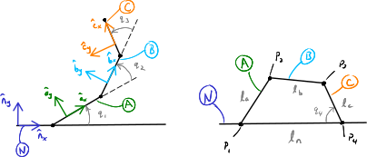
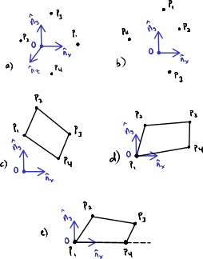
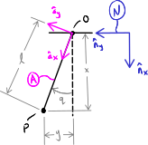

.. _chp-holonomic-constraints:

======================
Holonomic  Constraints
======================

Four-Bar Linkage
================

Consider the linkage shown below:

.. _configuration-four-bar:

   a) Shows four links in a plane :math:`A`, :math:`B`, :math:`C`, and
   :math:`N` with respective lengths :math:`l_a,l_b,l_c,l_n` connected in a
   closed loop at points :math:`P_1,P_2,P_3,P_4`. b) Shows the same linkage
   that has been seperated at point :math:`P_4` to make it an open chain of
   links.

This is a planar `four-bar linkage`_ with reference frames :math:`N,A,B,C`
attached to each bar. Four bar linkages are used in a wide variety of
mechanisms. One you may be familiar with is this rear suspension on a mountain
bicycle:

.. _mountain-bike-suspension:
.. figure:: https://upload.wikimedia.org/wikipedia/commons/thumb/7/7c/MtbFrameGeometry_FSR.png/320px-MtbFrameGeometry_FSR.png
   :align: center

   Four bar linkage shown in blue, red, orange, and green used in the rear
   suspension mechanism of a mountain bicycle.

   Cartemere, CC BY-SA 3.0 <https://creativecommons.org/licenses/by-sa/3.0>, via Wikimedia Commons

.. _four-bar linkage: https://en.wikipedia.org/wiki/Four-bar_linkage

A four bar linkage is an example of a *closed kinematic loop*. The case of
:numref:`configuration-four-bar` there are two vector paths to point
:math:`P_4`:

.. math::
   :label: vector-loop

   \bar{r}^{P_4/P_1} = \bar{r}^{P_2/P_1} + \bar{r}^{P_3/P_2} + \bar{r}^{P_4/P_3}

For the loop to close, the two vector paths must equate. We can resolve this by
disconnecting the loop at some location, :math:`P_4` in our case, and forming
the open loop vector equations to points that should coincide.

.. jupyter-execute::

   import sympy as sm
   import sympy.physics.mechanics as me
   me.init_vprinting()

Setup the variables, reference frames, and points:

.. jupyter-execute::

   q1, q2, q3 = me.dynamicsymbols('q1, q2, q3')
   la, lb, lc, ln = sm.symbols('l_a, l_b, l_c, l_n')

   N = me.ReferenceFrame('N')
   A = me.ReferenceFrame('A')
   B = me.ReferenceFrame('B')
   C = me.ReferenceFrame('C')

   A.orient_axis(N, q1, N.z)
   B.orient_axis(A, q2, A.z)
   C.orient_axis(B, q3, B.z)

   P1 = me.Point('P1')
   P2 = me.Point('P2')
   P3 = me.Point('P3')
   P4 = me.Point('P4')

SymPy Mechanics will warn you if you try to establish a closed loop among a set
of points and you should not do that. Instead you will establish positions
among points on one open leg of the chain:

.. jupyter-execute::

   P2.set_pos(P1, la*A.x)
   P3.set_pos(P2, lb*B.x)
   P4.set_pos(P3, lc*C.x)

   P4.pos_from(P1)

Now, declare a vector for the other path to :math:`P_4`:

.. jupyter-execute::

   r_P1_P4 = ln*N.x

Now we can form the left hand side of the following equation:

.. math::
   :label: constraint-expression

   \bar{r}^{P_4/P_1} - \left( \bar{r}^{P_2/P_1} + \bar{r}^{P_3/P_2} + \bar{r}^{P_4/P_3} \right) = 0

Using :external:py:meth:`~sympy.physics.vector.point.Point.pos_from` for the
open loop leg made of points and the additional vector:

.. jupyter-execute::

   loop = P4.pos_from(P1) - r_P1_P4
   loop

This "loop" vector equation must equate to zero for our linkage to always be a
closed loop. We have a planar mechanism, so we can extract two scalar equations
associated with a pair of unit vectors in the plane of the mechanism:

.. jupyter-execute::

   fhx = sm.trigsimp(loop.dot(N.x))
   fhx

.. jupyter-execute::

   fhy = sm.trigsimp(loop.dot(N.y))
   fhy

For the loop to close, these two expressions must equal zero for all values
:math:`q_1,q_2,q_3`. These are two nonlinear equations in three time varying
variables. A solution, sometimes analytically but likely only numerical, can be
found if we solve for two of the time varying variables. For example,
:math:`q_2` and :math:`q_3` can be solved for in terms of :math:`q_1`. We would
then say that :math:`q_2` and :math:`q_3` depend on :math:`q_1`. These two
equations are called holonomic constraints, or configuration constraints
because they constrain the kinematic configuration to be a loop. Holonomic
constraints take the form:

.. math::
   :label: configuration-constraint

   \bar{f}_h(q_1, \ldots, q_n, t) = 0 \textrm{ where } \bar{f}_h \in \mathbb{R}^M

These constraints are functions of configuration variables: time varying angles
and distances. In our case of the four-bar linkage:

.. math::
   :label: four-bar-constraints

   \bar{f}_h(q_1, q_2, q_3) = 0 \textrm{ where } \bar{f}_h \in \mathbb{R}^2

In SymPy, we'll typically form this column vector as so:

.. jupyter-execute::

   fh = sm.Matrix([fhx, fhy])
   fh

General Holonomic Constraints
=============================

If you consider a set of :math:`v` points, :math:`P_1,P_2,\ldots,P_v` that can
move unconstrained in Euclidean 3D space, then one would need :math:`3v`
constraint equations to fix the points (fully constrain the motion) in that
Euclidean space. For the four points in the four-bar linkage, we would then
need :math:`3(4)=12` constraints to lock all the points fully in place. The
figure below will be used to illustrate the general idea of constraining the
configuration of the four bar linkage.

.. _configuration-constraints:

   a) Four points in 3D space, b) four points constrained to 2D space, c)
   points are fixed to adjacent points by a fixed length, d) the first point is
   fixed at :math:`O` in two dimensions, e) the fourth point is fixed in the
   :math:`y` coordinate relative to :math:`O`.

Starting with a), there are the four points in 3D Euclidean space that are free
to move. Moving to b), each of the four points can be then constrained to be in
a plane with:

.. math::
   :label: planar-constraints

   \bar{r}^{P_1/O}\cdot\hat{n}_z = 0 \\
   \bar{r}^{P_2/O}\cdot\hat{n}_z = 0 \\
   \bar{r}^{P_3/O}\cdot\hat{n}_z = 0 \\
   \bar{r}^{P_4/O}\cdot\hat{n}_z = 0

where :math:`O` is a point fixed in :math:`N`. This applies four constraints
leaving 8 coordinates for the planar location of the points. Now at c) we
constrain the points with:

.. math::
   :label: length-constraints

   |\bar{r}^{P_2/P_1}| = l_a \\
   |\bar{r}^{P_3/P_2}| = l_b \\
   |\bar{r}^{P_4/P_3}| = l_c \\
   |\bar{r}^{P_4/P_1}| = l_n

These four constraint equations keep the points within the specified distances
from each other leaving 4 coordinates free. In d) point :math:`P_1` is fixed
relative to :math:`O` with 2 scalar constraints:

.. math::
   :label: p1-constraint

   \bar{r}^{P_1/O}\cdot\hat{n}_x = 0 \\
   \bar{r}^{P_1/O}\cdot\hat{n}_y = 0

Finally in e), :math:`P_4` is constrained with the single scalar:

.. math::
   :label: p4-constraint

   \bar{r}^{P_4/P_1} \cdot \hat{n}_y = 0

These 11 constraints leave a single free coordinate to describe the orientation
of :math:`A`, :math:`B`, and :math:`C` in :math:`N`. When we originally
sketched :numref:`configuration-four-bar` most of these constraints were
implied, i.e. we drew a planar mechanism with points :math:`P_1` and
:math:`P_4` fixed in :math:`N`, but formally there are 12 coordinates needed to
locate the four points and 11 constraints that constrain them to have the
configuration of a four-bar linkage.

A general holonomic constraint for a set of :math:`v` points with Cartesian
coordinates is then ([Kane1985]_ pg. 35):

.. math::
   :label: holonomic-cartesian

   f_h(x_1, y_1, z_1, \ldots, x_v, y_v, z_v, t) = 0

We include :math:`t` as it may also be possible that the constraint is an
explicit function of time (instead of only implicit, as seen above).

Generalized Coordinates
=======================

If a set of :math:`v` points are constrained with :math:`M` holonomic
constraints then only :math:`n` of the Cartesian coordinates are independent of
each other. The number of independent coordinates is then defined as
([Kane1985]_ pg 37):

.. math::
   :label: num-gen-coord

   n := 3v - M

These :math:`n` independent Cartesian coordinates can also be expressed as
:math:`n` functions of time :math:`q_1(t),q_2(t),\ldots,q_n(t)` in such a way
that the constraint equations are always satisfied. These functions
:math:`q_1(t),q_2(t),\ldots,q_n(t)` are called *generalized coordinates* and it
is possible to find :math:`n` independent coordinates that minimize the number
of explicit constraint equations needed to describe the system's configuration
at all times :math:`t`. These generalized coordinates are typically determined
by inspection of the system and there is a bit of an art to choosing the best
set. But you can always fall back to the formal process of constraining each
relevant point.

Take this simple pendulum with points :math:`O` and :math:`P` as an example:

If the pendulum length :math:`l` is constant and the orientation between
:math:`A` and :math:`N` can change, then the location of :math:`P` relative to
:math:`O` can be described with the Cartesian coordinates :math:`x` and
:math:`y`. It should be clear that :math:`x` and :math:`y` depend on each other
for this system. The constraint relationship between those two coordinates is:

.. math::
   :label: pendulum-length-constraint

   x^2 + y^2 = l^2

This implies that only one coordinate is independent, i.e. :math:`n=1`. More
formally, the two points give :math:`3v=3(2)=6` and there are 2 constraints for
the planar motion of each point, 2 constraints fixing :math:`O` in :math:`N`,
and 1 constraint fixing the distance from :math:`O` to :math:`P`, making
:math:`M=5` and thus confirming our intuition :math:`n=6-5=1`.

But there may be functions of time that relieve us from having to consider Eq.
:math:numref:`pendulum-length-constraint`. For example, these two coordinates
can also be written as as functions of the angle :math:`q`:

.. math::
   :label: xy-func-of-q

   x = l\cos q \\
   y = l\sin q

and if we describe the configuration with only :math:`q`, the constraint is
implicitly satisfied. :math:`q` is then a generalized coordinate because it
satisfies :math:`n=1` and we do not have to explicitly define a constraint
equation.

Now, let's return to the four-bar linkage example in
:numref:`configuration-four-bar` and think about what the generalized
coordinates of this system are. We know, at least intuitively, that :math:`n=1`
for the four bar linkage. The four-bar linkage in
:numref:`configuration-four-bar` is described in a way that assumes a number of
constraints are fulfilled, such as Eqs.  :math:numref:`planar-constraints` and
:math:numref:`p1-constraint`, so we do not have to formally consider them.

.. admonition:: Exercise

   Are :math:`q_1,q_2,q_3` generalized coordinates of the four-bar linkage? If
   not, why?

.. admonition:: Solution
   :class: dropdown

   Any one of the :math:`q_1,q_2,q_3` can be a generalized coordinate, but only
   one. The other two are depdendent due to the two constraints. We started
   with three coordinates :math:`q_1,q_2,q_3` describing the open chain
   :math:`P_1` to :math:`P_2` to :math:`P_3` to :math:`P_4`. Then we have two
   scalar constraint equations, leaving :math:`n=1`. Thus we can choose
   :math:`q_1`, :math:`q_2`, **or** :math:`q_3` to be the indepdendent
   generalized coordinate.

If we take the formal approach, starting with four unconstrained points, we
need 11 constraints to describe the system, but if we select generalized
coordinates to describe the system we only need 2 constraint equations (Eq.
:math:numref:`four-bar-constraints`)! This simplifies the mathematical problem
description and, as we will later see, is essential for obtaining the simplest
forms of the equations of motion of a multibody system.
