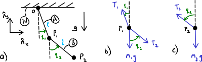

==================
Generalized Forces
==================

.. note::

   You can download this example as a Python script:
   :jupyter-download:script:`generalized-forces` or Jupyter Notebook:
   :jupyter-download:notebook:`generalized-forces`.

.. jupyter-execute::

   import sympy as sm
   import sympy.physics.mechanics as me
   me.init_vprinting(use_latex='mathjax')

At this point we have developed the three primary ingredients to formulate the
equations of motion of a multibody system:

1. Angular and Translational Kinematics
2. Mass and Mass Distribution
3. Forces, Moments, and Torques

For a single rigid body :math:`B` with mass :math:`m_B`, mass center
:math:`B_o`, and central inertia dyadic :math:`\breve{I}^{B/B_o}` having a
resultant force :math:`\bar{F}` at :math:`B_o` and moment :math:`\bar{M}` about
:math:`B_o` the `Newton-Euler Equations of Motion`_ in the inertial reference
frame :math:`N` can be written as follows:

.. math::
   :label: eq-newton-euler

   \bar{F} = & \frac{{}^N d \bar{p}}{dt} \quad \textrm{ where } \bar{p} = m_B{}^N\bar{v}^{B_o} \\
   \bar{M} = & \frac{{}^N d\bar{H}}{dt} \quad \textrm{ where }
   \bar{H} = \breve{I}^{B/B_o} \cdot {}^N\bar{\omega}^{B}

The left hand side contains the forces, moments, and torques (3.) acting on the
rigid body and the right hand side contains the kinematics (1.) and the mass
distribution (2.).

.. _Newton-Euler Equations of Motion: https://en.wikipedia.org/wiki/Newton%E2%80%93Euler_equations

For a set of particles and rigid bodies that make up a multibody system,
defined with generalized coordinates, generalized speeds, and constraints, the
generalized speeds characterize completely the motion of the system. The
velocities and angular velocities of every particle and rigid body in the
system are a function of these generalized speeds. The time rate of change of
the generalized speeds :math:`\frac{du}{dt}` will then play a critical role in
the formulation of the right hand side of the multibody system equations
of motion.

Take for example the multibody system shown in
:numref:`fig-generalized-forces-multi-pendulum`. A force :math:`\bar{F}`
applied at point :math:`Q` will cause all three of the lower particles to move.
The motion of the particles are described by the velocities, which are
functions of the generalized speeds. Thus :math:`\bar{F}` will, in general,
cause all of the generalized speeds to change. But how much does each
generalized speed change? The so called *partial velocites* of :math:`Q` in
:math:`N` will provide the answer to this question.

.. _fig-generalized-forces-multi-pendulum:
.. figure:: figures/generalized-forces-multi-pendulum.svg
   :align: center

   Four particles attached by massless links making up a 3 link planar simple
   pendulum. The top particle is fixed in :math:`N`. If the generalized
   coordinates :math:`q_1,q_2,q_3` represent the angles of the three pendulums
   then three generalized speeds could be defined as :math:`u_i=\dot{q}_i` for
   :math:`i=1,\ldots,3`.

Partial Velocities
==================

Recall that all translational and angular velocities of a multibody system can
be written in terms of the generalized speeds. By definition (Eq.
:math:numref:`eq-generalized-speeds`), these velocities can be expressed
uniquely as linear functions of the generalized speeds. For a holonomic system
with :math:`n` degrees of freedom in a single reference frame any translational
velocity or angular velocity can be written as ([Kane1985]_, pg.  45):

.. math::
   :label: eq-holonomic-partial-velocities

   \bar{v} = \sum_{r=1}^n \bar{v}_r u_r + \bar{v}_t \\
   \bar{\omega} = \sum_{r=1}^n \bar{\omega}_r u_r + \bar{\omega}_t

We call :math:`\bar{v}_r` and :math:`\bar{\omega}_r` the r\ :sup:`th` holonomic
partial velocity and angular velocity in the single reference frame,
respectively. :math:`\bar{v}_t` and :math:`\bar{\omega}_t` are the remainder
terms that are not linear in a generalized speed. Since the velocities are
linear in the generalized speeds, the partial velocities are equal to the
partial derivatives with respect to the generalized speeds:

.. math::
   :label: eq-partial-vel-partial-deriv

   \bar{v}_r = \frac{\partial \bar{v}}{\partial u_r} \quad
   \bar{v}_t = \frac{\partial \bar{v}}{\partial t} \\
   \bar{\omega}_r = \frac{\partial \bar{\omega}}{\partial u_r} \quad
   \bar{\omega}_t = \frac{\partial \bar{\omega}}{\partial t}

.. note::

   The reference frame these partials are taken with respect to should match
   that which the velocities are with respect to.

Given that the partial velocities are partial derivative, means that we may
interpret the partial velocities as the sensitivities of translational and
angular velocities to changes in :math:`u_r`. The partial velocities give an
idea of how any given velocity or angular velocity will change if one of the
generalized speeds changes. Figure
:numref:`fig-generalized-forces-partial-velocities` gives a graphical
interpretation of how a velocity of :math:`P` in :math:`N` is made up of
partial velocities and a remainder.

.. _fig-generalized-forces-partial-velocities:
.. figure:: figures/generalized-forces-partial-velocities.svg
   :align: center
   :width: 400px

   Velocity vector :math:`{}^N\bar{v}^P` of point :math:`P` shown expressed as
   a sum of linear combinations of generalized speeds and partial velocity
   vectors and a remainder vector. In this case there are two generalized
   speeds.

Partial velocities can be determined by inspection of velocity vector
expressions or calculated by taking the appropriate partial derivatives. Take,
for example, the single body system shown in
:numref:`fig-generalized-forces-par-vel-rod`. What are the partial velocities
for :math:`{}^N\bar{v}^A`, :math:`{}^N\bar{v}^B`, and
:math:`{}^N\bar{\omega}^R`?

.. _fig-generalized-forces-par-vel-rod:

   A rod :math:`R` pinned at :math:`A` on the horizontal line. :math:`A`'s
   horizontal translation is described by with the generalized coordinate
   :math:`q_1` and the angle of the rod relative to the horizontal is described
   by the generalized coordinate :math:`q_2`.

First calculate the velocities and ensure they are only in terms of the
generalized speeds and generalized coordinates. In this case, we have chosen
:math:`u_1=\dot{q}_1` and :math:`u2=\dot{q}_2`.

.. jupyter-execute::

   L = sm.symbols('L')
   q1, q2, u1, u2 = me.dynamicsymbols('q1, q2, u1, u2')

   N = me.ReferenceFrame('N')
   R = me.ReferenceFrame('R')

   R.orient_axis(N, q2, N.z)

.. jupyter-execute::

   N_v_A = u1*N.x
   N_v_A

.. jupyter-execute::

   N_w_R = u2*N.z
   N_w_R

.. jupyter-execute::

   r_A_B = -L*R.x
   N_v_B = N_v_A + me.cross(N_w_R, r_A_B)

   N_v_B.express(N)

Now, take the partial derivatives with respect to the generalized speeds to
find the six partial velocities:

.. jupyter-execute::

   v_A_1 = N_v_A.diff(u1, N)
   v_A_2 = N_v_A.diff(u2, N)

   v_A_1, v_A_2

.. jupyter-execute::

   v_B_1 = N_v_B.diff(u1, N)
   v_B_2 = N_v_B.diff(u2, N)

   v_B_1, v_B_2

.. jupyter-execute::

   w_R_1 = N_w_R.diff(u1, N)
   w_R_2 = N_w_R.diff(u2, N)

   w_R_1, w_R_2

SymPy Mechanics provides a convenience function
:external:py:func:`~sympy.physics.vector.functions.partial_velocity` to
calculate a set of partial velocities for a set of generalized speeds:

.. jupyter-execute::

   me.partial_velocity((N_v_A, N_v_B, N_w_R), (u1, u2), N)

If a system is nonholonomic, it is also true that every translational and
angular velocity can be expressed uniquely in terms of the :math:`p`
independent generalized speeds (see Eq.
:math:numref:`eq-contraint-linear-form-solve`). Thus, we can also define the
*nonholonomic partial velocities* :math:`\tilde{v}_r` and *nonholonomic partial
angular velocities* :math:`\tilde{\omega}_r` as per ([Kane1985]_, pg. 46):

.. math::
   :label: eq-nonholonomic-partial-velocities

   \bar{v} = \sum_{r=1}^p \tilde{v}_r u_r + \tilde{v}_t \\
   \bar{\omega} = \sum_{r=1}^p \tilde{\omega}_r u_r + \tilde{\omega}_t

See [Kane1985]_ pg. 48 for the relationship between holonomic and nonholonomic
partial velocities.

Generalized Active Forces
=========================

Suppose we have a holonomic multibody system made up of :math:`\nu` particles
with :math:`n` degrees of freedom in a reference frame :math:`A` that are
described by generalized speeds :math:`u_1,\ldots,u_n`. Each particle may have
a resultant force :math:`\bar{R}` applied to it. By projecting each of the
forces onto the partial velocity of its associated particle and summing the
projections, we arrive at the total scalar force contribution associated with
changes in that generalized speed. We call these scalar values, one for each
generalized speed, the *generalized active forces*. The r\ :sup:`th` holonomic
generalized active force for this system in A is defined as ([Kane1985]_, pg.
99):

.. math::
   :label: eq-rth-gaf

   F_r := \sum_{i=1}^\nu {}^A\bar{v}^{P_i}_r \cdot \bar{R}_i

where :math:`i` represents the i\ :sup:`th` particle.

Notice that the r\ :sup:`th` generalized active force is:

1. a scalar value
2. has contributions from all particles except if :math:`{}^A\bar{v}^{P_i}
   \perp \bar{R}_i`
3. associated with the r\ :sup:`th` generalized speed

We will typically collect all of the generalized active forces in a column
vector to allow for matrix operations with these values:

.. math::
   :label: eq-rth-gen-active-force

   \bar{F}_r = \begin{bmatrix}
   \sum_{i=1}^\nu {}^A\bar{v}_1^{P_i} \cdot \bar{R}_i \\
   \vdots \\
   \sum_{i=1}^\nu {}^A\bar{v}_r^{P_i} \cdot \bar{R}_i \\
   \vdots \\
   \sum_{i=1}^\nu {}^A\bar{v}_n^{P_i} \cdot \bar{R}_i
   \end{bmatrix}

Eq. :math:numref:`eq-rth-gaf` shows that the partial velocities transform the
forces applied to the multibody system from their Cartesian vector space to a
new generalized speed vector space.

Now let us calculate the generalized active forces for a simple multibody
system made up of only particles.
:numref:`fig-generalized-forces-double-pendulum` shows a double simple pendulum
made up of two particles :math:`P_1` and :math:`P_2` with masses :math:`m_1`
and :math:`m_2` respectively.

.. _fig-generalized-forces-double-pendulum:

   Double simple pendulum a) kinematic schematic, b) free body diagram of
   :math:`P_1`, c) free body diagram of :math:`P_2`.

To calculate the generalized active forces we first find the velocities of each
particle and write them in terms of the generalized speeds which we define as
:math:`u_1=\dot{q}_1,u_2=\dot{q}_2`.

.. jupyter-execute::

   l = sm.symbols('l')
   q1, q2, u1, u2 = me.dynamicsymbols('q1, q2, u1, u2')

   N = me.ReferenceFrame('N')
   A = me.ReferenceFrame('A')
   B = me.ReferenceFrame('B')

   A.orient_axis(N, q1, N.z)
   B.orient_axis(N, q2, N.z)

   O = me.Point('O')
   P1 = me.Point('P1')
   P2 = me.Point('P2')

   O.set_vel(N, 0)

   P1.set_pos(O, -l*A.y)
   P2.set_pos(P1, -l*B.y)

   P1.v2pt_theory(O, N, A)
   P2.v2pt_theory(P1, N, B)

   P1.vel(N), P2.vel(N)

.. jupyter-execute::

   repl = {q1.diff(): u1, q2.diff(): u2}

   N_v_P1 = P1.vel(N).xreplace(repl)
   N_v_P2 = P2.vel(N).xreplace(repl)

   N_v_P1, N_v_P2

We will need the partial velocities of each particle with respect to the two
generalized speeds, giving four partial velocities:

.. jupyter-execute::

   v_P1_1 = N_v_P1.diff(u1, N)
   v_P1_2 = N_v_P1.diff(u2, N)
   v_P2_1 = N_v_P2.diff(u1, N)
   v_P2_2 = N_v_P2.diff(u2, N)
   v_P1_1, v_P1_2, v_P2_1, v_P2_2

To determine the resultant forces acting on each particle we isolate each
particle from the system and draw a free body diagram with all of the forces
acting on the particle. Each particle has a gravitational force as well as
distance, or tension, forces that ensure the particle stays connected to the
massless rod. The resultant forces on each particle are then:

.. jupyter-execute::

   T1, T2 = me.dynamicsymbols('T1, T2')
   m1, m2, g = sm.symbols('m1, m2, g')

   R1 = -m1*g*N.y + T1*A.y - T2*B.y
   R1

.. jupyter-execute::

   R2 = -m2*g*N.y + T2*B.y
   R2

With the resultants and the partial velocities defined, the two generalized
active forces can then be found:

.. jupyter-execute::

   F1 = me.dot(v_P1_1, R1) + me.dot(v_P2_1, R2)
   F1

.. jupyter-execute::

   F2 = me.dot(v_P1_2, R1) + me.dot(v_P2_2, R2)
   F2

Notice that the distance forces :math:`T_1,T_2` are not present in the
generalized active forces :math:`F_1` or :math:`F_2`. This is not by
coincidence, but will always be true for noncontributing forces. They are in
fact named "noncontributing" because they do not contribute to the generalized
active forces (nor the full equations of motion we eventually arrive at).
Noncontributing forces need not be considered in the resultants, in general,
and we will not include them in further examples.

Notice also that the generalized forces have units of :math:`\textrm{force}
\times \textrm{length}`. This is because our generalized speeds are angular
rates. If our generalized speeds were linear rates, the generalized forces
would have units of :math:`\textrm{force}`.

Generalized Active Forces on a Rigid Body
=========================================

If a holonomic multibody system with :math:`n` degrees of freedom in reference
frame :math:`A` includes a rigid body :math:`B` then the loads acting on
:math:`B` can be described by a resultant force :math:`\bar{R}` bound to an
arbitrary point :math:`Q` in :math:`B` and a couple with torque
:math:`\bar{T}`. The generalized active force then for a single rigid body in a
multibody system is defined as ([Kane1985]_, pg. 106):

.. math::
   :label: eq-gaf-rigid-body

   (F_r)_B := {}^A\bar{v}^Q_r \cdot \bar{R} + {}^A\bar{\omega}^B_r \cdot \bar{T}

A generalized active force for each rigid body and particle in a system must be
summed to obtain the total generalized active force.

To demonstrate finding the generalized active forces for a multibody system
with two rigid bodies consider :numref:`fig-generalized-forces-3d-rods` which
shows two thin rods of length :math:`l` that are connected at points :math:`O`
and :math:`B_o`.

.. _fig-generalized-forces-3d-rods:
.. figure:: figures/generalized-forces-3d-rods.svg
   :align: center
   :width: 400px

   A multibody system comprised of two uniformly dense thin rods of length
   :math:`L` and mass :math:`m`. Rod :math:`A` is pinned at :math:`O` and can
   rotate about :math:`\hat{n}_z` through :math:`q_1`. Rod :math:`B` is pinned
   to :math:`A` and can rotate relative to :math:`A` about :math:`\hat{a}_x`
   through :math:`q_2`. Linear torisional springs of stiffnes :math:`k` with a
   free length of zero resists each relative rotation. Gravitational forces are
   in the :math:`\hat{n}_x` direction.

The first step is to define the necessary velocities we'll need: translational
velocities of the two mass centers and the angular velocities of each body. We
use the simple definition of the generalized speeds :math:`u_i=\dot{q}_i`.

.. jupyter-execute::

   m, g, k, l = sm.symbols('m, g, k, l')
   q1, q2, u1, u2 = me.dynamicsymbols('q1, q2, u1, u2')

   N = me.ReferenceFrame('N')
   A = me.ReferenceFrame('A')
   B = me.ReferenceFrame('B')

   A.orient_axis(N, q1, N.z)
   B.orient_axis(A, q2, A.x)

   A.set_ang_vel(N, u1*N.z)
   B.set_ang_vel(A, u2*A.x)

   O = me.Point('O')
   Ao = me.Point('A_O')
   Bo = me.Point('B_O')

   Ao.set_pos(O, l/2*A.x)
   Bo.set_pos(O, l*A.x)

   O.set_vel(N, 0)
   Ao.v2pt_theory(O, N, A)
   Bo.v2pt_theory(O, N, A)

   Ao.vel(N), Bo.vel(N), A.ang_vel_in(N), B.ang_vel_in(N)

Now determine the holonomic partial velocities in :math:`N`:

.. jupyter-execute::

   v_Ao_1 = Ao.vel(N).diff(u1, N)
   v_Ao_2 = Ao.vel(N).diff(u2, N)
   v_Bo_1 = Bo.vel(N).diff(u1, N)
   v_Bo_2 = Bo.vel(N).diff(u2, N)

   v_Ao_1, v_Ao_2, v_Bo_1, v_Bo_2

and the holonomic partial angular velocities in :math:`N`:

.. jupyter-execute::

   w_A_1 = A.ang_vel_in(N).diff(u1, N)
   w_A_2 = A.ang_vel_in(N).diff(u2, N)
   w_B_1 = B.ang_vel_in(N).diff(u1, N)
   w_B_2 = B.ang_vel_in(N).diff(u2, N)

   w_A_1, w_A_2, w_B_1, w_B_2

The resultant forces on the two bodies are simply the gravitational forces that
act at each mass center (we ignore the noncontributing pin joint contact
forces):

.. jupyter-execute::

   R_Ao = m*g*N.x
   R_Bo = m*g*N.x

   R_Ao, R_Bo

With linear torsion springs between frames A and N and frames A and B the
torques acting on each body are:

.. jupyter-execute::

   T_A = -k*q1*N.z + k*q2*A.x
   T_B = -k*q2*A.x

   T_A, T_B

Note that :math:`k q_2\hat{a}_x` in :math:`\bar{T}_A` is the reaction torque of
of body :math:`B` on :math:`A` via the torsional spring.

Now, a generalized active force component can be found for each body and each
generalized speed using :math:numref:`eq-gaf-rigid-body`:

.. jupyter-execute::

   F1_A = v_Ao_1.dot(R_Ao) + w_A_1.dot(T_A)
   F1_B = v_Bo_1.dot(R_Bo) + w_B_1.dot(T_B)
   F2_A = v_Ao_2.dot(R_Ao) + w_A_2.dot(T_A)
   F2_B = v_Bo_2.dot(R_Bo) + w_B_2.dot(T_B)

   F1_A, F1_B, F2_A, F2_B

Summing for each generalized speed and then stacking the two scalars in a
column vector gives the generalized active forces for the system:

.. jupyter-execute::

   F1 = F1_A + F1_B
   F2 = F2_A + F2_B

   Fr = sm.Matrix([F1, F2])
   Fr

For a nonholonomic system with :math:`p` degrees of freedom in reference frame
:math:`A`, the :math:`p` generalized active forces can be formed instead. The
nonholonomic generalized active force contributions from a particle :math:`P`
and rigid body :math:`B` are:

.. math::
   :label: eq-nonholonomic-gaf

   (\tilde{F}_r)_P = {}^A\tilde{v}^{P} \cdot \bar{R} \\
   (\tilde{F}_r)_B = {}^A\tilde{v}^Q \cdot \bar{R} + {}^A\tilde{\omega}^B \cdot \bar{T}

See [Kane1985]_ pg. 99 for the relationship between holonomic and nonholonomic
generalized active forces.

Generalized Inertia Forces
==========================

Analogous to the generalized active forces and their relationship to the left
hand side of the Newtwon-Euler equations (Eq. :math:numref:`eq-newton-euler`,
*generalized inertia forces* map the right hand side of the Newton-Euler
equations, time derivatives of linear and angular momentum, to the vector space
of the generalized speeds for a multibody system. For a holonomic multibody
system in :math:`A` made up of a set of :math:`\nu` particles the r\ :sup:`th`
generalized inertia force is defined as ([Kane1985]_, pg. 124):

.. math::

   F_r^* := \sum_{i=1}^\nu {}^A\bar{v}^{P_i}_r \cdot \bar{R}^*_i

where the resultant *inertia force* on the i\ :sup:`th` particle is:

.. math::

   \bar{R}^*_i := -m_i {}^A\bar{a}^{P_i}_i

The generalized inertia force for a single rigid body :math:`B` with mass
:math:`m_B`, mass center :math:`B_o`, and central inertia dyadic
:math:`\breve{I}^{B/Bo}` is defined as:

.. math::

   (F_r^*)_B := {}^A\bar{v}^{B_o}_r \cdot \bar{R}^* + {}^A\bar{\omega}^B_r \cdot \bar{T}^*

where the inertia force on the body is:

.. math::

   \bar{R}^* := -m_{B} {}^A\bar{a}^{B_o}

and the *inertia torque* on the body are

.. math::

   \bar{T}^* := -\left(
   {}^A\bar{\alpha}^B \cdot \breve{I}^{B/Bo} +
   {}^A\bar{\omega}^B \times \breve{I}^{B/Bo} \cdot {}^A\bar{\omega}^B
   \right)

Coming back to the system in :numref:`fig-generalized-forces-3d-rods` we can
now calculate the generalized inertia forces for the two rigid body system.
First, the velocities and partial velocities are found as before:

.. jupyter-execute::

   m, g, k, l = sm.symbols('m, g, k, l')
   q1, q2, u1, u2 = me.dynamicsymbols('q1, q2, u1, u2')

   N = me.ReferenceFrame('N')
   A = me.ReferenceFrame('A')
   B = me.ReferenceFrame('B')

   A.orient_axis(N, q1, N.z)
   B.orient_axis(A, q2, A.x)

   A.set_ang_vel(N, u1*N.z)
   B.set_ang_vel(A, u2*A.x)

   O = me.Point('O')
   Ao = me.Point('A_O')
   Bo = me.Point('B_O')

   Ao.set_pos(O, l/2*A.x)
   Bo.set_pos(O, l*A.x)

   O.set_vel(N, 0)
   Ao.v2pt_theory(O, N, A)
   Bo.v2pt_theory(O, N, A)

   v_Ao_1 = Ao.vel(N).diff(u1, N)
   v_Ao_2 = Ao.vel(N).diff(u2, N)
   v_Bo_1 = Bo.vel(N).diff(u1, N)
   v_Bo_2 = Bo.vel(N).diff(u2, N)

   w_A_1 = A.ang_vel_in(N).diff(u1, N)
   w_A_2 = A.ang_vel_in(N).diff(u2, N)
   w_B_1 = B.ang_vel_in(N).diff(u1, N)
   w_B_2 = B.ang_vel_in(N).diff(u2, N)

We will need the translational accelerations of the mass centers and the
angular accelerations of each body expressed in terms of the generalized
speeds, their derivatives, and the generalized coordinates:

.. jupyter-execute::

   Ao.acc(N), Bo.acc(N)

.. jupyter-execute::

   A.ang_acc_in(N), B.ang_acc_in(N)

The central moment of inertia of a thin uniformly dense rod of mass :math:`m`
and length :math:`L` about any axis normal to its length is:

.. jupyter-execute::

   I = m*l**2/12
   I

This can be used to formulate the central inertia dyadics of each rod:

.. jupyter-execute::

   I_A_Ao = I*me.outer(A.y, A.y) + I*me.outer(A.z, A.z)
   I_B_Bo = I*me.outer(B.x, B.x) + I*me.outer(B.z, B.z)
   I_A_Ao, I_B_Bo

The resultant inertia forces acting at the mass center of each body are:

.. jupyter-execute::

   Rs_Ao = -m*Ao.acc(N)
   Rs_Bo = -m*Bo.acc(N)

   Rs_Ao, Rs_Bo

And the inertia torques acting on each body are:

.. jupyter-execute::

   Ts_A = -(A.ang_acc_in(N).dot(I_A_Ao) +
            me.cross(A.ang_vel_in(N), I_A_Ao).dot(A.ang_vel_in(N)))
   Ts_A

.. jupyter-execute::

   Ts_B = -(B.ang_acc_in(N).dot(I_B_Bo) +
            me.cross(B.ang_vel_in(N), I_B_Bo).dot(B.ang_vel_in(N)))
   Ts_B

Now the generalized inertia forces can be formed by projecting the inertia
force and inertia torque onto the partial velocities:

.. jupyter-execute::

   F1s_A = v_Ao_1.dot(Rs_Ao) + w_A_1.dot(Ts_A)
   F1s_B = v_Bo_1.dot(Rs_Bo) + w_B_1.dot(Ts_B)
   F2s_A = v_Ao_2.dot(Rs_Ao) + w_A_2.dot(Ts_A)
   F2s_B = v_Bo_2.dot(Rs_Bo) + w_B_2.dot(Ts_B)

We then sum for each generalized speed and then stack them in a column vector
:math:`\bar{F}_r^*`:

.. jupyter-execute::

   F1s = F1s_A + F1s_B
   F2s = F2s_A + F2s_B

   Frs = sm.Matrix([F1s, F2s])
   Frs

For a nonholonomic system with :math:`p` degrees of freedom in reference frame
:math:`A`, the :math:`p` generalized active forces can be formed instead. The
nonholonomic generalized active force contributions from a particle :math:`P`
and rigid body :math:`B` are:

.. math::
   :label: eq-nonholonomic-gaf

   (\tilde{F}^*_r)_P = {}^A\tilde{v}^{P} \cdot \bar{R} \\
   (\tilde{F}^*_r)_B = {}^A\tilde{v}^Q \cdot \bar{R} + {}^A\tilde{\omega}^B \cdot \bar{T}

The relationship between the nonholonomic and holonomic generalized inertia
forces is give in [Kane1985]_ pg. 124.
