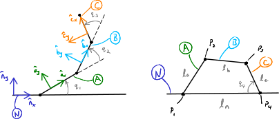

==============================================
Equations of Motion with Holonomic Constraints
==============================================

.. note::

   You can download this example as a Python script:
   :jupyter-download:script:`holonomic-eom` or Jupyter Notebook:
   :jupyter-download:notebook:`holonomic-eom`.

.. jupyter-execute::

   from IPython.display import HTML
   from matplotlib.animation import FuncAnimation
   from scipy.integrate import solve_ivp
   import matplotlib.pyplot as plt
   import numpy as np
   import sympy as sm
   import sympy.physics.mechanics as me

   me.init_vprinting(use_latex='mathjax')

When there are holonomic constraints present the equations of motion are
comprised of the kinematical differential equations, dynamical differential
equations, and the algebraic holonomic constraint equations. This set of
equations are called `differential algebraic equations`_ and the algebraic
equations cannot be solved for explicitly, as we did with the nonholonomic
algebraic constraint equations.

.. _differential algebraic equations: https://en.wikipedia.org/wiki/Differential-algebraic_system_of_equations

In a system such as this, there are :math:`N=n+M` total coordinates, with
:math:`n` generalized coordinates :math:`\bar{q}` and :math:`M` additional
dependent coordinates :math:`\bar{q}_r`. The holonomic constraints take this
form:

.. math::
   :label: eq-holonomic-constraints

   \bar{f}_h(\bar{q}, \bar{q}_r, t) = 0 \in \mathbb{R}^M

:math:`n` generalized speeds :math:`\bar{u}` and :math:`M` dependent speeds
:math:`\bar{u}_r` can be introduced along with :math:`N` kinematical
differential equations.

.. math::

   \bar{f}_k(\dot{\bar{q}}, \dot{\bar{q}}_r, \bar{u}, \bar{u}_r, \bar{q}, \bar{q}_r, t)  = 0 \in \mathbb{R}^N \\

Eq. :math:numref:`eq-holonomic-constraints` can be
differentiated with respect to time to arrive at:

.. math::
   :label: eq-holonomic-constraints-dot

   \dot{\bar{f}}_h(\bar{u}, \bar{u}_r, \bar{q}, \bar{q}_r, t) =
   \mathbf{M}_{hd}\bar{u}_r + \bar{g}_{hd} = 0 \in \mathbb{R}^M

The dependent speeds can be solved for:

.. math::

   \bar{u}_r = -\mathbf{M}_{hd}^{-1} \bar{g}_{hd} \in \mathbb{R}^M

and used to write the kinematical and dynamical differential equations only in
terms of the generalized speeds, generalized coordinates, and the dependent
coordinates.

.. math::
   :label: eq-holonomic-constrained-eom

   \bar{f}_k(\dot{\bar{q}}, \dot{\bar{q}}_r, \bar{u}, \bar{q}, \bar{q}_r, t)  = 0 \in \mathbb{R}^N \\
   \bar{f}_d(\dot{\bar{u}}, \bar{u}, \bar{q}, \bar{q}_r, t)  = 0 \in \mathbb{R}^n \\

This final set of equations has :math:`N+n` state variables and can be
integrated as a set of ordinary differential equations.

Four-bar Linkage Equations of Motion
====================================

Let's revisit the four-bar linkage from Sec. :ref:`Four-Bar Linkage` and
develop the equations of motion for the system. Assume that points :math:`P_2`
and :math:`P_3` are particle each with mass :math:`m` and that gravity acts in
the :math:`-\hat{n}_y` direction.

   a) Shows four links in a plane :math:`A`, :math:`B`, :math:`C`, and
   :math:`N` with respective lengths :math:`l_a,l_b,l_c,l_n` connected in a
   closed loop at points :math:`P_1,P_2,P_3,P_4`. b) Shows the same linkage
   that has been seperated at point :math:`P_4` to make it an open chain of
   links.

1. Declare all the variables
----------------------------

.. jupyter-execute::

   q1, q2, q3 = me.dynamicsymbols('q1, q2, q3')
   u1, u2, u3 = me.dynamicsymbols('u1, u2, u3')
   la, lb, lc, ln = sm.symbols('l_a, l_b, l_c, l_n')
   m, g = sm.symbols('m, g')
   t = me.dynamicsymbols._t

   q = sm.Matrix([q1])
   qr = sm.Matrix([q2, q3])
   qN = q.col_join(qr)
   u = sm.Matrix([u1])
   ur = sm.Matrix([u2, u3])
   uN = u.col_join(ur)

   qdN = qN.diff(t)
   ud = u.diff(t)

   uN_zero = {ui: 0 for ui in uN}
   qdN_zero = {qdi: 0 for qdi in qdN}
   ud_zero = {udi: 0 for udi in ud}

   p = sm.Matrix([la, lb, lc, ln, m, g])

2. Establish the open loop posiions of the points
-------------------------------------------------

Start by defining the positions of the points in terms of the :math:`N=3`
coordinates, leaving :math:`P_4` unconstrained.

.. jupyter-execute::

   N = me.ReferenceFrame('N')
   A = me.ReferenceFrame('A')
   B = me.ReferenceFrame('B')
   C = me.ReferenceFrame('C')

   A.orient_axis(N, q1, N.z)
   B.orient_axis(A, q2, A.z)
   C.orient_axis(B, q3, B.z)

   P1 = me.Point('P1')
   P2 = me.Point('P2')
   P3 = me.Point('P3')
   P4 = me.Point('P4')

   P2.set_pos(P1, la*A.x)
   P3.set_pos(P2, lb*B.x)
   P4.set_pos(P3, lc*C.x)

3. Create the holonomic constraints
-----------------------------------

Now :math:`M=2` holonomic constraints can be found by closing the loop.

.. jupyter-execute::

   loop = P4.pos_from(P1) - ln*N.x

   fh = sm.Matrix([loop.dot(N.x), loop.dot(N.y)])
   fh = sm.trigsimp(fh)
   fh

.. jupyter-execute::

   me.find_dynamicsymbols(fh)

4. Specify the kinematical differential equations
-------------------------------------------------

Use simple definitions for the generalized speed and the dependent speeds.

.. jupyter-execute::

   fk = sm.Matrix([
       q1.diff(t) - u1,
       q2.diff(t) - u2,
       q3.diff(t) - u3,
   ])
   Mk = fk.jacobian(qdN)
   gk = fk.xreplace(qdN_zero)
   qdN_sol = -Mk.LUsolve(gk)
   qd_repl = dict(zip(qdN, qdN_sol))
   qd_repl

5. Differentiate the holonomic constraints
------------------------------------------

.. jupyter-execute::

   fhd = fh.diff(t).xreplace(qd_repl)
   me.find_dynamicsymbols(fhd)

6. Solve for the dependent speed
--------------------------------

.. jupyter-execute::

   ur_zero = {ui: 0 for ui in ur}

   Mhd = fhd.jacobian(ur)
   ghd = fhd.xreplace(ur_zero)

   Mhd, ghd

.. jupyter-execute::

   ur_sol = -Mhd.LUsolve(ghd)
   ur_repl = dict(zip(ur, ur_sol))

.. jupyter-execute::

   gk = gk.xreplace(ur_repl)

7. Write velocities in terms of the generalized speeds
------------------------------------------------------

.. jupyter-execute::

   A.set_ang_vel(N, u1*N.z)
   B.set_ang_vel(A, ur_repl[u2]*A.z)
   C.set_ang_vel(B, ur_repl[u3]*B.z)

   P1.set_vel(N, 0)
   P2.v2pt_theory(P1, N, A)
   P3.v2pt_theory(P2, N, B)
   P4.v2pt_theory(P3, N, C)

8. Form the generalized active forces
-------------------------------------

.. jupyter-execute::

   R_P2 = -m*g*N.y
   R_P3 = -m*g*N.y

.. jupyter-execute::

   Fr = sm.Matrix([
       P2.vel(N).diff(u1, N).dot(R_P2) +
       P3.vel(N).diff(u1, N).dot(R_P3)
   ])

   me.find_dynamicsymbols(Fr)

9. Form the generalized inertia forces
--------------------------------------

.. jupyter-execute::

   me.find_dynamicsymbols(P2.acc(N), reference_frame=N)

.. jupyter-execute::

   me.find_dynamicsymbols(P3.acc(N), reference_frame=N)

.. jupyter-execute::

   Rs_P2 = -m*P2.acc(N)
   Rs_P3 = -m*P3.acc(N).xreplace(qd_repl).xreplace(ur_repl)

   Frs = sm.Matrix([
       P2.vel(N).diff(u1, N).dot(Rs_P2) +
       P3.vel(N).diff(u1, N).dot(Rs_P3)
   ])
   me.find_dynamicsymbols(Frs)

10. Prepare the dynamical differential equations
------------------------------------------------

.. jupyter-execute::

   Md = Frs.jacobian(ud)
   gd = Frs.xreplace(ud_zero) + Fr
   me.find_dynamicsymbols(Md), me.find_dynamicsymbols(gd)

Simulate the Four-bar Linkage
=============================

.. jupyter-execute::

   eval_k = sm.lambdify((qN, u, p), (Mk, gk))
   eval_d = sm.lambdify((qN, u, p), (Md, gd))

.. jupyter-execute::

   p_vals = np.array([
       0.8,  # la [m]
       2.0,  # lb [m]
       1.0,  # lc [m]
       2.0,  # ln [m]
       1.0,  # m [kg]
       9.81,  # g [m/s^2]
   ])

.. jupyter-execute::

   from scipy.optimize import fsolve

.. jupyter-execute::

   q1_val = np.deg2rad(10.0)

   eval_fh = sm.lambdify((qr, q, p), fh)

   q2_val, q3_val = fsolve(lambda qr, q, p: np.squeeze(eval_fh(qr, [q], p)),
                           np.deg2rad([20.0, -150]),
                           args=(q1_val, p_vals))

   qN_vals = np.array([q1_val, q2_val, q3_val])
   np.rad2deg(qN_vals)

.. jupyter-execute::

   def eval_rhs(t, x, p):

       qN = x[:3]
       u = x[3:]

       Mk, gk = eval_k(qN, u, p)
       qNd = -np.linalg.solve(Mk, np.squeeze(gk))

       Md, gd = eval_d(qN, u, p)
       ud = -np.linalg.solve(Md, gd)[0]

       return np.hstack((qNd, ud))

.. jupyter-execute::

   u10 = 0.0
   x0 = np.hstack((qN_vals, u10))
   t0, tf = 0.0, 30.0
   fps = 20
   ts = np.linspace(t0, tf, num=int(fps*(tf - t0)))

   eval_rhs(t0, x0, p_vals)

.. jupyter-execute::

   sol = solve_ivp(eval_rhs, (t0, tf), x0, args=(p_vals,), t_eval=ts, atol=1e-6, rtol=1e-3)
   xs = np.transpose(sol.y)
   ts = sol.t

.. jupyter-execute::

   def simulate(eval_rhs, t0, tf, fps, q1_0, u1_0, q2_0g, q3_0g, p):

       ts = np.linspace(t0, tf, num=int(fps*(tf - t0)))

       q2_val, q3_val = fsolve(lambda qr, q, p: np.squeeze(eval_fh(qr, [q], p)),
                               [q2_0g, q3_0g],
                               args=(q1_0, p))
       x0 = np.array([q1_val, q2_val, q3_val, u1_0])

       sol = solve_ivp(eval_rhs, (ts[0], ts[-1]), x0, args=(p_vals,), t_eval=ts, atol=1e-6, rtol=1e-3)

       xs = np.transpose(sol.y)
       ts = sol.t

       con = []
       for xi in xs:  # xs is shape(n, 4)
          con.append(eval_fh(xi[1:3], xi[0:1], p_vals).squeeze())
       con = np.array(con)

       return ts, xs, con

   ts, xs, con = simulate(
       eval_rhs,
       t0=t0,
       tf=tf,
       fps=fps,
       q1_0=np.deg2rad(10.0),
       u1_0=0.0,
       q2_0g=np.deg2rad(20.0),
       q3_0g=np.deg2rad(-150.0),
       p=p_vals,
   )

.. jupyter-execute::

   def plot_results(ts, xs, con):
       """Returns the array of axes of a 4 panel plot of the state trajectory
       versus time.

       Parameters
       ==========
       ts : array_like, shape(n,)
          Values of time.
       xs : array_like, shape(n, 4)
          Values of the state trajectories corresponding to ``ts`` in order
          [q1, q2, q3, u1].
       con : array_like, shape(n, 2)
          x and y constraint violations of P4 at each time in ``ts``.

       Returns
       =======
       axes : ndarray, shape(3,)
          Matplotlib axes for each panel.

       """
       fig, axes = plt.subplots(3, 1, sharex=True)

       fig.set_size_inches((10.0, 6.0))

       axes[0].plot(ts, np.rad2deg(xs[:, :3]))  # q1, q2, q3
       axes[1].plot(ts, np.rad2deg(xs[:, 3]))  # u1
       axes[2].plot(ts, np.squeeze(con))

       axes[0].legend(['$q_1$', '$q_2$', '$q_3$'])
       axes[1].legend(['$u_1$'])
       axes[2].legend([r'$\cdot\hat{n}_x$', r'$\cdot\hat{n}_y$'])

       axes[0].set_ylabel('Angle [deg]')
       axes[1].set_ylabel('Angular Rate [deg/s]')
       axes[2].set_ylabel('Distance [m]')
       axes[2].set_xlabel('Time [s]')

       fig.tight_layout()

       return axes

   plot_results(ts, xs, con);

Animate the Motion
==================

We'll animate the four bar linkage multiple times so it is useful to create
some functions to for the repated use. First, we create a function that plots
the initial configuration of the linkage and returns any objects we may need in
the animation code.

.. jupyter-execute::

   coordinates = P2.pos_from(P1).to_matrix(N)
   for point in [P3, P4, P1, P2]:
      coordinates = coordinates.row_join(point.pos_from(P1).to_matrix(N))

   eval_point_coords = sm.lambdify((qN, p), coordinates)
   eval_point_coords(qN_vals, p_vals)

.. jupyter-execute::

   title_template = 'Time = {:1.2f} s'

   def setup_animation_plot(ts, xs, p):
       """

       Parameters
       ==========
       ts : array_like, shape(n,)
          Values of time.
       xs : array_like, shape(n, 4)
          Values of the state trajectories corresponding to ``ts`` in order
          [q1, q2, q3, u1].
       p : array_like, shape(6,)

       """

       x, y, z = eval_point_coords(xs[0, :3], p)

       fig, ax = plt.subplots()
       fig.set_size_inches((10.0, 10.0))
       ax.set_aspect('equal')
       ax.grid()

       lines, = ax.plot(x, y, color='black',
                        marker='o', markerfacecolor='blue', markersize=10)

       title_text = ax.set_title(title_template.format(ts[0]))
       ax.set_xlim((-1.0, 3.0))
       ax.set_ylim((-1.0, 1.0))
       ax.set_xlabel('$x$ [m]')
       ax.set_ylabel('$y$ [m]')

       return fig, ax, title_text, lines

   setup_animation_plot(ts, xs, p_vals);

Now we can create a function that initializes the plot, runs the animation and
displays the results in Jupyter.

.. jupyter-execute::

   def animate_linkage(ts, xs, p_vals):

       # setup the initial figure and axes
       fig, ax, title_text, lines = setup_animation_plot(ts, xs, p_vals)

       # precalculate all of the point coordinates
       coords = []
       for xi in xs:
           coords.append(eval_point_coords(xi[:3], p_vals))
       coords = np.array(coords)

       # define the animation update function
       def update(i):
           title_text.set_text(title_template.format(ts[i]))
           lines.set_data(coords[i, 0, :], coords[i, 1, :])

       plt.close()

       # create the animation
       return FuncAnimation(fig, update, len(ts))

   HTML(animate_linkage(ts, xs, p_vals).to_jshtml(fps=fps))

.. jupyter-execute::

   def eval_rhs_fsolve(t, x, p):

       qN = x[:3]
       u = x[3:]

       # correct the depdendent coordinates
       qN[1:] = fsolve(lambda qr, q, p: np.squeeze(eval_fh(qr, [q], p)),
                       qN[1:],  # guess with current solution
                       args=(qN[0], p_vals))

       Mk, gk = eval_k(qN, u, p)
       qNd = -np.linalg.solve(Mk, np.squeeze(gk))

       Md, gd = eval_d(qN, u, p)
       ud = -np.linalg.solve(Md, gd)[0]

       return np.hstack((qNd, ud))

   ts_fsolve, xs_fsolve, con_fsolve = simulate(
       eval_rhs_fsolve,
       t0=t0,
       tf=tf,
       fps=fps,
       q1_0=np.deg2rad(10.0),
       u1_0=0.0,
       q2_0g=np.deg2rad(20.0),
       q3_0g=np.deg2rad(-150.0),
       p=p_vals,
   )

.. jupyter-execute::

   plot_results(ts_fsolve, xs_fsolve, con_fsolve)

.. jupyter-execute::

   HTML(animate_linkage(ts, xs, p_vals).to_jshtml(fps=fps))

.. todo:: Integrate with tighter tolerances.

https://github.com/bmcage/odes/blob/master/ipython_examples/Planar%20Pendulum%20as%20DAE.ipynb

Simulate using a DAE Solver
===========================

In the prior simulation, we we numerically solved for :math:`q_2` and
:math:`q_3` at each time step to provide a correction to those two variables.
This is effective, to some degree, but is a naive approach. There are more
robust and efficient numerical methods for correcting the state variables at
each time step. For example, the Sundials library include IDA_ for solving the
initial value problem of a set of differential algebriac equations.
scikits.odes provides a Python interface to many Sundials routines, including
IDA.

.. _IDA: https://sundials.readthedocs.io/en/latest/ida/

In general, we can write the equations of motion of a holonomic system with
:math:`M` holonomic constraints and :math:`n` degrees of freedom as this
minimal set of equations:

.. math::
   :label: eq-dae-system

   \bar{f}_k(\dot{\bar{q}}, \bar{u}, \bar{q}, \bar{q}_r, t)  = 0 \in \mathbb{R}^n \\
   \bar{f}_d(\dot{\bar{u}}, \bar{u}, \bar{q}, \bar{q}_r, t)  = 0 \in \mathbb{R}^n \\
   \bar{f}_h(\bar{q}, \bar{q}_r, t) = 0 \in \mathbb{R}^M

This gives :math:`2n+M` equations in :math:`2n+M` state variables
:math:`\bar{u},\bar{q},\bar{q}_r`.

sckits.odes ``dae()`` serves a similar function to ``solve_ivp()``, except it
solves the differential alebraic system. ``dae()`` works with the explicit form
of the equations, exactly as shown in Eq. :math:numref:`eq-dae-system`. We need
to build a function that returns the left hand side of the equations and we
will call the output of those equations the "residual", which should equate to
zero all times.

We will import the ``dae`` function directly, as that is all we need from
scikits.odes.

.. jupyter-execute::

   from scikits.odes import dae

We first need to design a function that evaulates the left hand side of Eq.
:math:numref:`eq-dae-system` and it needs to have a specific function
signature. In addition to the arguments in ``eval_rhs()`` above, this function
needs the time derivative of the states and a vector to store the result in.

.. note::

   ``eval_eom()`` does not return a value. It only sets the individual values
   in the ``residual`` array. So if you run ``eval_eom()`` and check
   ``residual`` you will see it has changed.

.. jupyter-execute::

   def eval_eom(t, x, xd, residual, p):
       """Returns the residual vector of the equations of motion.

       Parameters
       ==========
       t : float
          Time at evaluation.
       x : ndarray, shape(4,)
          State vector at time t: x = [q1, q2, q3, u1].
       xd : ndarray, shape(4,)
          Time derivative of the state vector at time t: xd = [q1d, q2d, q3d, u1d].
       residual : ndarray, shape(4,)
          Vector to store the residuals in: residuals = [fk, fd, fh1, fh2].
       p : ndarray, shape(6,)
          Constant parameters: p = [la, lb, lc, ln, m, g]

       """

       q1, q2, q3, u1 = x
       q1d, _, _, u1d = xd

       Md, gd = eval_d([q1, q2, q3], [u1], p)

       residual[0] = -q1d + u1  # fk, float
       residual[1] = Md[0]*u1d + gd[0]  # fd, float
       residual[2:] = eval_fh([q2, q3], [q1], p).squeeze()  # fh, shape(2,)

We already have the initial state defined ``x0``, but we need to initialize the
time derivatives of the states. These must be consistent with the equations of
motion, including the constraints. In our case, :math:`u_1=0` so
:math:`\dot{q}_1,\dot{q}_2` and :math:`\dot{q}_3` will also be zero. But we do
need to solve :math:`\bar{f}_d` for the initial :math:`\dot{u}_1`.

.. jupyter-execute::

   Md_vals, gd_vals = eval_d(x0[:3], x0[3:], p_vals)

   xd0 = np.array([
      0.0,  # q1d [rad/s]
      0.0,  # q2d [rad/s]
      0.0,  # q3d [rad/s]
      -np.linalg.solve(Md_vals, gd_vals)[0],  # u1d [rad/s^2]
   ])
   xd0

Now I'll create an empty array to store the residual results in using
:external:py:func:`~numpy.empty`.

.. jupyter-execute::

   residual = np.empty(4)
   residual

With all of the arguments for ``eval_eom()`` prepared, we can see if it updates
the residual properly. We should get a residual of zero if we've set consistent
initial conditions.

.. jupyter-execute::

   eval_eom(t0, x0, xd0, residual, p_vals)
   residual

It looks like our functions works! Now we can integrate the differential
algebraic equations with the IDA integrator. We first intialize a solver with
the desired integrator parameters. I've set ``atol`` and ``rtol`` to be fairly
small here to see how well the integrator manages to enforce the constraints.
The ``first_step_size`` is set to ``1e-18`` as recommended from the
scikits.odes documentation, as DAE solvers often need very small first
integration steps. The ``algebraic_vars_idx`` argument is used to indicate
which indexes of ``residual`` correspond to the holonomic constraints. Lastly,
``old_api`` is set to false to use the newest solution outputs.

.. jupyter-execute::

   solver = dae('ida',
                lambda t, x, xd, res: eval_eom(t, x, xd, res, p_vals),
                #first_step_size=1e-18,
                atol=1e-6,
                rtol=1e-3,
                algebraic_vars_idx=[2, 3],
                old_api=False)

.. todo:: Here are were the options are listed https://github.com/bmcage/odes/blob/1e3b3324748f4665ee5a52ed1a6e0b7e6c05be7d/scikits/odes/sundials/ida.pyx#L848

To find a solution, the desired time array and the initial conditions are
provided to ``solve()``. The time and state values are stored in ``.values.t``
and ``.values.y``.

.. jupyter-execute::

   solution = solver.solve(ts, x0, xd0)
   ts_dae = solution.values.t
   xs_dae = solution.values.y

Now we can have a look at the results. The constraints are held to the order we
specified in the integrator options.

.. jupyter-execute::

   con_dae = []
   for xi in xs_dae:  # xs is shape(n, 4)
      con_dae.append(eval_fh(xi[1:3], xi[0:1], p_vals).squeeze())
   con_dae = np.array(con_dae)

   plot_results(ts_dae, xs_dae, con_dae);

.. jupyter-execute::

   HTML(animate_linkage(ts_dae, xs_dae, p_vals).to_jshtml(fps=fps))

.. jupyter-execute::

   fig, ax = plt.subplots()

   ax.plot(ts, xs[:, -1], 'C0',
           ts_fsolve, xs_fsolve[:, -1], 'C1',
           ts_dae, xs_dae[:, -1], 'C2')
   ax.legend(['solve_ivp', 'solve_ivp + fsolve', 'IDA'])
