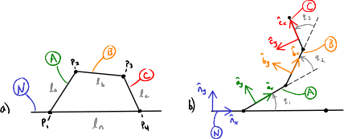

==============================================
Equations of Motion with Holonomic Constraints
==============================================

.. note::

   You can download this example as a Python script:
   :jupyter-download:script:`holonomic-eom` or Jupyter Notebook:
   :jupyter-download:notebook:`holonomic-eom`.

.. jupyter-execute::

   from IPython.display import HTML
   from matplotlib.animation import FuncAnimation
   from scipy.integrate import solve_ivp
   import matplotlib.pyplot as plt
   import numpy as np
   import sympy as sm
   import sympy.physics.mechanics as me

   me.init_vprinting(use_latex='mathjax')

When there are holonomic constraints present the equations of motion are
comprised of the kinematical differential equations :math:`\bar{f}_k`,
dynamical differential equations :math:`\bar{f}_d`, and the holonomic
constraint equations :math:`\bar{f}_h`. This set of equations are called
`differential algebraic equations`_ and the algebraic equations cannot be
solved for explicitly, as we did with the nonholonomic algebraic constraint
equations.

.. _differential algebraic equations: https://en.wikipedia.org/wiki/Differential-algebraic_system_of_equations

In a system such as this, there are :math:`N=n+M` total coordinates, with
:math:`n` generalized coordinates :math:`\bar{q}` and :math:`M` additional
dependent coordinates :math:`\bar{q}_r`. The holonomic constraints take this
form:

.. math::
   :label: eq-holonomic-constraints

   \bar{f}_h(\bar{q}, \bar{q}_r, t) = 0 \in \mathbb{R}^M

:math:`n` generalized speeds :math:`\bar{u}` and :math:`M` dependent speeds
:math:`\bar{u}_r` can be introduced using :math:`N` kinematical differential
equations.

.. math::

   \bar{f}_k(\dot{\bar{q}}, \dot{\bar{q}}_r, \bar{u}, \bar{u}_r, \bar{q}, \bar{q}_r, t)  = 0 \in \mathbb{R}^N \\

We can formulate the kinematical and dynamical equations of motion by
transforming the holonomic constraints into a function of generalized speeds.
These equations are then treated just like nonholonomic constraints described
in the previous Chp. :ref:`Equations of Motion with Nonholonomic Constraints`.

.. math::
   :label: eq-holonomic-constraints-dot

   \dot{\bar{f}}_h(\bar{u}, \bar{u}_r, \bar{q}, \bar{q}_r, t) =
   \mathbf{M}_{hd}\bar{u}_r + \bar{g}_{hd} = 0 \in \mathbb{R}^M

We can solve for :math:`M` dependent generalized speeds:

.. math::

   \bar{u}_r = -\mathbf{M}_{hd}^{-1} \bar{g}_{hd} \in \mathbb{R}^M

and then rewrite the kinematical and dynamical differential equations in terms
of the generalized speeds, their time derivatives, the generalized coordinates,
and the dependent coordinates.

.. math::
   :label: eq-holonomic-constrained-eom

   \bar{f}_k(\dot{\bar{q}}, \dot{\bar{q}}_r, \bar{u}, \bar{q}, \bar{q}_r, t)  = 0 \in \mathbb{R}^N \\
   \bar{f}_d(\dot{\bar{u}}, \bar{u}, \bar{q}, \bar{q}_r, t)  = 0 \in \mathbb{R}^n \\

This final set of equations has :math:`N+n` state variables and can be
integrated as a set of ordinary differential equations or the :math:`N+n+M`
equations can be integrated as a set of differential algebraic equations. We
will demonstrate the differences in the results if one or the other is done.

Four-bar Linkage Equations of Motion
====================================

To demonstrate the formulation of the equations of motion of a system with an
explicit holonomic constraints, let's revisit the four-bar linkage. We will now
make :math:`P_2` and :math:`P_3` particles, each with mass :math:`m` and
include the effects of gravity in the :math:`-\hat{n}_y` direction.

   a) Shows four links in a plane :math:`A`, :math:`B`, :math:`C`, and
   :math:`N` with respective lengths :math:`l_a,l_b,l_c,l_n` connected in a
   closed loop at points :math:`P_1,P_2,P_3,P_4`. b) Shows the same linkage
   that has been seperated at point :math:`P_4` to make it an open chain of
   links.

As before, we setup the system by disconnecting the kinematic loop at point
:math:`P_4` and then use this open loop to derive equations for the holonomic
constraints that close the loop.

1. Declare all of the variables
-------------------------------

We have three coordinates, only one of which is a generalized coordinate. I use
``q`` to hold the single generalized coordinate, ``qr`` for the two dependent
coordinates, and ``qN`` as a column vector to hold all the coordinates;
similarly for the generalized speeds.

.. jupyter-execute::

   q1, q2, q3 = me.dynamicsymbols('q1, q2, q3')
   u1, u2, u3 = me.dynamicsymbols('u1, u2, u3')
   la, lb, lc, ln = sm.symbols('l_a, l_b, l_c, l_n')
   m, g = sm.symbols('m, g')
   t = me.dynamicsymbols._t

   p = sm.Matrix([la, lb, lc, ln, m, g])

   q = sm.Matrix([q1])
   qr = sm.Matrix([q2, q3])
   qN = q.col_join(qr)

   u = sm.Matrix([u1])
   ur = sm.Matrix([u2, u3])
   uN = u.col_join(ur)

   qdN = qN.diff(t)
   ud = u.diff(t)

   p, q, qr, qN, u, ur, uN, qdN, ud

.. jupyter-execute::

   ur_zero = {ui: 0 for ui in ur}
   uN_zero = {ui: 0 for ui in uN}
   qdN_zero = {qdi: 0 for qdi in qdN}
   ud_zero = {udi: 0 for udi in ud}

2. Setup the open loop kinematics and holonomic constraints
-----------------------------------------------------------

Start by defining the orientation of the reference frames and positions of the
points in terms of the :math:`N=3` coordinates, leaving :math:`P_4`
unconstrained.

.. jupyter-execute::

   N = me.ReferenceFrame('N')
   A = me.ReferenceFrame('A')
   B = me.ReferenceFrame('B')
   C = me.ReferenceFrame('C')

   A.orient_axis(N, q1, N.z)
   B.orient_axis(A, q2, A.z)
   C.orient_axis(B, q3, B.z)

   P1 = me.Point('P1')
   P2 = me.Point('P2')
   P3 = me.Point('P3')
   P4 = me.Point('P4')

   P2.set_pos(P1, la*A.x)
   P3.set_pos(P2, lb*B.x)
   P4.set_pos(P3, lc*C.x)

3. Create the holonomic constraints
-----------------------------------

Now :math:`M=2` holonomic constraints can be found by closing the loop.

.. jupyter-execute::

   loop = P4.pos_from(P1) - ln*N.x

   fh = sm.Matrix([loop.dot(N.x), loop.dot(N.y)])
   fh = sm.trigsimp(fh)
   fh

.. warning::

   Be careful about using :external:py:func:`~sympy.trigsimp` on larger
   problems, as it can really slow down the calculations. It is not necessary
   to use, but I do so here so that the resulting equations are human readable
   in this context.

Note that these constraints are only a function of the :math:`N` coordinates.

.. jupyter-execute::

   me.find_dynamicsymbols(fh)

4. Specify the kinematical differential equations
-------------------------------------------------

Use simple definitions for the generalized speed :math:`u_1` and the dependent
speeds :math:`u_2` and :math:`u_3`. We create :math:`N=3` generalized speeds
even though the degrees of freedom are :math:`n=1`.

.. jupyter-execute::

   fk = sm.Matrix([
       q1.diff(t) - u1,
       q2.diff(t) - u2,
       q3.diff(t) - u3,
   ])
   Mk = fk.jacobian(qdN)
   gk = fk.xreplace(qdN_zero)
   qdN_sol = -Mk.LUsolve(gk)
   qd_repl = dict(zip(qdN, qdN_sol))
   qd_repl

5. Solve for the dependent speeds
---------------------------------

Differentiate the holonomic constraints with respect to time to arrive at a
motion constraint. This is equivalent to setting :math:`^{N}\bar{v}^{A_o}=0`.

.. jupyter-execute::

   fhd = fh.diff(t).xreplace(qd_repl)
   fhd = sm.trigsimp(fhd)
   fhd

These holonomic motion constraints are functions of the coordinates and speeds.

.. jupyter-execute::

   me.find_dynamicsymbols(fhd)

Choose :math:`u_2` and :math:`u_3` as the dependent speeds and solve the linear
equations for these depdendent speeds.

.. jupyter-execute::

   Mhd = fhd.jacobian(ur)
   ghd = fhd.xreplace(ur_zero)
   ur_sol = sm.trigsimp(-Mhd.LUsolve(ghd))
   ur_repl = dict(zip(ur, ur_sol))
   ur_repl

6. Write velocities in terms of the generalized speeds
------------------------------------------------------

We have three simple rotations and we can write the three angular velocities
only in terms of :math:`u_1` by using the expressions for the independent
speeds from the previous step.

.. jupyter-execute::

   A.set_ang_vel(N, u1*N.z)
   B.set_ang_vel(A, ur_repl[u2]*A.z)
   C.set_ang_vel(B, ur_repl[u3]*B.z)

Now, by using the two point velocity theorem the velocities of each point will
also only be in terms of :math:`u_1`.

.. jupyter-execute::

   P1.set_vel(N, 0)
   P2.v2pt_theory(P1, N, A)
   P3.v2pt_theory(P2, N, B)
   P4.v2pt_theory(P3, N, C)

   me.find_dynamicsymbols(P4.vel(N), reference_frame=N)

We'll also need the kinematical differential equations only in terms of the one
generalized speed, so replace the dependent speeds in :math:`\bar{g}_k`.

.. jupyter-execute::

   gk = gk.xreplace(ur_repl)

7. Form the generalized active forces
-------------------------------------

We have a holonomic system so the number of degrees of freedom is :math:`n=1`.
There are two particles that move and gravity acts on each of them, as a
contributing force. The resultant contributing forces on each of the particles
is:

.. jupyter-execute::

   R_P2 = -m*g*N.y
   R_P3 = -m*g*N.y

The partial velocities of each particle are easily found for the single
generalized speed and :math:`\bar{F}_r` is:

.. jupyter-execute::

   Fr = sm.Matrix([
       P2.vel(N).diff(u1, N).dot(R_P2) + P3.vel(N).diff(u1, N).dot(R_P3)
   ])
   Fr

Check to make sure our generalized active forces do not contain dependent speeds.

.. jupyter-execute::

   me.find_dynamicsymbols(Fr)

8. Form the generalized inertia forces
--------------------------------------

To calculate the generalized inertia forces we need the acceleration of each
particle. These should be only functions of :math:`\dot{u}_1,u_1`, and the
three coordinates. For :math:`P_2`, that is already true:

.. jupyter-execute::

   me.find_dynamicsymbols(P2.acc(N), reference_frame=N)

but for :math:`P_3` we need to make some substitutions:

.. jupyter-execute::

   me.find_dynamicsymbols(P3.acc(N), reference_frame=N)

Knowing that, the inertia resultants can be written as:

.. jupyter-execute::

   Rs_P2 = -m*P2.acc(N)
   Rs_P3 = -m*P3.acc(N).xreplace(qd_repl).xreplace(ur_repl)

and the generalized inertia forces can be formed and we can make sure they are
not functions of the dependent speeds.

.. jupyter-execute::

   Frs = sm.Matrix([
       P2.vel(N).diff(u1, N).dot(Rs_P2) + P3.vel(N).diff(u1, N).dot(Rs_P3)
   ])
   me.find_dynamicsymbols(Frs)

8. Equations of motion
----------------------

Finally, the matrix form of dynamical differential equations is found as we
have done before.

.. jupyter-execute::

   Md = Frs.jacobian(ud)
   gd = Frs.xreplace(ud_zero) + Fr

And we can check to make sure the dependent speeds have been elminated.

.. jupyter-execute::

   me.find_dynamicsymbols(Mk), me.find_dynamicsymbols(gk)

.. jupyter-execute::

   me.find_dynamicsymbols(Md), me.find_dynamicsymbols(gd)

Simulate without constraint enforcement
=======================================

The equations of motion are functions of all three coordinates, yet two of them
are dependent on the other, thus for the equations to be valid, coordinates
that satisfy the constraints must be supplied when evaluating the equations.
We have built in the constraints that the velocity and acceleration of point
:math:`P_4` must be zero, but the position constrain is not explicitly present.

.. jupyter-execute::

   eval_k = sm.lambdify((qN, u, p), (Mk, gk))
   eval_d = sm.lambdify((qN, u, p), (Md, gd))

.. jupyter-execute::

   def eval_rhs(t, x, p):

       qN = x[:3]
       u = x[3:]

       Mk, gk = eval_k(qN, u, p)
       qNd = -np.linalg.solve(Mk, np.squeeze(gk))

       # Md, gd, and ud are each 1x1
       Md, gd = eval_d(qN, u, p)
       ud = -np.linalg.solve(Md, gd)[0]

       return np.hstack((qNd, ud))

.. jupyter-execute::

   p_vals = np.array([
       0.8,  # la [m]
       2.0,  # lb [m]
       1.0,  # lc [m]
       2.0,  # ln [m]
       1.0,  # m [kg]
       9.81,  # g [m/s^2]
   ])

In general, :math:`\bar{f}_h` is nonlinear in all of the coordinates. We can
solve these equations for the dependent coordinates using numerical `root
finding methods`_. SciPy's :external:py:func:`~scipy.optimize.fsolve` function
is capable of finding the roots for nonlinear functions, given a good guess.

.. _root finding methods: https://en.wikipedia.org/wiki/Root-finding_algorithms

.. admonition:: Exercise

   There are most often multiple solutions for the dependent coordinates for a
   given value of the dependent coordinates.

We'll import ``fsolve`` directly.

.. jupyter-execute::

   from scipy.optimize import fsolve

``fsolve()`` requires a function that evaluates expressions that equal to zero
and a guess for the roots of that function, at a minimum. Our function should
evaluate the holonomic constraints given the dependent coordinates.

.. jupyter-execute::

   eval_fh = sm.lambdify((qr, q, p), fh)

.. jupyter-execute::

   q1_val = np.deg2rad(10.0)  # set the independent coordinate value
   q2_val, q3_val = fsolve(
       lambda qr, q, p: np.squeeze(eval_fh(qr, q, p)),  # squeeze to a 1d array
       np.deg2rad([10.0, -150]),  # initial guess for q2 and q3
       args=([q1_val], p_vals)) # known values in fh

Now we have values of the coordinates that satisfy the constraints.

.. jupyter-execute::

   qN_vals = np.array([q1_val, q2_val, q3_val])
   np.rad2deg(qN_vals)

.. jupyter-execute::

   eval_fh(qN_vals[1:], qN_vals[:1], p_vals)

.. jupyter-execute::

   u1_val = 0.0
   x0 = np.hstack((qN_vals, u1_val))
   t0, tf, fps = 0.0, 30.0, 20
   ts = np.linspace(t0, tf, num=int(fps*(tf - t0)))

With consistent coordinates the initial conditions can be set and
``eval_rhs()`` tested.

.. jupyter-execute::

   eval_rhs(t0, x0, p_vals)

The dependent initial conditions need to be solved before each simulation

.. jupyter-execute::

   def simulate(eval_rhs, t0, tf, fps, q1_0, u1_0, q2_0g, q3_0g, p):
       """Returns the simulation results.

       Parameters
       ==========
       eval_rhs : function
          Function that returns the derivatives of the states in the form:
          ``eval_rhs(t, x, p)``.
       t0 : float
          Initial time in seconds.
       tf : float
          Final time in seconds.
       fps : integer
          Number of "frames" per second to output.
       q1_0 : float
          Initial q1 angle in radians.
       u1_0 : float
          Initial u1 rate in radians/s.
       q2_0g : float
          Guess for the initial q2 angle in radians.
       q3_0g : float
          Guess for the initial q3 angle in radians.
       p : array_like, shape(6,)
          Constant parameters p = [la, lb, lc, ln, m, g].

       Returns
       =======
       ts : ndarray, shape(n,)
          Time values.
       xs : ndarray, shape(n, 4)
          State values at each time.
       con : ndarray, shape(n, 2)
          Constraint violations at each time in meters.

       """

       ts = np.linspace(t0, tf, num=int(fps*(tf - t0)))

       q2_val, q3_val = fsolve(
           lambda qr, q, p: np.squeeze(eval_fh(qr, q, p)),
           [q2_0g, q3_0g],
           args=([q1_0], p))
       x0 = np.array([q1_val, q2_val, q3_val, u1_0])

       sol = solve_ivp(eval_rhs,
                       (ts[0], ts[-1]),
                       x0,
                       args=(p_vals,),
                       t_eval=ts,
                       rtol=1e-3,
                       atol=1e-6)

       xs = np.transpose(sol.y)
       ts = sol.t

       con = []
       for xi in xs:  # xs is shape(n, 4)
          con.append(eval_fh(xi[1:3], xi[0:1], p_vals).squeeze())
       con = np.array(con)

       return ts, xs, con

.. jupyter-execute::

   def plot_results(ts, xs, con):
       """Returns the array of axes of a 4 panel plot of the state trajectory
       versus time.

       Parameters
       ==========
       ts : array_like, shape(n,)
          Values of time.
       xs : array_like, shape(n, 4)
          Values of the state trajectories corresponding to ``ts`` in order
          [q1, q2, q3, u1].
       con : array_like, shape(n, 2)
          x and y constraint violations of P4 at each time in ``ts``.

       Returns
       =======
       axes : ndarray, shape(3,)
          Matplotlib axes for each panel.

       """
       fig, axes = plt.subplots(3, 1, sharex=True)

       fig.set_size_inches((10.0, 6.0))

       axes[0].plot(ts, np.rad2deg(xs[:, :3]))  # q1(t), q2(t), q3(t)
       axes[1].plot(ts, np.rad2deg(xs[:, 3]))  # u1(t)
       axes[2].plot(ts, np.squeeze(con))  # fh(t)

       axes[0].legend(['$q_1$', '$q_2$', '$q_3$'])
       axes[1].legend(['$u_1$'])
       axes[2].legend([r'$\cdot\hat{n}_x$', r'$\cdot\hat{n}_y$'])

       axes[0].set_ylabel('Angle [deg]')
       axes[1].set_ylabel('Angular Rate [deg/s]')
       axes[2].set_ylabel('Distance [m]')
       axes[2].set_xlabel('Time [s]')

       fig.tight_layout()

       return axes

.. jupyter-execute::

   ts, xs, con = simulate(
       eval_rhs,
       t0=t0,
       tf=tf,
       fps=fps,
       q1_0=np.deg2rad(10.0),
       u1_0=0.0,
       q2_0g=np.deg2rad(10.0),
       q3_0g=np.deg2rad(-150.0),
       p=p_vals,
   )
   plot_results(ts, xs, con);

The linkage seems to simulate fine with realistic angle values, but the final
graph shows :math:`\bar{f}_h(t)`. Notice that the constraints are initially
satisfied but the constraints gradually become unsatisfied, with a maximum
violation of XX cm over the X seconds.

Animate the Motion
==================

We'll animate the four bar linkage multiple times so it is useful to create
some functions to for the repeated use. Start by creating a function that
evaluates the point locations, as we have done before.

.. jupyter-execute::

   coordinates = P2.pos_from(P1).to_matrix(N)
   for point in [P3, P4, P1, P2]:
      coordinates = coordinates.row_join(point.pos_from(P1).to_matrix(N))

   eval_point_coords = sm.lambdify((qN, p), coordinates)
   eval_point_coords(qN_vals, p_vals)

Now create a function that plots the initial configuration of the linkage and
returns any objects we may need in the animation code.

.. jupyter-execute::

   title_template = 'Time = {:1.2f} s'

   def setup_animation_plot(ts, xs, p):
       """Returns objects needed for the animation.

       Parameters
       ==========
       ts : array_like, shape(n,)
          Values of time.
       xs : array_like, shape(n, 4)
          Values of the state trajectories corresponding to ``ts`` in order
          [q1, q2, q3, u1].
       p : array_like, shape(6,)

       """

       x, y, z = eval_point_coords(xs[0, :3], p)

       fig, ax = plt.subplots()
       fig.set_size_inches((10.0, 10.0))
       ax.set_aspect('equal')
       ax.grid()

       lines, = ax.plot(x, y, color='black',
                        marker='o', markerfacecolor='blue', markersize=10)

       title_text = ax.set_title(title_template.format(ts[0]))
       ax.set_xlim((-1.0, 3.0))
       ax.set_ylim((-1.0, 1.0))
       ax.set_xlabel('$x$ [m]')
       ax.set_ylabel('$y$ [m]')

       return fig, ax, title_text, lines

   setup_animation_plot(ts, xs, p_vals);

Now we can create a function that initializes the plot, runs the animation and
displays the results in Jupyter.

.. jupyter-execute::

   def animate_linkage(ts, xs, p_vals):

       # setup the initial figure and axes
       fig, ax, title_text, lines = setup_animation_plot(ts, xs, p_vals)

       # precalculate all of the point coordinates
       coords = []
       for xi in xs:
           coords.append(eval_point_coords(xi[:3], p_vals))
       coords = np.array(coords)

       # define the animation update function
       def update(i):
           title_text.set_text(title_template.format(ts[i]))
           lines.set_data(coords[i, 0, :], coords[i, 1, :])

       # close figure to prevent premature display
       plt.close()

       # create and return the animation
       return FuncAnimation(fig, update, len(ts))

Now, keep an eye on :math:`P_4` during the animation of the simulation.

.. jupyter-execute::

   HTML(animate_linkage(ts, xs, p_vals).to_jshtml(fps=fps))

Correct Dependent Coordinates
=============================

Above we are relying on the integration of differential equations to generate
the coordinates. Because there is accumulated integration error in each state,
the constraints and nothing is enforcing the constraint among the coordinates,
the constraint violation grows with time and the point :math:`P_4` drifts from
its location. One way to try to address this is to correct the dependent
coordinates at each evaluation of the state derivatives. We can use
``fsolve()`` to do so, in the same way we solved for the initial conditions.
Below, I force the dependent coordinates to satisfy the constraints to the
default tolerance of ``fsolve()``.

.. jupyter-execute::

   def eval_rhs_fsolve(t, x, p):

       qN = x[:3]
       u = x[3:]

       # correct the depdendent coordinates
       qN[1:] = fsolve(lambda qr, q, p: np.squeeze(eval_fh(qr, q, p)),
                       qN[1:],  # guess with current solution for q2 and q3
                       args=(qN[:1], p_vals))

       Mk, gk = eval_k(qN, u, p)
       qNd = -np.linalg.solve(Mk, np.squeeze(gk))

       Md, gd = eval_d(qN, u, p)
       ud = -np.linalg.solve(Md, gd)[0]

       return np.hstack((qNd, ud))

Now we can simulate with the same integrator tolerances and see if it improves
the results.

.. jupyter-execute::

   ts_fsolve, xs_fsolve, con_fsolve = simulate(
       eval_rhs_fsolve,
       t0=t0,
       tf=tf,
       fps=fps,
       q1_0=np.deg2rad(10.0),
       u1_0=0.0,
       q2_0g=np.deg2rad(20.0),
       q3_0g=np.deg2rad(-150.0),
       p=p_vals,
   )

   plot_results(ts_fsolve, xs_fsolve, con_fsolve)

.. jupyter-execute::

   HTML(animate_linkage(ts, xs, p_vals).to_jshtml(fps=fps))

This result looks much improved. The motion is more consistency periodic and
the constraint violations do not grow over time. The constraint violations do
reach large values at some times but tighter integration tolerances can bring
those down in magnitude. A potential downside of this approach is that
``fsolve()`` can be a computationally costly function to run depending on the
complexity of the constraints and the desired solver tolerances. Fortunately,
there are dedicated differential algebraic equation solvers that apply more
efficient and accurate numerical methods to maintain the constraints in the
initial value problem.

Simulate using a DAE Solver
===========================

In the prior simulation, we we numerically solved for :math:`q_2` and
:math:`q_3` at each time step to provide a correction to those two variables.
This is effective, to some degree, but is a naive approach. There are more
robust and efficient numerical methods for correcting the state variables at
each time step. For example, the Sundials library includes the IDA_ solver for
solving the initial value problem of a set of differential algebraic equations.
`scikits.odes`_ provides a Python interface to many Sundials routines,
including IDA.

.. _IDA: https://sundials.readthedocs.io/en/latest/ida/
.. _scikits.odes: https://scikits-odes.readthedocs.io/en/stable/

To use scikits.odes solver, we need to write the equations of motion in
implicit form. In general, we can write the equations of motion of a holonomic
system with :math:`M` holonomic constraints and :math:`n` degrees of freedom as
this minimal set of equations:

.. math::
   :label: eq-dae-system

   \bar{f}_k(\dot{\bar{q}}, \bar{u}, \bar{q}, \bar{q}_r, t)  = 0 \in \mathbb{R}^n \\
   \bar{f}_d(\dot{\bar{u}}, \bar{u}, \bar{q}, \bar{q}_r, t)  = 0 \in \mathbb{R}^n \\
   \bar{f}_h(\bar{q}, \bar{q}_r, t) = 0 \in \mathbb{R}^M

This gives :math:`2n+M` equations in :math:`2n+M` state variables
:math:`\bar{u},\bar{q},\bar{q}_r`.

sckits.odes ``dae()`` is similar to ``solve_ivp()``, except it solves the
differential algebraic system. ``dae()`` works with the explicit form of the
equations, exactly as shown in Eq. :math:numref:`eq-dae-system`. We need to
build a function that returns the left hand side of the equations and we will
call the output of those equations the "residual", which should equate to zero
all times.

We will import the ``dae`` function directly, as that is all we need from
scikits.odes.

.. jupyter-execute::

   from scikits.odes import dae

We first need to create a residual function.
We first need to design a function that evaulates the left hand side of Eq.
:math:numref:`eq-dae-system` and it needs to have a specific function
signature. In addition to the arguments in ``eval_rhs()`` above, this function
needs the time derivative of the states and a vector to store the result in.

.. note::

   ``eval_eom()`` does not return a value. It only sets the individual values
   in the ``residual`` array. So if you run ``eval_eom()`` and check
   ``residual`` you will see it has changed.

.. jupyter-execute::

   def eval_eom(t, x, xd, residual, p):
       """Returns the residual vector of the equations of motion.

       Parameters
       ==========
       t : float
          Time at evaluation.
       x : ndarray, shape(4,)
          State vector at time t: x = [q1, q2, q3, u1].
       xd : ndarray, shape(4,)
          Time derivative of the state vector at time t: xd = [q1d, q2d, q3d, u1d].
       residual : ndarray, shape(4,)
          Vector to store the residuals in: residuals = [fk, fd, fh1, fh2].
       p : ndarray, shape(6,)
          Constant parameters: p = [la, lb, lc, ln, m, g]

       """

       q1, q2, q3, u1 = x
       q1d, _, _, u1d = xd

       Md, gd = eval_d([q1, q2, q3], [u1], p)

       residual[0] = -q1d + u1  # fk, float
       residual[1] = Md[0]*u1d + gd[0]  # fd, float
       residual[2:] = eval_fh([q2, q3], [q1], p).squeeze()  # fh, shape(2,)

We already have the initial state defined ``x0``, but we need to initialize the
time derivatives of the states. These must be consistent with the equations of
motion, including the constraints. In our case, :math:`u_1=0` so
:math:`\dot{q}_1,\dot{q}_2` and :math:`\dot{q}_3` will also be zero. But we do
need to solve :math:`\bar{f}_d` for the initial :math:`\dot{u}_1`.

.. jupyter-execute::

   Md_vals, gd_vals = eval_d(x0[:3], x0[3:], p_vals)

.. jupyter-execute::

   residual = np.empty(4)
   Md_vals, gd_vals = eval_d(qN_vals, [0.0], p_vals)
   xd0 = np.array([
      0.0,  # q1d [rad/s]
      0.0,  # q2d [rad/s]
      0.0,  # q3d [rad/s]
      -np.linalg.solve(Md_vals, gd_vals)[0],  # u1d [rad/s^2]
   ])
   xd0

Now I'll create an empty array to store the residual results in using
:external:py:func:`~numpy.empty`.

.. jupyter-execute::

   residual = np.empty(4)
   residual

With all of the arguments for ``eval_eom()`` prepared, we can see if it updates
the residual properly. We should get a residual of zero if we've set consistent
initial conditions.

.. jupyter-execute::

   eval_eom(t0, x0, xd0, residual, p_vals)
   residual

It looks like our functions works! Now we can integrate the differential
algebraic equations with the IDA integrator. We first intialize a solver with
the desired integrator parameters. I've set ``atol`` and ``rtol`` to be fairly
small here to see how well the integrator manages to enforce the constraints.
The ``first_step_size`` is set to ``1e-18`` as recommended from the
scikits.odes documentation, as DAE solvers often need very small first
integration steps. The ``algebraic_vars_idx`` argument is used to indicate
which indexes of ``residual`` correspond to the holonomic constraints. Lastly,
``old_api`` is set to false to use the newest solution outputs.

.. jupyter-execute::

   solver = dae('ida',
                lambda t, x, xd, res: eval_eom(t, x, xd, res, p_vals),
                #first_step_size=1e-18,
                rtol=1e-3,
                atol=1e-6,
                algebraic_vars_idx=[2, 3],
                old_api=False)

.. todo:: Here are were the options are listed https://github.com/bmcage/odes/blob/1e3b3324748f4665ee5a52ed1a6e0b7e6c05be7d/scikits/odes/sundials/ida.pyx#L848

To find a solution, the desired time array and the initial conditions are
provided to ``solve()``. The time and state values are stored in ``.values.t``
and ``.values.y``.

.. jupyter-execute::

   solution = solver.solve(ts, x0, xd0)
   ts_dae = solution.values.t
   xs_dae = solution.values.y

Now we can have a look at the results. The constraints are held to the order we
specified in the integrator options.

.. jupyter-execute::

   con_dae = []
   for xi in xs_dae:  # xs is shape(n, 4)
      con_dae.append(eval_fh(xi[1:3], xi[0:1], p_vals).squeeze())
   con_dae = np.array(con_dae)

.. jupyter-execute::

   plot_results(ts_dae, xs_dae, con_dae);

.. jupyter-execute::

   HTML(animate_linkage(ts_dae, xs_dae, p_vals).to_jshtml(fps=fps))

.. jupyter-execute::

   fig, ax = plt.subplots()
   fig.set_size_inches((10.0, 6.0))

   ax.plot(ts, xs[:, -1], 'C0',
           ts_fsolve, xs_fsolve[:, -1], 'C1',
           ts_dae, xs_dae[:, -1], 'C2')
   ax.legend(['solve_ivp', 'solve_ivp + fsolve', 'IDA'])
