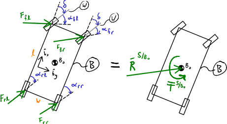

=========================
Force, Moment, and Torque
=========================

.. note::

   You can download this example as a Python script:
   :jupyter-download:script:`loads` or Jupyter Notebook:
   :jupyter-download:notebook:`loads`.

.. jupyter-execute::

   import sympy as sm
   import sympy.physics.mechanics as me
   me.init_vprinting(use_latex='mathjax')

Force
=====

A *force* is an abstraction we use to describe the thing that causes mass to
move (i.e. accelerate from a stationary state). There are four `fundamental
forces of nature`_ of which all other forces can be derived from. Moments and
torques can be described using forces and have analogous relationships as
particles have to a rigid body being made up of a set of particles spatially
fixed together. Forces, moments, and torques have magnitude and direction and
thus we use vectors to describe them mathematically.

.. _fundamental forces of nature: https://en.wikipedia.org/wiki/Force#Fundamental_forces

Bound and Free Vectors
======================

Vectors may have a *line of action*. A line of action is parallel to the vector
and passes through a particular point. If a vector has a line of action, it is
said to be *bound* to its line of action. If a vector is not bound to a line of
action it is said to be *free*.

Angular velocity is an example of a free vector. It has a direction and
magnitude, but is not associated with any line of action. A force vector, on
the other hand, is bound. If a force is applied to a rigid body, we must know
where on the body it is applied to resolve the force's effect. A force vector
acting on rigid body :math:`B` at point :math:`P` has a line of action through
:math:`P` and parallel to the force vector.

Moment
======

If a vector is a bound vector, then we can define its *moment* about a point.
The moment :math:`\bar{M}` of bound vector :math:`\bar{v}` about point
:math:`P` is a vector itself and is defined as ([Kane1985]_, pg 90):

.. math::
   :label: eq-moment-definition

   \bar{M} := \bar{r}^{L/P} \times \bar{v}

:math:`\bar{r}^{L/P}` is a position vector from :math:`P` to any point
:math:`L` on the line of action of :math:`\bar{v}`.

A moment can be the result of a set of vectors. The *resultant* of a set
:math:`S` of vectors :math:`\bar{v}_1,\ldots,\bar{v}_\nu` is defined as:

.. math::
   :label: eq-resultant-definition

   \bar{R}^{S} := \sum_{i=1}^{\nu} \bar{v}_i

If each vector in the resultant is bound, the sum of the moments due to each
vector about :math:`P` is call the moment of :math:`\bar{R}^{S}` about
:math:`P`.  This summation can be written as:

.. math::
   :label: eq-sum-moments

   \bar{M}^{S/P} = \sum_{i=1}^{\nu} \bar{r}^{L_i/P} \times \bar{v}_i

The moment of bound vectors :math:`S` about one point :math:`P` is related to
the moment about another point :math:`Q` by ([Kane1985_], pg. 91):

.. math::
   :label: eq-moment-another-point

   \bar{M}^{S/P} = \bar{M}^{S/Q} + \bar{r}^{P/Q} \times \bar{R}^{S/Q}

:math:`\bar{R}^{S/Q}` is the resultant of the set :math:`S` bound to a line of
action through :math:`Q`.

.. todo:: Show a figure here to represent the left and right sides of the
   equation.

Couple
======

A set of bound vectors with a resultant equal to zero is called a *couple*. A
couple can have as many vectors as desired or needed with a minimum number
being two, such that :math:`\bar{R}^{S}=0`. A couple composed of two vectors is
called a *simple couple*. :numref:`fig-force-couples` shows a few examples of
couples.

.. todo:: I started this caption with "a)" and that caused docutils to error
   and not recognize it as a caption.

.. _fig-force-couples:
.. figure:: figures/force-couples.svg
   :align: center

   Three couples: a) simple couple, b) & c) couples made up of multiple forces

The *torque* of a couple :math:`\bar{T}` is the moment of the couple about a
point. Because the resultant of a couple is zero, the torque of a couple is the
same about all points. The torque, being a moment, is also a vector.

Equivalence & Replacement
=========================

Two sets of bound vectors are *equivalent* when they have these two properties:

1. equal resultants
2. equal moments about *any* point

If 1. and 2. are true, the sets are said to be *replacements* of each other.
Couples that have equal torques are equivalent, because the resultants are zero
and moments about any point are equal to the torque.

Given a set of bound vectors :math:`S` and a set of bound vectors that consist
of a torque of a couple :math:`\bar{T}` and vector :math:`\bar{v}` bound to an
arbitrary point :math:`P` it is a necessary and sufficient condition that the
second set is a replacement of the first if ([Kane1985]_, pg 95):

.. math::
   :label: eq-couple-torque-repl

   \bar{T} = \bar{M}^{S/P} \\
   \bar{v} = \bar{R}^S

This means that every set of bound vectors can be replaced by an equivalent
torque of a couple and a single bound vector that is the resultant of the
replaced set. This replacement simplifies the description of forces acting on
bodies.

Take for example the birds eye view of a four wheeled car which has front
steering and motors at each wheel allowing for precise control of the
propulsion forces at each wheel. A diagram of the forces acting at each wheel
is shown in :numref:`fig-force-car-replacement`.

.. _fig-force-car-replacement:

   Forces acting at each tire replaced with a resultant and a torque.

.. todo:: The torque should probably not have :math:`B_o` in the superscript
   because it is the same about any point. But the moment is calculated about
   that point. Not sure the best notation.

   Add the length and width to figure.

.. jupyter-execute::

   l, w = sm.symbols('l, w')
   Ffl, Ffr, Frl, Frr = me.dynamicsymbols('F_{fl}, F_{fr}, F_{rl}, F_{rr}')
   alphafl, alphafr = me.dynamicsymbols(r'\alpha_{fl}, \alpha_{fr}')
   alpharl, alpharr = me.dynamicsymbols(r'\alpha_{rl}, \alpha_{rr}')
   delta = me.dynamicsymbols('delta')

With the symbols defined, I use some auxiliary reference frames to establish
the orientations with :math:`B` behind the car body, :math:`W` being the steered
front wheels, and the others to establish the direction of the force at each
wheel.

.. jupyter-execute::

   B = me.ReferenceFrame('B')
   W = me.ReferenceFrame('W')
   FR = me.ReferenceFrame('F_R')
   FL = me.ReferenceFrame('F_L')
   RR = me.ReferenceFrame('R_R')
   RL = me.ReferenceFrame('R_L')

   W.orient_axis(B, delta, B.z)
   FR.orient_axis(W, alphafr, W.z)
   FL.orient_axis(W, alphafl, W.z)
   RR.orient_axis(B, alpharr, B.z)
   RL.orient_axis(B, alpharl, B.z)

The resultant of the forces expressed in the :math:`B` frame is then:

.. jupyter-execute::

   R = Ffl*FL.x + Ffr*FR.x + Frl*RL.x + Frr*RR.x
   R.express(B).simplify()

This resultant is bound to a line of action through :math:`B_o`. The associated
couple is then calculated as the total moment about :math:`B_o`:

.. jupyter-execute::

   T = (me.cross(l/2*B.x - w/2*B.y, Ffl*FL.x) +
        me.cross(l/2*B.x + w/2*B.y, Ffr*FR.x) +
        me.cross(-l/2*B.x - w/2*B.y, Frl*RL.x) +
        me.cross(-l/2*B.x + w/2*B.y, Frr*RR.x))
   T = T.express(B).simplify()
   T

Since we can always describe the forces acting on a rigid body as a resultant
force and an associate torque of a couple, we will often take advantage of this
simpler form for constructing models.

Specifying Forces and Torques
=============================

Forces are bound vectors that can be considered acting on specific points, thus
we will always need a vector and a point to fully describe the force. Methods
and functions in SymPy Mechanics that make use of forces will typically require
a tuple containing a point and a vector, for example the resultant force
:math:`R^{B/B_o}` acting on the mass center of the car would be specified like
so:

.. jupyter-execute::

   Bo = me.Point('Bo')
   force = (Bo, R)
   force

Torques of a couple are free vectors (not bound to a line of action) but
represent a couple acting on a rigid body, thus a reference frame associated
with a rigid body and the vector representing the torque will be used to
describe the torque in SymPy Mechanics. For example:

.. jupyter-execute::

   torque = (B, T)
   torque

We will often refer to forces and torques collectively as *loads*.

.. todo:: Open an issue in SymPy about these tuples not rendering as typeset
   math.

Equal & Opposite
================

Both forces and torques applied to a multibody system must obey `Newton's Third
Law`_, i.e. that forces and torques act equal and opposite. Take for example a
torque from a motor that causes a pinned lever :math:`B` to rotate relative to
the ground :math:`N` shown in :numref:`fig-force-equal-opposite`. The motor
torque occurs between the ground and the lever (or more precisely the stator
and the rotor which are fixed to the ground and the lever). A sign convention
must be chosen for the equal and opposite torque.

.. _fig-force-equal-opposite:

   A motor stator :math:`N` fixed to ground with an arm fixed to the motor
   rotor :math:`B` shown as one unit in a) and as seperate bodies in b) with
   equal and opposite torque vectors applied to the pair of bodies representing
   the torque of a couple generated by the motor. We've arbitrarily selected a
   the sign convention shown, i.e. a positive value of torque applies a postive
   torque to :math:`B` and a negative torque to :math:`N` if the torque is
   parallel to :math:`\hat{n}_z=\hat{b}_z`.

.. _Newton's Third Law: https://en.wikipedia.org/wiki/Newton's_laws_of_motion#Third_law

The motor torque can be specified as a time varying vector:

.. jupyter-execute::

   T, q = me.dynamicsymbols('T, q')

   N = me.ReferenceFrame('N')
   B = me.ReferenceFrame('B')

   Tm = T*N.z

Then the equal and opposite torques are captured by these two tuples:

.. jupyter-execute::

   (B, Tm), (N, -Tm)

with equal and opposite torques applied to each body.

.. warning::

   Careful about your sign convention. It is equally valid to choose `(B, -Tm),
   (N, Tm)`. But it is useful to choose a sign convention such that when the
   signs of angular velocity and torque are the same it corresponds to power
   into the system (from the motor in this case). So `B.orient_axis(N, q, N.z)`
   corresponds to `(T*N.z, B)` to power in with both are positive or both are
   negative. This is just a convention though and the choice of force and
   torque signs can be anything, just make sure you know and understand what it
   is!

Contributing and Non-contributing Forces
========================================

*Contributing forces* are those that do work on the multibody system. Work_ of
a force :math:`\bar{F}` acting over path :math:`S` is defined as:

.. math::
   :label: eq-work-definition

   W = \int_S \bar{F} \cdot d\bar{s}

where :math:`d\bar{s}` is the differential vector tangent to the path at the
point the force is applied.

.. _work: https://en.wikipedia.org/wiki/Work_(physics)

For example, the gravitational force acting on a particle moving through a
unidirectional constant gravitational field (i.e. graviational force is equal
in magnitude, doesn't change, and always the same direction) does work on the
system.

*Non-contributing forces* do no work on the system. For example, when a force
acts between two points that have no relative motion, no work is done. Examples
of non-contributing forces:

a. contact forces on particles across smooth (frictionless) surfaces of rigid
   bodies
b. any internal contact and body (distance) forces between any two points in a
   rigid body
c. contact forces between bodies rolling without slipping on each other (special
   case of a.)

Later we will see how generalized coordinates relieve us from having to specify
an non-contributing forces.

Gravity
=======

We will often be interested in a multibody systems motion when it is subject to
gravitational forces. The simplest case is a constant unidirectional
gravitational field, which is appropriate model for objects moving on and near
the Earth's surface. The gravitational forces can be applied solely to the mass
centers of each rigid body in a multibody system as a resultant force. The
gravitational torque on the bodies is zero because the force is equal in
magnitude for each particle in the body. See [Kane1985]_ pg. 110 for the more
general case of `Newton's Law of Universal Gravitation`_ where this is not the
case. Studies of spacecraft dynamics often require considering both gravitational
forces and moments.

.. _Newton's Law of Universal Gravitation: https://en.wikipedia.org/wiki/Newton's_law_of_universal_gravitation

In SymPy Mechanics, a gravitational force acting on a particle of mass
:math:`m` with acceleration due to gravity being :math:`g` in the
:math:`-\hat{n}_y` direction would take this form:

.. jupyter-execute::

   m, g = sm.symbols('m, g')
   Fg = -m*g*N.y
   Fg

Springs & Dampers
=================

Idealized springs and dampers are useful models of elements that have distance
and velocity dependent forces and torques. A spring with free length
:math:`q_0` and where :math:`q_1,q_2` locate the ends of the spring along a
line parallel to the :math:`\hat{n}_x`.

If we displace :math:`P` in the positive :math:`\hat{n}_x` direction the spring
will apply a force in the negative :math:`\hat{n}_x` direction on point
:math:`P`. So we chose a sign convention that the force on :math:`P` from the
spring is opposite the direction of the displacement.

.. _fig-force-spring:
.. figure:: figures/force-spring.svg
   :align: center

   Diagram of a spring.

If the spring is linear with stiffness :math:`k` the spring force vector is
then:

.. jupyter-execute::

   q0, k = sm.symbols('q0, k')
   q1, q2 = me.dynamicsymbols('q1, q2')

   displacement = q2 - q1 - q0
   displacement

Here a positive displacement represents the spring in tension and a negative
displacement is compression.

.. jupyter-execute::

   Fs = -k*displacement*N.x
   Fs

Similarly, a linear damping force with damping coefficient :math:`c` is defined
as:

.. jupyter-execute::

   c = sm.symbols('c')
   t = me.dynamicsymbols._t

   Fc = -c*displacement.diff(t)*N.x
   Fc

Aerodynamic Drag
================

Aerodynamic drag_ of a blunt body is dominated by the frontal area drag and the
magnitude of this drag force can be modeled with the following equation:

.. math::
   :label: eq-aerodynamic-drag

   \frac{1}{2}\rho C_dAv^2

where :math:`\rho` is the density of the air, :math:`C_d` is the drag
coefficient, :math:`A` is the frontal area, and :math:`v` is the air speed
relative to the body.

.. _drag: https://en.wikipedia.org/wiki/Drag_(physics)

If a body is moving in still air at an arbitrary velocity and point :math:`P`
is the aerodynamic center of the body then the aerodynamic drag force vector
that opposes the motion can be found with such an equation:

.. jupyter-execute::

   A, Cd, rho = sm.symbols('A, C_d, rho')
   ux, uy, uz = me.dynamicsymbols('u_x, u_y, u_z', real=True)

   N_v_P = ux*N.x + uy*N.y + uz*N.z

   Fd = -N_v_P.normalize()*Cd*A*rho/2*N_v_P.dot(N_v_P)
   Fd

If the motion is only along the :math:`\hat{n}_x` direction, for example, the
equation for the drag force vector reduces to:

.. jupyter-execute::

   Fd.xreplace({uy: 0, uz:0})

Friction
========

Coulomb's Law provides a simple model of dry friction_ between two objects. It
takes the scalar form:

.. math::
   :label: eq-coulomb-friction

   F_f =
   \begin{cases}
   \mu F_N & v < 0 \\
   0 & v = 0 \\
   -\mu F_N & v > 0
   \end{cases}

where :math:`F_N` is the normal force between the two objects, :math:`v` is the
relative speed between the two objects, and :math:`\mu` is the coefficient of
friction.

.. _friction: https://en.wikipedia.org/wiki/Friction

SymPy's :external:py:class:`~sympy.functions.elementary.piecewise.Piecewise` is
one way to create a symbolic representation of this function:

.. jupyter-execute::

   mu, m, g = sm.symbols('mu, m, g')

   Fn = m*g

   displacement = q2 - q1

   Ff = sm.Piecewise((mu*Fn, displacement.diff(t) < 0),
                     (-mu*Fn, displacement.diff(t) > 0),
                     (0, True))*N.x
   Ff

The `signum function`_
(:external:py:function:`~sympy.functions.elementary.complexes.sign`) can also
be used in a similar and simpler form:

.. _signum function: https://en.wikipedia.org/wiki/Sign_function

.. jupyter-execute::

   Ff = -mu*Fn*sm.sign(displacement.diff(t))*N.x
   Ff

Collision
=========

If two points, a point and a surface, or two surfaces collide the impact
behavior depends on the material properties and mass of the colliding bodies.
In general, elastic and inelastic momentum balances for just before and after
impact can be solved for the multibody system. This will be introduced in a
later chapter. For a simpler but, as we will learn, often less favorable for
numerical evaluation approach. Impact can be captured by creating a stiff
spring that only engages if one body penetrates the other body. Some viscous
damping can be included to capture the inelastic aspects.

.. _fig-force-collision:

   Particle :math:`P` colliding with a surface.

For example, if modeling a particle :math:`P` that impacts a surface normal to
:math:`\hat{n}_z` that contains point :math:`O` the penetration of the particle
into the surface (if positive :math:`z` is out and negative :math:`z` is inside
the surface) can be described with:

.. math::
   :label: eq-penetration

   z_p = \frac{| \bar{r}^{P/O} \cdot \hat{n}_z | - \bar{r}^{P/O} \cdot \hat{n}_z}{2}

This is equivalent to a piecewise function that is zero if the particle is above
the surface and is the penetration distance if below the surface.

.. jupyter-execute::

   x, y, z = me.dynamicsymbols('x, y, z', real=True)

   r_O_P = x*N.x + y*N.y + z*N.z

   zh = r_O_P.dot(N.z)

   zp = (sm.Abs(zh) - zh)/2
   zp

A nonlinear spring, for example one that is proportional to :math:`z_p^3` will
give more stiffness the more penetration. Combining with some viscous damping
the vertical force on :math:`P` is:

.. jupyter-execute::

   k, c = sm.symbols('k, c')

   Fz = (k*zp**3 + c*zp.diff(t))*N.z
   Fz

A Coulomb friction force can slow the particle's sliding on the surface:

.. jupyter-execute::

   mu = sm.symbols('mu')

   vx = r_O_P.dot(N.x).diff(t)
   vy = r_O_P.dot(N.y).diff(t)

   Fx = -sm.Abs(vx)/vx*mu*Fz.dot(N.z)*N.x
   Fy = -sm.Abs(vy)/vy*mu*Fz.dot(N.z)*N.y
   Fx, Fy

These measure numbers for the force vector then evaluate to zero when there is
no penetration :math:`z_p` and evaluates to a spring and damper and Coulomb
friction when there is.

.. todo:: This needs some work, the first one should evaluate to zero.

.. jupyter-execute::

   vz = me.dynamicsymbols('v_z', negative=True)

   repl = {z.diff(): vz, z: 0}

   Fx.xreplace(repl), Fy.xreplace(repl), Fz.xreplace(repl)

.. jupyter-execute::

   repl = {z.diff(): vz, z: 2}

   Fx.xreplace(repl), Fy.xreplace(repl), Fz.xreplace(repl)

.. jupyter-execute::

   repl = {z.diff(): vz, z: -2}

   Fx.xreplace(repl), Fy.xreplace(repl), Fz.xreplace(repl)

Finally, the force on the particle can be fully described:

.. todo:: This fails to render.

.. jupyter-execute::

   #Fc = Fx*N.x + Fy*N.y + Fz*N.z
   #Fc
