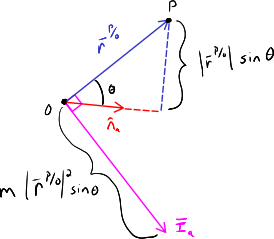

=================
Mass Distribution
=================

.. note::

   You can download this example as a Python script:
   :jupyter-download-script:`mass` or Jupyter Notebook:
   :jupyter-download-notebook:`mass`.

Learning Objectives
===================

After completing this chapter readers will be able to:

- calculate the mass, mass center, and inertia of a set of particles
- use inertia vectors to find inertia scalars of a set of particles
- formulate an inertia matrix for a set of particles
- use a dyadic to manipulate 2nd order tensors in multiple reference frames
- calculate the inertia dyadic of a set of particles
- apply the parallel axis theorem
- calculate the principal moments of inertia and the principal axes
- calculate angular momentum of a rigid body

.. jupyter-execute::

   import sympy as sm
   import sympy.physics.mechanics as me
   me.init_vprinting(use_latex='mathjax')

.. container:: invisible

   .. jupyter-execute::

      class ReferenceFrame(me.ReferenceFrame):

          def __init__(self, *args, **kwargs):

              kwargs.pop('latexs', None)

              lab = args[0].lower()
              tex = r'\hat{{{}}}_{}'

              super(ReferenceFrame, self).__init__(*args,
                                                   latexs=(tex.format(lab, 'x'),
                                                           tex.format(lab, 'y'),
                                                           tex.format(lab, 'z')),
                                                   **kwargs)
      me.ReferenceFrame = ReferenceFrame

In the prior chapters, we have developed the tools to formulate the kinematics
of points and reference frames. The kinematics are the first of three essential
parts needed to form the equations of motion of a multibody system; the other
two being the mass distribution of and the forces acting on the system.

When a point is associated with a particle of mass :math:`m` or a reference
frame is associated with a rigid body that has some mass distribution,
`Newton's`_ and `Euler's`_ second laws of motion show that the time rate of
change of the linear and angular momenta must be equal to the forces and
torques acting on the particle or rigid body, respectively. The momentum of a
particle is determined by its mass and velocity and the angular momentum of a
rigid body is determined by the distribution of mass and its angular velocity.
In this chapter, we will introduce mass and its distribution.

.. _Newton's: https://en.wikipedia.org/wiki/Newton%27s_laws_of_motion
.. _Euler's: https://en.wikipedia.org/wiki/Euler%27s_laws_of_motion

Particles and Rigid Bodies
==========================

We will introduce and use the concepts of particles and rigid bodies in this
chapter. Both are abstractions of real translating and rotating objects.
Particles are points that have a location in Euclidean space which have a
volumetrically infinitesimal mass. Rigid bodies are reference frames that have
orientation which have an associated continuous distribution of mass. The
distribution of mass can be thought of as a infinite collection of points
distributed in a finite volumetric boundary. All of the points distributed in
the volume are fixed to one another and translate together.

For example, an airplane can be modeled as a rigid body when one is concerned
with both its translation and orientation. This could be useful when
investigating its minimum turn radii and banking angle. But it could also be
modeled as a particle when one is only concerned with its translation; for
example when you observing the motion of the airplane from a location outside
the Earth's atmosphere.

Mass
====

Given a set of :math:`\nu` particles with masses :math:`m_1,\ldots,m_\nu` the
total mass, or *zeroth moment of mass*, of the set is defined as:

.. math::
   :label: eq-zeroth-moment

   m := \sum_{i=1}^\nu m_i

.. admonition:: Exercise

   What is the mass of an object made up of two particles of mass :math:`m` and
   a rigid body with mass :math:`m/2`?

.. admonition:: Solution
   :class: dropdown

   .. jupyter-execute::

      m = sm.symbols('m')

      m_total = m + m + m/2
      m_total

For a rigid body consisting of a solid with a density :math:`\rho` defined at
each point within its volumetric :math:`V` boundary, the total mass becomes an
integral of the general form:

.. math::
   :label: eq-zeroth-moment-rigid-body

   m := \int_{\textrm{solid}} \rho dV

.. admonition:: Exercise

   What is the mass of a cone with uniform density :math:`\rho`, radius
   :math:`r`, and height :math:`h`?

.. admonition:: Solution
   :class: dropdown

   Using cylindrical coordinates to write :math:`dV=r \mathrm{d}z
   \mathrm{d}\theta \mathrm{d}r`,
   :external:py:func:`~sympy.integrals.integrals.integrate` function can solve
   the triple integral:

   .. math::

      \int_0^h  \int_0^{2\pi} \int_0^{\frac{r}{h}z} \rho r \mathrm{d}{z} \mathrm{d}{\theta} \mathrm{d}r

   .. jupyter-execute::

      p, r, h, z, theta = sm.symbols('rho, r, h, z, theta')

      sm.integrate(p*r, (r, 0, r/h*z), (theta, 0, 2*sm.pi), (z, 0, h))

Mass Center
===========

If each particle in a set of :math:`S` particles is located at positions
:math:`\bar{r}^{P_i/O},\ldots,\bar{r}^{P_\nu/O}` the *first moment of mass* is
defined as:

.. math::
   :label: eq-first-moment

   \sum_{i=1}^\nu m_i \bar{r}^{P_i/O}\textrm{.}

There is then a point :math:`S_o` in which the first mass moment is equal to
zero; fulfilling the following equation:

.. math::
   :label: eq-first-moment-zero

   \sum_{i=1}^\nu m_i \bar{r}^{P_i/S_o} = 0\textrm{.}

This point :math:`S_o` is referred to as the *mass center* (or *center of
mass*) of the set of particles. The mass center's position can be found by
dividing the first moment of mass by the zeroth moment of mass:

.. math::
   :label: mass-center-particles

   \bar{r}^{S_o/O} = \frac{ \sum_{i=1}^\nu m_i \bar{r}^{P_i/O} }{\sum_{i=1}^\nu m_i}\textrm{.}

which is the first moment divided by the zeroth moment. For a solid body, this
takes the integral form:

.. math::
   :label: mass-center-rigid-body

   \bar{r}^{S_o/O} = \frac{ \int_{\textrm{solid}} \rho \bar{r} dV }{ \int_{\textrm{solid}} \rho dV }

The particle form (Eq. :math:numref:`mass-center-particles`) can be calculated
using vectors and scalars in SymPy Mechanics. Here is an example of three
particles each at an arbitrary location relative to :math:`O`:

.. jupyter-execute::

   m1, m2, m3 = sm.symbols('m1, m2, m3')
   x1, x2, x3 = me.dynamicsymbols('x1, x2, x3')
   y1, y2, y3 = me.dynamicsymbols('y1, y2, y3')
   z1, z2, z3 = me.dynamicsymbols('z1, z2, z3')

   A = me.ReferenceFrame('A')

   zeroth_moment = (m1 + m2 + m3)

   first_moment = (m1*(x1*A.x + y1*A.y + z1*A.z) +
                   m2*(x2*A.x + y2*A.y + z2*A.z) +
                   m3*(x3*A.x + y3*A.y + z3*A.z))
   first_moment

.. jupyter-execute::

   r_O_So =  first_moment/zeroth_moment
   r_O_So

.. admonition:: Exercise

   If :math:`m_2=2m_1` and :math:`m_3=3m_1` in the above example, find the mass
   center.

.. admonition:: Solution
   :class: dropdown

   .. jupyter-execute::

      r_O_So.xreplace({m2: 2*m1, m3: 3*m1}).simplify()

Distribution of Mass
====================

The inertia, or second moment of mass, describes the distribution of mass
relative to a point about an axis. Inertia characterizes the resistance to
angular acceleration in the same way that mass characterizes the resistance to
linear acceleration. For a set of particles :math:`P_1,\ldots,P_\nu` with
positions :math:`\bar{r}^{P_1/O},\ldots,\bar{r}^{P_\nu/O}` all relative to a
point :math:`O`, the *inertia vector* about the unit vector :math:`\hat{n}_a`
is defined as ([Kane1985]_, pg. 61):

.. math::
   :label: inertia-vector-particles

   \bar{I}_a := \sum_{i=1}^\nu m_i \bar{r}^{P_i/O} \times \left( \hat{n}_a \times
   \bar{r}^{P_i/O}  \right)

.. todo:: Add the rigid body form of the inertia vector.

This vector describes the sum of each mass's contribution to the mass
distribution about a line that is parallel to :math:`\hat{n}_a` and passes
through :math:`O`. Figure :numref:`fig-mass-inertia-vector` shows a visual
representation of this vector for a single particle :math:`P` with mass
:math:`m`.

.. _fig-mass-inertia-vector:

   Inertia vector for a single particle :math:`P` of mass :math:`m` and its
   relationship to :math:`\hat{n}_a`.

For this single particle, the magnitude of :math:`\bar{I}_a` is:

.. math::
   :label: inertia-vector-magnitude

   \left| \bar{I}_a \right| = m \left| \bar{r}^{P/O} \right| ^2 | \sin\theta |

where :math:`\theta` is angle between :math:`\bar{r}^{P/O}` and
:math:`\hat{n}_a`. We see that :math:`\bar{I}_a` is always perpendicular to
:math:`\bar{r}^{P/O}` and scales with :math:`m`, :math:`| \bar{r}^{P/O} |^2`,
and :math:`\sin\theta`. If :math:`\hat{n}_a` happens to be parallel to
:math:`\bar{r}^{P/O}` then the magnitude of :math:`\bar{I}_a` is zero. If
:math:`\hat{n}_a` is perpendicular to :math:`\bar{r}^{P/O}` then the magnitude
is:

.. math::
   :label: intertia-vector-magnitude-perp

   \left| \bar{I}_a \right| = m \left| \bar{r}^{P/O} \right| ^2

The inertia vector fully describes the distribution of the particles with
respect to :math:`O` about :math:`\hat{n}_a`.

A component of :math:`\bar{I}_a` in the :math:`\hat{n}_b` direction is called
an *inertia scalar* and is defined as ([Kane1985]_, pg. 62):

.. math::
   :label: inertia-scalar

   I_{ab} := \bar{I}_{a} \cdot \hat{n}_b

The inertia scalar can be rewritten using Eq.
:math:numref:`inertia-vector-particles` as:

.. math::
   :label: eq-product-of-inertia

   I_{ab} =
   \sum_{i=1}^\nu m_i
   \left( \bar{r}^{P_i/O} \times \hat{n}_a \right)
   \cdot
   \left( \bar{r}^{P_i/O} \times \hat{n}_b \right)\textrm{.}

This form implies that:

.. math::
   :label: eq-product-of-inertia-equivalence

   I_{ab} = I_{ba}

If :math:`\hat{n}_a = \hat{n}_b` then this inertia scalar is called a *moment
of inertia* and if :math:`\hat{n}_a \neq \hat{n}_b` it is called a *product of
inertia*. Moments of inertia describe the mass distribution about a single axis
whereas products of inertia describe the mass distribution relative to two
axes.

When :math:`\hat{n}_a = \hat{n}_b` Eq. :math:numref:`eq-product-of-inertia`
reduces to the moment of inertia:

.. math::
   :label: eq-moment-of-inertia

   I_{aa} =
   \sum_{i=1}^\nu m_i
   \left( \bar{r}^{P_i/O} \times \hat{n}_a \right) \cdot
   \left( \bar{r}^{P_i/O} \times \hat{n}_a \right)

It is common to define the *radius of gyration* :math:`k_{aa}`, which is the
radius of a ring that has the same moment of inertia as the set of particles or
rigid body. The radius of gyration about a line through :math:`O` parallel to
:math:`\hat{n}_a` is defined as:

.. math::

   k_{aa} := \sqrt{\frac{I_{aa}}{m}}

.. admonition:: Exercise

   Three masses of :math:`m`, :math:`2m`, and :math:`3m` slide on a ring of
   radius :math:`r`. Mass :math:`3m` always lies :math:`\pi/6` anitclockwise
   from :math:`m` and mass :math:`2m` always lies :math:`\pi/7` clockwise from
   :math:`m`. Find the acute angle from the line from the ring center to
   :math:`m` to a line tangent to the ring at point :math:`O` which minimizes
   the total radius of gyration of all three masses about the line tangent to
   the ring.

   .. _fig-mass-ring:
   .. figure:: figures/mass-ring.svg
      :align: center
      :width: 50%

.. admonition:: Solution
   :class: dropdown

   Define the necessary variables, including :math:`\theta` to locate mass
   :math:`m`.

   .. jupyter-execute::

      m, r, theta = sm.symbols('m, r, theta')
      A = me.ReferenceFrame('A')

   Create position vectors to each of the masses:

   .. jupyter-execute::

      r_O_m = (r + r*sm.sin(theta))*A.x + r*sm.cos(theta)*A.y
      r_O_2m = (r + r*sm.sin(theta + sm.pi/7))*A.x + r*sm.cos(theta + sm.pi/7)*A.y
      r_O_3m = (r + r*sm.sin(theta - sm.pi/6))*A.x + r*sm.cos(theta - sm.pi/6)*A.y

   Create the inertia scalar for a moment of inertia about the point :math:`O`
   and :math:`\hat{a}_y`.

   .. jupyter-execute::

      Iyy = (m*me.dot(r_O_m.cross(A.y), r_O_m.cross(A.y)) +
             2*m*me.dot(r_O_2m.cross(A.y), r_O_2m.cross(A.y)) +
             3*m*me.dot(r_O_3m.cross(A.y), r_O_3m.cross(A.y)))
      Iyy

   Recognizing that the radius of gyration is minimized when the moment of
   inertia is minimized, we can take the derivative of the moment of inertia
   with respect to :math:`\theta` and set that equal to zero.

   .. jupyter-execute::

      dIyydtheta = sm.simplify(Iyy.diff(theta))
      dIyydtheta

   We can divide through by :math:`mr^2` and solve numerically for
   :math:`\theta` since it is the only variable present in the expression.

   .. jupyter-execute::

      theta_sol = sm.nsolve((dIyydtheta/m/r**2).evalf(), theta, 0)
      theta_sol

   In degrees that is:

   .. jupyter-execute::

      import math

      theta_sol*180/math.pi

   The :external:py:func:`~sympy.plotting.plot.plot` function can make quick
   plots of single variate functions. Here we see that rotating the set of
   masses around the ring will maximize and minimize the radius of gyration
   and that our solution is a minima. :math:`m=r=1` was selected so we could
   plot only as a function of :math:`\theta`.

   .. jupyter-execute::

      kyy = sm.sqrt(Iyy/m)
      kyy

   .. jupyter-execute::

      sm.plot(kyy.xreplace({m: 1, r: 1}));

   .. jupyter-execute::

      kyy.xreplace({m: 1, r: 1, theta: theta_sol}).evalf()

Inertia Matrix
==============

For mutually perpendicular unit vectors fixed in reference frame :math:`A`, the
moments of inertia with respect to :math:`O` about each unit vector and the
products of inertia among the pairs of perpendicular unit vectors can be
computed using the inertia vector expressions in the prior section. This, in
general, results in nine inertia scalars (6 unique scalars because of
:math:numref:`eq-product-of-inertia-equivalence`) that describe the mass
distribution of a set of particles or a rigid body in 3D space. These scalars
are typically presented as a symmetric *inertia matrix* (also called an
*inertia tensor*) that takes this form:

.. math::
   :label: eq-inertia-matrix

   \begin{bmatrix}
    I_{xx} & I_{xy} & I_{xz} \\
    I_{yx} & I_{yy} & I_{yz} \\
    I_{zx} & I_{zy} & I_{zz}
   \end{bmatrix}_A

where the moments of inertia are on the diagonal and the products of inertia
are the off diagonal entries. Eq.
:math:numref:`eq-product-of-inertia-equivalence` holds for the products of
inertia, i.e. :math:`I_{xy}=I_{yx}`, :math:`I_{xz}=I_{zx}`, and
:math:`I_{yz}=I_{zy}`, and the subscript :math:`A` indicates that these scalars
are relative to unit vectors :math:`\hat{a}_x,\hat{a}_y,\hat{a}_z`.

This matrix (or second order tensor) is similar to the vectors (or first order
tensors) we've already worked with:

.. math::
   :label: eq-column-vector

   \begin{bmatrix}
   v_1 \\
   v_2 \\
   v_3
   \end{bmatrix}_A

Recall that we have a notation for writing such a vector that allows us to
combine components expressed in different reference frames:

.. math::

   v_1\hat{a}_x + v_2\hat{a}_y + v_3\hat{a}_z

There also exists an analogous form for second order tensors that are
associated with different reference frames called a dyadic_.

.. _dyadic: https://en.wikipedia.org/wiki/Dyadics

.. todo:: Maybe a problem that asks them to balance an unbalanced inertia.
   Place a point mass somewhere that results in no products of inertia. Could
   ask to add a mass to the ring above that ensures all products of inertia are
   zero.

Dyadics
=======

If we introduce the `outer product`_ operator between two vectors we see that
it generates a matrix akin to the inertia matrix above.

.. math::
   :label: eq-vector-outer-product

   \begin{bmatrix}
   v_1 \\ v_2 \\ v_3
   \end{bmatrix}_A
   \otimes
   \begin{bmatrix}
     w_1 \\ w_2 \\ w_3
   \end{bmatrix}_A
   =
   \begin{bmatrix}
   v_1w_1 & v_1w_2 & v_1w_3 \\
   v_2w_1 & v_2w_2 & v_2w_3 \\
   v_3w_1 & v_3w_2 & v_3w_3 \\
   \end{bmatrix}_A

.. _outer product: https://en.wikipedia.org/wiki/Outer_product

In SymPy Mechanics outer products can be taken between two vectors to create
the dyadic :math:`\breve{Q}` using
:external:py:func:`~sympy.physics.vector.functions.outer`:

.. jupyter-execute::

   v1, v2, v3 = sm.symbols('v1, v2, v3')
   w1, w2, w3 = sm.symbols('w1, w2, w3')

   A = me.ReferenceFrame('A')

   v = v1*A.x + v2*A.y + v3*A.z
   w = w1*A.x + w2*A.y + w3*A.z

   Q = me.outer(v, w)
   Q

The result is not the matrix form shown in Eq.
:math:numref:`eq-vector-outer-product`, but instead the result is a dyadic. The
dyadic is the analogous form for second order tensors as what we've been using
for first order tensors. If the matrix form is needed, it can be found with
:external:py:meth:`~sympy.physics.vector.dyadic.Dyadic.to_matrix`:

.. jupyter-execute::

   Q.to_matrix(A)

The dyadic is made up of scalars multiplied by unit dyads. Examples of unit
dyads are:

.. jupyter-execute::

   me.outer(A.x, A.x)

Unit dyads correspond to unit entries in the 3x3 matrix:

.. jupyter-execute::

   me.outer(A.x, A.x).to_matrix(A)

Unit dyads are analogous to unit vectors. There are nine unit dyads in total
associated with the three orthogonal unit vectors. Here is another example:

.. jupyter-execute::

   me.outer(A.y, A.z)

.. jupyter-execute::

   me.outer(A.y, A.z).to_matrix(A)

These unit dyads can be formed from any unit vectors. This is convenient
because we can create dyadics, just like vectors, which are made up of
components in different reference frames. For example:

.. jupyter-execute::

   theta = sm.symbols("theta")

   A = me.ReferenceFrame('A')
   B = me.ReferenceFrame('B')

   B.orient_axis(A, theta, A.x)

   P = 2*me.outer(B.x, B.x) + 3*me.outer(A.x, B.y) + 4*me.outer(B.z, A.z)
   P

The dyadic :math:`\breve{P}` can be expressed in unit dyads of :math:`A`

.. jupyter-execute::

   P.express(A)

.. jupyter-execute::

   P.to_matrix(A)

or :math:`B`: :

.. jupyter-execute::

   P.express(B)

.. jupyter-execute::

   P.to_matrix(B)

The *unit dyadic* is defined as:

.. math::
   :label: eq-unit-dyadic

   \breve{U} :=
   \hat{a}_x \otimes \hat{a}_x +
   \hat{a}_y \otimes \hat{a}_y +
   \hat{a}_z \otimes \hat{a}_z

.. todo:: I need a notation to distinguish a unit dyadic like we do with unit
   vectors and vectors.

The unit dyadic can be created with SymPy:

.. jupyter-execute::

   U = me.outer(A.x, A.x) + me.outer(A.y, A.y) + me.outer(A.z, A.z)
   U

and it represents the identity matrix in :math:`A`:

.. jupyter-execute::

   U.to_matrix(A)

Note that the unit dyadic is the same when expressed in any reference frame:

.. jupyter-execute::

   U.express(B).simplify()

.. todo:: ReferenceFrame should have an attribute that returns the unit dyadic
   (or dyads). See: https://github.com/sympy/sympy/issues/24965

Properties of Dyadics
=====================

.. todo:: Peter mentioned that some of these are definitions, like the
   definition of a dyadic-vector dot product. I should probably make that
   clearer what is a definition and what is a theorem that follows.

Dyadics have similar properties as vectors but are not necessarily commutative.

- Scalar multiplication: :math:`\alpha(\bar{u}\otimes\bar{v}) = \alpha\bar{u}\otimes\bar{v} = \bar{u}\otimes\alpha\bar{v}`
- Distributive: :math:`\bar{u}\otimes(\bar{v} + \bar{w}) = \bar{u}\otimes\bar{v} + \bar{u}\otimes\bar{w}`
- Left and right dot product with a vector (results in a vector):

  - :math:`\bar{u}\cdot(\bar{v}\otimes\bar{w}) = (\bar{u}\cdot\bar{v})\bar{w}`
  - :math:`(\bar{u}\otimes\bar{v})\cdot\bar{w} = \bar{u}(\bar{v}\cdot\bar{w})`

- Left and right cross product with a vector (results in a dyadic):

  - :math:`\bar{u}\times(\bar{v}\otimes\bar{w}) = (\bar{u}\times\bar{v})\otimes\bar{w}`
  - :math:`(\bar{u}\otimes\bar{v})\times\bar{w} = \bar{u}\otimes(\bar{v}\times\bar{w})`

- Dot products between arbitrary vectors :math:`\bar{u}` and arbitrary dyadics
  :math:`\breve{V}` are not commutative: :math:`\breve{V}\cdot\bar{u} \neq
  \bar{u}\cdot\breve{V}`
- Dot products between arbitrary vectors and the unit dyadic are commutative
  and result in the vector itself: :math:`\breve{U}\cdot\bar{v} =
  \bar{v}\cdot\breve{U} = \bar{v}`

Inertia Dyadic
==============

Previously we defined the inertia vector as:

.. math::
   :label: eq-inertia-vector-again

   \bar{I}_a = \sum_{i=1}^\nu m_i \bar{r}^{P_i/O} \times \left( \hat{n}_a \times \bar{r}^{P_i/O}  \right)

Using the `vector triple product`_ identity:
:math:`\bar{a}\times(\bar{b}\times\bar{c}) = \bar{b}(\bar{a}\cdot\bar{c}) -
\bar{c}(\bar{a}\cdot\bar{b})`, the inertia vector can be written as
([Kane1985]_, pg. 68):

.. _vector triple product: https://en.wikipedia.org/wiki/Triple_product#Vector_triple_product

.. math::
   :label: eq-apply-triple-vec-product

   \bar{I}_a = \sum_{i=1}^\nu m_i
   \left[\hat{n}_a \left( \bar{r}^{P_i/O} \cdot \bar{r}^{P_i/O} \right) -
   \bar{r}^{P_i/O} \left( \bar{r}^{P_i/O} \cdot \hat{n}_a \right) \right]

Now by introducing a unit dyadic, we can write:

.. math::

   \bar{I}_a =
   \sum_{i=1}^\nu m_i \left[
   \left|\bar{r}^{P_i/O}\right|^2 \hat{n}_a \cdot \breve{U}  -
   \hat{n}_a \cdot \left(\bar{r}^{P_i/O} \otimes \bar{r}^{P_i/O}\right)
   \right]

:math:`\hat{n}_a` can be pulled out of the summation:

.. math::

   \bar{I}_a =
   \hat{n}_a \cdot
   \sum_{i=1}^\nu m_i \left(
   \left|\bar{r}^{P_i/O}\right|^2 \breve{U}  -
   \bar{r}^{P_i/O} \otimes \bar{r}^{P_i/O}
   \right)

The *inertia dyadic* :math:`\breve{I}` of a set of :math:`S` particles relative
to :math:`O` is now defined as:

.. math::
   :label: eq-inertia-dyadic

   \breve{I}^{S/O} :=
   \sum_{i=1}^\nu m_i \left(
   \left|\bar{r}^{P_i/O}\right|^2 \breve{U}  -
   \bar{r}^{P_i/O} \otimes \bar{r}^{P_i/O}
   \right)

where:

.. math::

   \bar{I}_a = \hat{n}_a \cdot \breve{I}^{S/O}

Note that we have now described the inertia of the set of particles without
needing to specify a vector :math:`\hat{n}_a`. This inertia dyadic contains the
complete description of inertia with respect to point :math:`O` about any axis.
The vectors and dyadics in Eq. :math:numref:`eq-inertia-dyadic` can be written
in terms of any reference frame unit vectors or unit dyads, respectively.

If you have a solid body, an infinite set of points with a volumetric boundary,
then you must solve the integral version of :math:numref:`eq-inertia-dyadic`
where the position of any location in the particle is parameterize by
:math:`\tau` which can represent a volume, line, or surface parameterization.

.. math::
   :label: eq-inertia-dyadic-solid

   \breve{I}^{S/O} := \int_\textrm{solid} \rho
   \left(
   \left|\bar{r}^{P(\tau)/O}\right|^2 \breve{U}  -
   \bar{r}^{P(\tau)/O} \otimes \bar{r}^{P(\tau)/O}
   \right) \textrm{d}\tau

In SymPy Mechanics, simple inertia dyadics in terms of the unit vectors of a
single reference frame can quickly be generated with
:external:py:func:`~sympy.physics.mechanics.functions.inertia`. For example:

.. jupyter-execute::

   Ixx, Iyy, Izz = sm.symbols('I_{xx}, I_{yy}, I_{zz}')
   Ixy, Iyz, Ixz = sm.symbols('I_{xy}, I_{yz}, I_{xz}')

   I = me.inertia(A, Ixx, Iyy, Izz, ixy=Ixy, iyz=Iyz, izx=Ixz)
   I

.. jupyter-execute::

   I.to_matrix(A)

This inertia dyadic can easily be expressed relative to another reference frame
if the orientation is defined (demonstrated above in :ref:`Dyadics`):

.. jupyter-execute::

   sm.trigsimp(I.to_matrix(B))

This is equivalent to the matrix transform to express an inertia matrix in
other reference frame (see some explanations `on stackexchange
<https://physics.stackexchange.com/questions/637421/inertia-tensor-of-rotated-object>`_
about this transform):

.. math::
   :label: eq-inertia-transform

   {}^B\mathbf{C}^A \ \mathbf{I} \ {}^A\mathbf{C}^B

.. jupyter-execute::

   sm.trigsimp(B.dcm(A)*I.to_matrix(A)*A.dcm(B))

.. admonition:: Exercise

   .. todo:: Improve this figure. Get the svg!

   .. figure:: https://objects-us-east-1.dream.io/mechmotum/typical-bicycle-geometry.png
      :align: center

      Head tube angle of a bicycle.

   Given the inertia dyadic of a bicycle's handlebar and fork assembly about
   its mass center where :math:`\hat{n}_x` points from the center of the rear
   wheel to the center of the front wheel and :math:`\hat{n}_z` points
   downward, normal to the ground, and the head tube angle is 68 degrees from
   the ground plane, find the moment of inertia about the tilted steer axis
   given the inertia dyadic:

   .. jupyter-execute::

      N = me.ReferenceFrame('N')

      I = (0.25*me.outer(N.x, N.x) +
           0.25*me.outer(N.y, N.y) +
           0.10*me.outer(N.z, N.z) -
           0.07*me.outer(N.x, N.z) -
           0.07*me.outer(N.z, N.x))
      I

.. admonition:: Solution
   :class: dropdown

   Create a new reference frame that is aligned with the steer axis.

   .. jupyter-execute::

      H = me.ReferenceFrame('H')
      H.orient_axis(N, 68.0*sm.pi/180, N.y)

   Dot the inertia dyadic twice with :math:`\hat{h}_z` (which is aligned with
   the steer axis) to get the moment of inertia about the steer axis:

   .. jupyter-execute::

      I.dot(H.z).dot(H.z).evalf()

   Alternatively, you can use the matrix transformation.

   .. jupyter-execute::

      I.to_matrix(N)

   .. jupyter-execute::

      I_H = (H.dcm(N) @ I.to_matrix(N) @ N.dcm(H)).evalf()
      I_H

   .. jupyter-execute::

      I_H[2, 2]

Parallel Axis Theorem
=====================

If you know the central inertia dyadic of a rigid body :math:`B` (or
equivalently a set of particles) about its mass center :math:`B_o` then it is
possible to calculate the inertia dyadic about any other point :math:`O`. To do
so, you must account for the inertial contribution due to the distance between
the points :math:`O` and :math:`B_o`. This is done with the `parallel axis
theorem`_ ([Kane1985]_, pg. 70):

.. math::
   :label: eq-parallel-axis-theorem

   \breve{I}^{B/O} = \breve{I}^{B/B_o} + \breve{I}^{B_o/O}

.. _parallel axis theorem: https://en.wikipedia.org/wiki/Parallel_axis_theorem

The last term is the inertia of a particle with mass :math:`m` (total mass of
the body or set of particles) located at the mass center about point :math:`O`.

.. math::
   :label: eq-parallel-axis-theorem-expanded

   \breve{I}^{B_o/O} = m \left(
   \left|\bar{r}^{B_o/O}\right|^2 \breve{U}  -
   \bar{r}^{B_o/O} \otimes \bar{r}^{B_o/O}
   \right)

When :math:`B_o` is displaced from point :math:`O` by three Cartesian distances
:math:`d_x,d_y,d_z` the general form of the last term in Eq.
:math:numref:`eq-parallel-axis-theorem` can be found:

.. jupyter-execute::

   dx, dy, dz, m = sm.symbols('d_x, d_y, d_z, m')

   N = me.ReferenceFrame('N')

   r_O_Bo = dx*N.x + dy*N.y + dz*N.z

   U = me.outer(N.x, N.x) + me.outer(N.y, N.y) + me.outer(N.z, N.z)

   I_Bo_O = m*(me.dot(r_O_Bo, r_O_Bo)*U - me.outer(r_O_Bo, r_O_Bo))
   I_Bo_O

The matrix form of this dyadic shows the typical presentation of the parallel
axis addition term:

.. jupyter-execute::

   I_Bo_O.to_matrix(N)

Principal Axes and Moments of Inertia
=====================================

If the inertia vector :math:`\bar{I}_a` with respect to point :math:`O` is
parallel to its unit vector :math:`\hat{n}_a` then the line through :math:`O`
and parallel to :math:`\hat{n}_a` is called a *principal axis* of the set of
particles or rigid body. The plane that is normal to :math:`\hat{n}_a` is
called a *principal plane*. The moment of inertia about this principal axis is
called a *principal moment of inertia*. The consequence of :math:`\bar{I}_a`
being parallel to :math:`\hat{n}_a` is that the products of inertia are all
zero. The *principal inertia dyadic* can then be written as so:

.. math::
   :label: eq-principal-inertia-dyadic

   \breve{I}^{B/O} =
   I_{11} \hat{b}_1 \otimes \hat{b}_1 +
   I_{22} \hat{b}_2 \otimes \hat{b}_2 +
   I_{33} \hat{b}_3 \otimes \hat{b}_3

where :math:`\hat{b}_1,\hat{b}_2,\hat{b}_3` are mutually perpendicular unit
vectors in :math:`B` that are each parallel to a principal axis and
:math:`I_{11},I_{22},I_{33}` are all principal moments of inertia.

Geometrically symmetric objects with uniform mass density have principal planes
that are perpendicular with the planes of symmetry of the geometry. But there
also exist unique principal axes for non-symmetric and non-uniform density
objects.

The principal axes and their associated principal moments of inertia can be
found by solving the eigenvalue problem. The eigenvalues of an arbitrary
inertia matrix are the principal moments of inertia and the eigenvectors are
the unit vectors parallel to the mutually perpendicular principal axes.
Recalling that the inertia matrix is a symmetric matrix of real numbers, we
know then that it is Hermitian and therefore all its eigenvalues are real.
Symmetric matrices are also diagonalizable and the eigenvectors will then be
orthonormal.

.. warning::

   Finding the eigenvalues of a 3x3 matrix require finding the roots of the
   `cubic equation`_. It is possible to find the symbolic solution, but it is
   not a simple result. Unless you really need the symbolic result, it is best
   to solve for principal axes and moments of inertia numerically.

.. _cubic equation: https://en.wikipedia.org/wiki/Cubic_equation

Here is an example of finding the principal axes and associated moments of
inertia with SymPy:

.. jupyter-execute::

   I = sm.Matrix([[1.0451, 0.0, -0.1123],
                  [0.0, 2.403, 0.0],
                  [-0.1123, 0.0, 1.8501]])
   I

The :external:py:meth:`~sympy.matrices.matrices.MatrixEigen.eigenvects` method on a
SymPy matrix returns a list of tuples that each contain ``(eigenvalue,
multiplicity, eigenvector)``:

.. jupyter-execute::

   ev1, ev2, ev3 = I.eigenvects()

The results are a bit confusing to parse but you can extract the relevant
information as follows.

The first and largest eigenvalue (principal moment of inertia) and its
associated eigenvector (principal axis direction) is:

.. jupyter-execute::

   ev1[0]

.. jupyter-execute::

   ev1[2][0]

This shows that the :math:`y` axes was already the major principal axis. The
second eigenvalue and its associated eigenvector is:

.. jupyter-execute::

   ev2[0]

.. jupyter-execute::

   ev2[2][0]

This is the smallest eigenvalue and thus the minor moment of inertia about the
minor principal axis. The third eigenvalue and its associated eigenvector give
the intermediate principal axis and the intermediate moment of inertia:

.. jupyter-execute::

   ev3[0]

.. jupyter-execute::

   ev3[2][0]

.. todo:: A SymPy dyadic could return the principal directions in a given
   reference frame.

Angular Momentum
================

The angular momentum vector of a rigid body :math:`B` in reference frame
:math:`A` about point :math:`O` is defined as:

.. math::
   :label: eq-angular-momentum

   {}^A \bar{H}^{B/O} := \breve{I}^{B/O} \cdot {}^A\bar{\omega}^B

The dyadic-vector dot product notation makes this definition succinct. If the
point is instead the mass center of :math:`B`, point :math:`B_o`, then the
inertia dyadic is the *central inertia dyadic* and the result is the *central
angular momentum* in :math:`A` is:

.. math::
   :label: eq-central-angular-momentum

   {}^A \bar{H}^{B/B_o} = \breve{I}^{B/B_o} \cdot {}^A\bar{\omega}^B

Here is an example of calculating the angular momentum expressed in the body
fixed reference frame in SymPy Mechanics:

.. jupyter-execute::

   Ixx, Iyy, Izz = sm.symbols('I_{xx}, I_{yy}, I_{zz}')
   Ixy, Iyz, Ixz = sm.symbols('I_{xy}, I_{yz}, I_{xz}')
   w1, w2, w3 = me.dynamicsymbols('omega1, omega2, omega3')

   B = me.ReferenceFrame('B')

   I = me.inertia(B, Ixx, Iyy, Izz, Ixy, Iyz, Ixz)

   A_w_B = w1*B.x + w2*B.y + w3*B.z

   I.dot(A_w_B)

If the body fixed unit vectors happen to be aligned with the principal axes of
the rigid body, then the central angular momentum simplifies:

.. jupyter-execute::

   I1, I2, I3 = sm.symbols('I_1, I_2, I_3')
   w1, w2, w3 = me.dynamicsymbols('omega1, omega2, omega3')

   B = me.ReferenceFrame('B')

   I = me.inertia(B, I1, I2, I3)

   A_w_B = w1*B.x + w2*B.y + w3*B.z

   I.dot(A_w_B)
