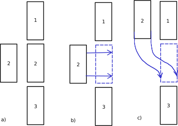
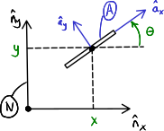
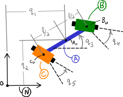

========================
Nonholonomic Constraints
========================

Motion Constraints
==================

In the prior chapter, we discussed constraints on the configuration of a
system. The configuration considers where points are and how reference frames
are oriented. In this chapter, we will consider constraints on the motion of a
system.

Take for example parallel parking a car as a motivating example.

.. _motion-parallel:

We know that car 2 can be in either the left or right location in a), i.e. the
car's configuration permits either location. But the scenario in b) isn't
possible. A car can't move from the left configuration to the right
configuration by simply moving to the right [*]_. Although, this surely would
be nice if we could. A car has wheels and only the front wheels can be steered,
so the scenario in c) is the only way for the car to end up in the right
configuration. The car has to move in a specific way to get from one
configruation to another. This entails that we have some kind of constraint on
the motion but not the configuration. Constraints such as these are called
*nonholonomic constraints* and they take the form:

.. math::
   :label: nonholonomic-constraints

   \bar{f}_n(\bar{u}, \bar{q}, t) = 0 \\
   \textrm{ where } \\
   \bar{f}_n \in \mathbb{R}^m \\
   \bar{u} = \left[ u_1, \ldots, u_n\right]^T \in \mathbb{R}^n\\
   \bar{q} = \left[ q_1, \ldots, q_n\right]^T \in \mathbb{R}^n

Kinematical Differential Equations
==================================

The variables :math:`u_1, \ldots, u_n` are defined as linear functions of the
time derivatives of the generalized coordinates :math:`\dot{q}_1, \ldots,
\dot{q}_n`. These variables are called generalized speeds. They take the form:

.. math::
   :label: generalized-speeds

   \bar{u} := \mathbf{Y}_k \dot{\bar{q}} + \bar{z}_k(\bar{q}, t)

:math:`\bar{u}` must be chosen such that :math:`\mathbf{Y}_k` is invertible.
Eq. :math:numref:`generalized-speeds` are called *kinematical differential
equations*. The most common, and always valid, choice of generalized speeds
is:

.. math::
   :label: generalized-speeds

   \bar{u} = \mathbf{I} \dot{\bar{q}}

where :math:`u_i = \dot{q}_i` for :math:`i=1,\ldots,n`.

Choosing Generalized Speeds
===========================

.. jupyter-execute::

   import sympy as sm
   import sympy.physics.mechanics as me
   me.init_vprinting(use_latex='mathjax')

Take for example the angular velocity of a reference frame which is oriented
with a :math:`z\textrm{-}x\textrm{-}y` body fixed orientation:

.. jupyter-execute::

   q1, q2, q3 = me.dynamicsymbols('q1, q2, q3')

   A = me.ReferenceFrame('A')
   B = me.ReferenceFrame('B')

   B.orient_body_fixed(A, (q1, q2, q3), 'ZXY')

   A_w_B = B.ang_vel_in(A).simplify()
   A_w_B

Choice 1
--------

If we choose the simplest definition for the :math:`u`'s, i.e.
:math:`u_1=\dot{q}_1`, :math:`u_2=\dot{q}_2`, and :math:`u_3=\dot{q}_3`, the
angular velocity takes this form:

.. jupyter-execute::

   u1, u2, u3 = me.dynamicsymbols('u1, u2, u3')

   t = me.dynamicsymbols._t
   qdot = sm.Matrix([q1.diff(t), q2.diff(t), q3.diff(t)])
   u = sm.Matrix([u1, u2, u3])

   A_w_B = A_w_B.xreplace(dict(zip(qdot, u)))
   A_w_B

.. jupyter-execute::

   Yk_plus_zk = qdot
   Yk_plus_zk

.. jupyter-execute::

   Yk = Yk_plus_zk.jacobian(qdot)
   Yk

.. jupyter-execute::

   zk = Yk_plus_zk.xreplace(dict(zip(qdot, sm.zeros(3, 1))))
   zk

The linear equation can be solved for the :math:`\dot{q}`'s:

.. jupyter-execute::

   sm.Eq(qdot, Yk.LUsolve(u - zk))

Choice 2
--------

Another valid choice is to set the :math:`u`'s equal to each measure number of
the angular velocity expressed in :math:`B`:

.. math::

   u_1 = {}^A\bar{\omega}^B \cdot \hat{b}_x \\
   u_2 = {}^A\bar{\omega}^B \cdot \hat{b}_y \\
   u_3 = {}^A\bar{\omega}^B \cdot \hat{b}_z

so that:

.. math::

   {}^A\bar{\omega}^B = u_1\hat{b}_x + u_2\hat{b}_y + u_3\hat{b}_z

.. jupyter-execute::

   A_w_B = B.ang_vel_in(A).simplify()
   A_w_B

.. jupyter-execute::

   u1_expr = A_w_B.dot(B.x)
   u2_expr = A_w_B.dot(B.y)
   u3_expr = A_w_B.dot(B.z)

   Yk_plus_zk = sm.Matrix([u1_expr, u2_expr, u3_expr])
   Yk_plus_zk

.. jupyter-execute::

   Yk = Yk_plus_zk.jacobian(qdot)
   Yk

.. jupyter-execute::

   zk = Yk_plus_zk.xreplace(dict(zip(qdot, sm.zeros(3, 1))))
   zk

.. jupyter-execute::

   sm.Eq(qdot, sm.trigsimp(Yk.LUsolve(u - zk)))

.. note::

   Notice how the kinematical differential equations are not valid when
   :math:`q_2` or :math:`q_3` are even multiples of :math:`\pi/2`. If your
   system must orient through these values, you'll need to select a different
   body fixed rotation or an orientation method that isn't suseptible to these
   issues.

Choice 3
--------

Another valid choice is to set the :math:`u`'s equal to each measure number of
the angular velocity expressed in :math:`A`:

.. math::

   u_1 = {}^A\bar{\omega}^B \cdot \hat{a}_x \\
   u_2 = {}^A\bar{\omega}^B \cdot \hat{a}_y \\
   u_3 = {}^A\bar{\omega}^B \cdot \hat{a}_z

so that:

.. math::

   {}^A\bar{\omega}^B = u_1\hat{a}_x + u_2\hat{a}_y + u_3\hat{a}_z

.. jupyter-execute::

   A_w_B = B.ang_vel_in(A).express(A).simplify()
   A_w_B

.. jupyter-execute::

   u1_expr = A_w_B.dot(A.x)
   u2_expr = A_w_B.dot(A.y)
   u3_expr = A_w_B.dot(A.z)

   Yk_plus_zk = sm.Matrix([u1_expr, u2_expr, u3_expr])
   Yk_plus_zk

.. jupyter-execute::

   Yk = Yk_plus_zk.jacobian(qdot)
   Yk

.. jupyter-execute::

   zk = Yk_plus_zk.xreplace(dict(zip(qdot, sm.zeros(3, 1))))
   zk

.. jupyter-execute::

   sm.Eq(qdot, sm.trigsimp(Yk.LUsolve(u - zk)))

There are many more possible choices and you are free to select the generalized
coordinates as you please, as long as they fit the form of equation
:math:numref:`generalized-speeds` and :math:`\mathbf{Y}_k` is invertible.

The selection of generalized speeds can reduce the complexity of important
velocity expressions, and if selected carefully may reduce the complexity of
the equations of motion we will derive in a later chapters.

Chaplygin Sleigh
================

Take the simple example of the `Chaplygin Sleigh`_. A sleigh can slide along a
flat plane, but can only move in the direction it is oriented. This system is
described by three generalized coordinates :math:`x,y,\theta`. For the motion
to only occur along it's body fixed :math:`x` direction, the component of
velocity in the body fixed :math:`y` direction must equal zero at all times.

.. _Chaplygin Sleigh: https://en.wikipedia.org/wiki/Chaplygin_sleigh

The velocity of :math:`P` is found like so:

.. jupyter-execute::

   x, y, theta = me.dynamicsymbols('x, y, theta')

   N = me.ReferenceFrame('N')
   A = me.ReferenceFrame('A')

   A.orient_axis(N, theta, N.z)

   O = me.Point('O')
   P = me.Point('P')

   P.set_pos(O, x*N.x + y*N.y)

   O.set_vel(N, 0)

   P.vel(N).express(A)

The motion constraint takes this form (without introducing generalized speeds
for simplicity):

.. jupyter-execute::

   fn = P.vel(N).dot(A.y)
   fn

How do we know that this is, in fact, a nonoholomic constraint and not simply
the time derivative of a holonomic constraint? If we can integrate :math:`f_n`
with respect to time and we arrive at a function of only the generalized
coordinates and time, then we do not have an essential nonholonomic constraint,
but a holnomic constraint in disquise. It is not generally possible to
integrate :math:`f_n` easily so we can check the integrability of :math:`f_n`
indirectly.

If :math:`f_n` of the sleigh was the time derivative of a holonomic constraint
then it would have to be able to be expressed in this form:

.. math::

   \frac{d f_h}{dt} =
   \frac{\partial f_h}{\partial x} \frac{dx}{dt} +
   \frac{\partial f_h}{\partial y} \frac{dy}{dt} +
   \frac{\partial f_h}{\partial \theta} \frac{d\theta}{dt} +
   \frac{\partial f_h}{\partial t}

and a condition of integrability is that the mixed partials must commute.

.. todo:: Link to https://en.wikipedia.org/wiki/Symmetry_of_second_derivatives

By inspection of ``fn`` we see that we can extract the partial derivatives by
collecting the coefficients. SymPy's
:external:py:meth:`~sympy.core.basic.Basic.coeff` can extract the coefficients
for us:

.. jupyter-execute::

   dfdx = fn.coeff(x.diff())
   dfdy = fn.coeff(y.diff())
   dfdth = fn.coeff(theta.diff())

   dfdx, dfdy, dfdth

Each pair of mixed partials can be calculated. For example
:math:`\frac{\partial*2 f_h}{\partial x \partial y}` and
:math:`\frac{\partial*2 f_h}{\partial y \partial x}`:

.. jupyter-execute::

   dfdx.diff(y), dfdy.diff(x)

and the other two pairs:

.. jupyter-execute::

   dfdx.diff(theta), dfdth.diff(x)

.. jupyter-execute::

   dfdy.diff(theta), dfdth.diff(y)

We see that to for the last two pairs, the mixed partials do not commute. This
proves that :math:`f_n` is not integrable and is thus an essential nonholonomic
constraint.

.. todo:: Differentiate a holonomic constraint and show that it is integrable.

Snakeboard
==========

A snakeboard_ is a variation on a skateboard that can be propelled via
nonholonomic locomotion [Ostrowski1994]_. Similar to the Chaplygin Sleigh, the
wheels can generally only travel in the direction they are pointed. This
classic video from 1993 shows how to propel the board:

.. raw:: html

   

   <iframe width="560" height="315"
   src="https://www.youtube.com/embed/yxlC95YjmEs" title="YouTube video player"
   frameborder="0" allow="accelerometer; autoplay; clipboard-write;
   encrypted-media; gyroscope; picture-in-picture" allowfullscreen></iframe>
   

.. _snakeboard: https://en.wikipedia.org/wiki/Snakeboard

:numref:`fig-snakeboard` shows what a real snakeboard looks like and
:numref:`fig-snakeboard-configuration` shows a configuration diagram.

.. _fig-snakeboard:
.. figure:: https://upload.wikimedia.org/wikipedia/commons/thumb/6/61/Snakeboard_down.jpg/640px-Snakeboard_down.jpg
   :align: center

   Example of a snakeboard that shows the two footpads each with attached truck
   and pair of wheels that are connected by the coupler.

   Николайков Вячеслав, `CC BY-SA 3.0
   <https://creativecommons.org/licenses/by-sa/3.0>`_, via Wikimedia Commons

.. todo:: Add unit vectors to this figure.

   Configuration diagram of a planar snakeboard model.

.. jupyter-execute::

   q1, q2, q3, q4, q5 = me.dynamicsymbols('q1, q2, q3, q4, q5')
   l = sm.symbols('l')

   N = me.ReferenceFrame('N')
   A = me.ReferenceFrame('A')
   B = me.ReferenceFrame('B')
   C = me.ReferenceFrame('C')

   A.orient_axis(N, q3, N.z)
   B.orient_axis(A, q4, A.z)
   C.orient_axis(A, q5, A.z)

The angular velocities of each reference frame are:

.. jupyter-execute::

   A.ang_vel_in(N)

.. jupyter-execute::

   B.ang_vel_in(N)

.. jupyter-execute::

   C.ang_vel_in(N)

.. jupyter-execute::

   O = me.Point('O')
   Ao = me.Point('A_o')
   Bo = me.Point('B_o')
   Co = me.Point('C_o')

   Ao.set_pos(O, q1*N.x + q2*N.y)
   Bo.set_pos(Ao, l/2*A.x)
   Co.set_pos(Ao, -l/2*A.x)

   O.set_vel(N, 0)

   Ao.vel(N)

.. jupyter-execute::

   Bo.v2pt_theory(Ao, N, A)

.. jupyter-execute::

   Co.v2pt_theory(Ao, N, A)

.. jupyter-execute::

   fn = sm.Matrix([Bo.vel(N).dot(B.y),
                   Co.vel(N).dot(C.y)])
   fn = sm.trigsimp(fn)
   fn

Now introduce some generalized speeds.

.. math::

   u_i = \dot{q}_i \textrm{ for } i=1,2,4,5 \\
   u_3 = \frac{l\dot{q}_3}{2}

Now replace all of the time derivatives of the generalized coordinates with the
generalized speeds. We use :external:py:meth:`~sympy.core.basic.Basic.subs`
here because the replacement isn't an exact replacement.

.. jupyter-execute::

   u1, u2, u3, u4, u5 = me.dynamicsymbols('u1, u2, u3, u4, u5')

   u_repl = {
       q1.diff(): u1,
       q2.diff(): u2,
       l*q3.diff()/2: u3,
       q4.diff(): u4,
       q5.diff(): u5
   }

   fn = fn.subs(u_repl)
   fn

These nonholonomic constraints take this form:

.. math::

   \bar{f}_n(u_1, u_2, u_3, q_3, q_4, q_5) = 0 \textrm{ where } \bar{f}_n \in \mathbb{R}^2

Two of the generalized speeds must be selected as dependent generalized speeds
because these equations let us solve for two in terms of the third. In general,
the nonholonomic constraints are always linear in the generalized speeds. If we
introduce :math:`\bar{u}_s` as a vector of independent generalized speeds and
:math:`\bar{u}_r` as a vector of dependent generalized speeds, the nonholonomic
constraints can be written as:

.. math::

   \bar{f}_n(\bar{u}_s, \bar{u}_r, \bar{q}, t) =
   \mathbf{A}_r \bar{u}_r - \mathbf{A}_s \bar{u}_s - \bar{b}_s = 0

or

.. math::

    \bar{u}_r = \mathbf{A}_r^{-1}\left(\mathbf{A}_s \bar{u}_s + \bar{b}_s\right) \\
    \bar{u}_r = \mathbf{A}_n \bar{u}_s + \bar{b}_n

For the snakeboard let's choose :math:`\bar{u}_s = [u_3, u_4, u_5]^T` as the
independent generalized speeds and :math:`\bar{u}_r = [u_1, u_2]^T` as the
dependent generalized speeds.

.. jupyter-execute::

   us = sm.Matrix([u3, u4, u5])
   ur = sm.Matrix([u1, u2])

:math:`\mathbf{A}_r` are the linear coefficients of :math:`\bar{u}_r` so:

.. jupyter-execute::

   Ar = fn.jacobian(ur)
   Ar

:math:`\mathbf{A}_s` are the negative of the linear coefficients of
:math:`\bar{u}_s` so:

.. jupyter-execute::

   As = -fn.jacobian(us)
   As

:math:`-\bar{b}_s` remains when :math:`\bar{u}=0`:

.. jupyter-execute::

   bs = -fn.xreplace(dict(zip([u1, u2, u3, u4, u5], [0, 0, 0, 0, 0])))
   bs

:math:`\mathbf{A}_n` and :math:`\bar{b}_n` are formed by solving the linear
system:

.. jupyter-execute::

   An = Ar.LUsolve(As)
   An = sm.simplify(An)
   An

.. jupyter-execute::

   bn = Ar.LUsolve(bs)
   bn

We now have the dependent generalized speeds written as functions of the
indepdendent generalized speeds:

.. jupyter-execute::

   sm.Eq(ur, An*us + bn)

Degrees of Freedom
==================

For simple nonholonomic systems observed in a reference frame :math:`A`, such
as the Chapylign Sleigh or the Snakeboard, the *degrees of freedom* in
:math:`A` are equal to the number of independent generalized speeds. The number
of degrees of freedom :math:`p` is defined as:

.. math::

   p := n - m

where :math:`n` is the number of generalized coordinates and :math:`m` are the
number of nonholonomic constraints (and thus dependent generalized speeds). If
there are no nonholonomic constraints, the system is a holonomic system in
:math:`A` and :math:`p=n` making the number of degrees of freedom equal to the
number of generalized coordinates.

The Chaplighn Sliegh has :math:`p = 3 - 1 = 2` degrees of freedom and the
Snakeboard has :math:`p = 5 - 2 = 3` degrees of freedom. The four bar linkage
of the previous chapter has :math:`p = 1 - 0 = 1` degrees of freedom.

.. rubric:: Footnotes

.. [*] Well, we could find a very strong person to push th ecar sideways,
   overcoming the very high resisting friction force.
