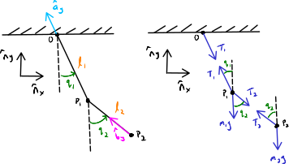

===============================
Exposing Noncontributing Forces
===============================

.. note::

   You can download this example as a Python script:
   :jupyter-download-script:`noncontributing` or Jupyter Notebook:
   :jupyter-download-notebook:`noncontributing`.

.. jupyter-execute::

   import numpy as np
   import sympy as sm
   import sympy.physics.mechanics as me
   me.init_vprinting(use_latex='mathjax')

.. container:: invisible

   .. jupyter-execute::

      class ReferenceFrame(me.ReferenceFrame):

          def __init__(self, *args, **kwargs):

              kwargs.pop('latexs', None)

              lab = args[0].lower()
              tex = r'\hat{{{}}}_{}'

              super(ReferenceFrame, self).__init__(*args,
                                                   latexs=(tex.format(lab, 'x'),
                                                           tex.format(lab, 'y'),
                                                           tex.format(lab, 'z')),
                                                   **kwargs)
      me.ReferenceFrame = ReferenceFrame

Learning Objectives
===================

After completing this chapter readers will be able to:

- apply Newton's Second Law to write equations of motion with maximal
  coordinates, which naturally expose noncontributing forces
- use the auxiliary generalized speed method to expose noncontributing forces
  in Kane's minimal coordinate formulation

Introduction
============

Kane's formulation relieves us from having to consider noncontributing forces
(See Sec. :ref:`Contributing and Noncontributing Forces`), but often we are
interested in one or more of these noncontributing forces. In this chapter, I
will show how you can find the equation for a noncontributing force by
introducing *auxiliary generalized speeds*. But first, let's solve the
equations of motion for a system by directly applying Newton's Second Law of
motion, which requires us to explicitly define all contributing and
noncontributing forces.

Double Pendulum Example
=======================

:numref:`fig-noncontributing-pendulum-fbd` shows a schematic of a simple planar
`double pendulum`_ described by two generalized coordinates :math:`q_1` and
:math:`q_2`. The particles :math:`P_1` and :math:`P_2` have masses :math:`m_1`
and :math:`m_2`, respectively. The lengths of the first and second pendulum
arms are :math:`l_1` and :math:`l_2`, respectively. On the right, the `free
body diagrams`_ depict the two tension forces :math:`T_1` and :math:`T_2` that
act on each particle to keep them at their respective radial locations.

.. _double pendulum: https://en.wikipedia.org/wiki/Double_pendulum
.. _free body diagrams: https://en.wikipedia.org/wiki/Free_body_diagram

.. _fig-noncontributing-pendulum-fbd:

   On the left, a kinematic diagram of a simple double planar pendulum with two
   links :math:`A` of length :math:`l_1` and :math:`B` of length :math:`l_2`.
   On the right are free body diagrams of each particle showing all of the
   contributing and noncontributing forces acting on them. Gravity acts in the
   :math:`-\hat{n}_y` direction.

Start by creating all of the necessary variables. The tension forces are time
varying quantities.

.. jupyter-execute::

   m1, m2, l1, l2, g = sm.symbols('m1, m2, l1, l2, g')
   q1, q2, u1, u2, T1, T2 = me.dynamicsymbols('q1, q2, u1, u2, T1, T2')
   t = me.dynamicsymbols._t

   p = sm.Matrix([m1, m2, l1, l2, g])
   q = sm.Matrix([q1, q2])
   u = sm.Matrix([u1, u2])
   r = sm.Matrix([T1, T2])

   ud = u.diff(t)

   p, q, u, r, ud

Both pendulums' configuration are described by angles relative to the vertical
direction. We will choose the generalized speeds to be :math:`\bar{u} =
\dot{\bar{q}}` and set the angular velocities to be in terms of them.

.. jupyter-execute::

   N = me.ReferenceFrame('N')
   A = me.ReferenceFrame('A')
   B = me.ReferenceFrame('B')

   A.orient_axis(N, q1, N.z)
   B.orient_axis(N, q2, N.z)

   A.set_ang_vel(N, u1*N.z)
   B.set_ang_vel(N, u2*N.z)

Now the positions, velocities, and accelerations of each particle can be
formed.

.. jupyter-execute::

   O = me.Point('O')
   P1 = O.locatenew('P1', -l1*A.y)
   P2 = P1.locatenew('P2', -l2*B.y)

   O.set_vel(N, 0)
   P1.v2pt_theory(O, N, A)

.. jupyter-execute::

   P2.v2pt_theory(P1, N, B)

.. jupyter-execute::

   P1.a2pt_theory(O, N, A)

.. jupyter-execute::

   P2.a2pt_theory(P1, N, B)

All of the kinematics are strictly in terms of the generalized coordinates and
the generalized speeds.

Apply Newton's Second Law Directly
==================================

Direction application of Newton's Second Law can be done if *all* of the forces
(noncontributing and contributing) are described for each of the two particles.
Vector equations representing the law for each particle are:

.. math::

   \sum\bar{F}^{P_1} = m_1 {}^N\bar{a}^{P_1} \\
   \sum\bar{F}^{P_2} = m_2 {}^N\bar{a}^{P_2}

From the free body diagram (:numref:`fig-noncontributing-pendulum-fbd`) we see
that all of the forces acting on :math:`P_1` are:

.. jupyter-execute::

   F_P1 = T1*A.y - T2*B.y - m1*g*N.y
   F_P1.express(N)

and all of the forces acting on :math:`P_2` are:

.. jupyter-execute::

   F_P2 = T2*B.y - m2*g*N.y
   F_P2.express(N)

Now we can form the two vector expressions of Newton's Second Law for each
particle. Moving everything to the right hand side gives:

.. math::

   \bar{0} = \sum\bar{F}^{P_1} - m_1 {}^N\bar{a}^{P_1} \\
   \bar{0} = \sum\bar{F}^{P_2} - m_2 {}^N\bar{a}^{P_2}

.. jupyter-execute::

   zero_P1 = F_P1 - m1*P1.acc(N)
   zero_P2 = F_P2 - m2*P2.acc(N)

These two planar vector equations can then be written as four scalar equations
by extracting the :math:`\hat{n}_x` and :math:`\hat{n}_y` measure numbers.

.. jupyter-execute::

   fd = sm.Matrix([
       zero_P1.dot(N.x),
       zero_P1.dot(N.y),
       zero_P2.dot(N.x),
       zero_P2.dot(N.y),
   ])
   fd

It is important to note that these scalar equations are linear in both the time
derivatives of the generalized speeds :math:`\dot{u}_1,\dot{u}_2` as well as
the two noncontributing force magnitudes :math:`T_1,T_2` and that all four
equations are coupled in these four variables.

.. jupyter-execute::

   (me.find_dynamicsymbols(fd[0]), me.find_dynamicsymbols(fd[1]),
    me.find_dynamicsymbols(fd[2]), me.find_dynamicsymbols(fd[3]))

That means we can write the equations as:

.. math::

   \bar{f}_d(\dot{\bar{u}}, \bar{q}, \bar{r}, t) =
   \mathbf{M}_d
   \begin{bmatrix}
   \dot{\bar{u}} \\
   \bar{r}
   \end{bmatrix}
   + \bar{g}_d

where :math:`\bar{r} = \left[T_1 \ T_2 \right]^T`. The linear coefficient
matrix and the remainder can be extracted as usual:

.. jupyter-execute::

   ud, r

.. jupyter-execute::

   udr = ud.col_join(r)
   udr_zero = {v: 0 for v in udr}

   Md = fd.jacobian(udr)
   gd = fd.xreplace(udr_zero)

   Md, udr, gd

The four equations are fully coupled, so we must solve for the four variables
simultaneously. When applying Newton's Second Law directly, additional coupled
equations for each noncontributing force are necessary to solve the dynamical
differential equations. When formulating the equations with Kane's method,
similar equations for the noncontributing forces can be generated, but the
noncontributing forces will remain absent from the dynamical differential
equations.

Auxiliary Generalized Speeds
============================

When we form Kane's equations, noncontributing forces will not be present in
the equations of motion as they are above in the classical Newton formulation,
but it is possible to expose select noncontributing forces by taking advantage
of the role of the partial velocities. Forces and torques that are not normal
to the partial velocity will contribute to the equations of motion. It is then
possible to introduce fictitious partial velocities via an auxiliary
generalized speed, along with a force or torque that acts in the same direction
of the fictitious motion to generate extra equations for the noncontributing
forces or torques. See [Kane1985]_ pg. 114 for more explanation of this idea.

As an example , here I introduce two fictitious generalized speeds, :math:`u_3`
and :math:`u_4` that lets each particle have motion relative to its fixed
location on the pendulum arm in the direction of the two noncontributing forces
that we desire to know. :numref:`fig-noncontributing-pendulum-aux` shows the
two additional speeds and the associated forces. We introduce these speeds
without introducing any related generalized coordinates.

.. _fig-noncontributing-pendulum-aux:
.. figure:: figures/noncontributing-pendulum-aux.svg
   :align: center
   :width: 50%

   Kinematic diagram of the double pendulum showing the fictitious auxiliarly
   generalized speeds :math:`u_3` and :math:`u_4` and the associated
   contributing forces.

First find the velocity of :math:`P_1` with the additional velocity component
and store this separately in ``N_v_P1a`` to indicate it is affected by this
auxiliary generalized speed.

.. jupyter-execute::

   u3, u4 = me.dynamicsymbols('u3, u4')

   N_v_P1a = P1.vel(N) - u3*A.y
   N_v_P1a

Similarly, write the velocity of :math:`P_2` using the velocity two point
theorem and adding the auxiliary component. Note that the pendulum arm does not
change in length because we have not added any generalized coordinates, so the
two auxiliary velocities can be simply added in each step.

.. jupyter-execute::

   N_v_P2a = N_v_P1a + me.cross(B.ang_vel_in(N), P2.pos_from(P1)) - u4*B.y
   N_v_P2a

These two velocities will be used to generate the partial velocities for two
additional generalized active forces and generalized inertia forces, one for
each of the auxiliary generalized speeds :math:`u_3` and :math:`u_4`.

Auxiliary Generalized Active Forces
===================================

We now have four generalized speeds, two of which are auxiliary generalized
speeds. With these speeds we will formulate four generalized active forces. The
generalized active forces associated with :math:`u_1` and :math:`u_2` are no
different than if we were not exposing the noncontributing forces, so we follow
the usual procedure.

.. jupyter-execute::

   R_P1 = -m1*g*N.y
   R_P2 = -m2*g*N.y

.. jupyter-execute::

   F1 = P1.vel(N).diff(u1, N).dot(R_P1) + P2.vel(N).diff(u1, N).dot(R_P2)
   F1

.. jupyter-execute::

   F2 = P1.vel(N).diff(u2, N).dot(R_P1) + P2.vel(N).diff(u2, N).dot(R_P2)
   F2

For :math:`F_3` and :math:`F_4`, the contributing forces we wish to know that
are associated with the auxiliary generalized speeds are added to the resultant
acting on the two particles.

.. jupyter-execute::

   R_P1_aux = R_P1 + T1*A.y - T2*B.y
   R_P2_aux = R_P2 + T2*B.y

Now the velocities of the particles that include the auxiliary generalized
speeds are used to calculate the partial velocities and the auxiliary
generalized active forces are formed.

.. jupyter-execute::

   F3 = N_v_P1a.diff(u3, N).dot(R_P1_aux) + N_v_P2a.diff(u3, N).dot(R_P2_aux)
   F3

.. jupyter-execute::

   F4 = N_v_P1a.diff(u4, N).dot(R_P1_aux) + N_v_P2a.diff(u4, N).dot(R_P2_aux)
   F4

Finally, we form :math:`\bar{F}_r` that consists of the two normal generalized
active forces and the two auxiliary generalized active forces, the later two
containing the unknown force magnitudes :math:`T_1` and :math:`T_2`.

.. jupyter-execute::

   Fr = sm.Matrix([F1, F2, F3, F4])
   Fr

Auxiliary Generalized Inertia Forces
====================================

Similar to the generalized active forces, the generalized inertia forces for
:math:`u_1` and :math:`u_2` are computed as usual. See [Kane1985]_ pg. 169 and
pg. 217 for more explanation.

.. jupyter-execute::

   Rs_P1 = -m1*P1.acc(N)
   Rs_P2 = -m2*P2.acc(N)

.. jupyter-execute::

   F1s = P1.vel(N).diff(u1, N).dot(Rs_P1) + P2.vel(N).diff(u1, N).dot(Rs_P2)
   F1s

.. jupyter-execute::

   F2s = P1.vel(N).diff(u2, N).dot(Rs_P1) + P2.vel(N).diff(u2, N).dot(Rs_P2)
   F2s

The auxiliary generalized inertia forces are found using the velocities where
:math:`u_3` and :math:`u_4` are present, but the acceleration of the particles
need not include :math:`u_3` and :math:`u_4`, because they are equal to zero
because :math:`u_3` and :math:`u_4` are actually equal to zero.

.. jupyter-execute::

   F3s = N_v_P1a.diff(u3, N).dot(Rs_P1) + N_v_P2a.diff(u3, N).dot(Rs_P2)
   F3s

.. jupyter-execute::

   F4s = N_v_P1a.diff(u4, N).dot(Rs_P1) + N_v_P2a.diff(u4, N).dot(Rs_P2)
   F4s

And finally, :math:`\bar{F}_r^*` is formed for all four generalized speeds:

.. jupyter-execute::

   Frs = sm.Matrix([F1s, F2s, F3s, F4s])
   Frs = sm.trigsimp(Frs)
   Frs

.. warning::

   In this example, :math:`u_3,u_4,\dot{u}_3,\dot{u}_4` are not present in the
   auxiliary generalized inertia forces but you may end up with auxiliary
   speeds and their derivatives in your auxiliary generalized inertia forces.
   If you do, you need to set them all to zero to arrive at the desired
   equations.

Augmented Dynamical Differential Equations
==========================================

We can now form Kane's dynamical differential equations which I will name
:math:`\bar{f}_a` to indicate they include the auxiliary equations. These
equations are linear in :math:`\dot{u}_1,\dot{u}_2,T_1` and :math:`T_2`.

.. jupyter-execute::

   fa = Frs + Fr
   me.find_dynamicsymbols(fa)

Now when we extract the linear coefficients, we see that the dynamical
differential equations (the first two rows) are independent of the unknown
force magnitudes, allowing us to use the equations for :math:`\dot{\bar{u}}`
independently.

.. jupyter-execute::

   Ma = fa.jacobian(udr)
   ga = fa.xreplace(udr_zero)

   Ma, udr, ga

We can solve the system to find functions for :math:`T_1` and :math:`T_2`, if
desired.

.. jupyter-execute::

   udr_sol = -Ma.LUsolve(ga)

.. jupyter-execute::

   T1_sol = sm.trigsimp(udr_sol[2])
   T1_sol

.. jupyter-execute::

   T2_sol = sm.trigsimp(udr_sol[3])
   T2_sol

Compare Newton and Kane Results
===============================

To ensure that the Newton approach and the Kane approach do produce equivalent
results, we can numerically evaluate the equations with the same inputs and see
if the results are the same. Here are some arbitrary numerical values for the
states and constants.

.. jupyter-execute::

   q0 = np.array([
       np.deg2rad(15.0),  # q1 [rad]
       np.deg2rad(25.0),  # q2 [rad]
   ])

   u0 = np.array([
       np.deg2rad(123.0),  # u1 [rad/s]
       np.deg2rad(-41.0),  # u2 [rad/s]
   ])

   p_vals = np.array([
       1.2,  # m1 [kg]
       5.6,  # m2 [kg]
       1.34,  # l1 [m]
       6.7,  # l2 [m]
       9.81,  # g [m/2^2]
   ])

Create numeric functions to evaluate the two sets of matrices and execute both
functions with the same numerical inputs from above.

.. jupyter-execute::

   eval_d = sm.lambdify((q, u, p), (Md, gd))
   eval_a = sm.lambdify((q, u, p), (Ma, ga))

   Md_vals, gd_vals = eval_d(q0, u0, p_vals)
   Ma_vals, ga_vals = eval_a(q0, u0, p_vals)

Now compare the solutions for :math:`\begin{bmatrix}\dot{\bar{u}} & \bar{r}
\end{bmatrix}`.

.. jupyter-execute::

   -np.linalg.solve(Md_vals, np.squeeze(gd_vals))

.. jupyter-execute::

   -np.linalg.solve(Ma_vals, np.squeeze(ga_vals))

For this set of inputs, the outputs are the same showing that using the
auxiliary speed approach gives the same results, with the slight advantage that
the dynamical differential equations are not coupled to the equations for the
noncontributing forces in Kane's method.

The forces can also be evaluated directly from the symbolic solutions, which is
useful for post simulation application.

.. jupyter-execute::

   eval_forces = sm.lambdify((q, u, p), (T1_sol, T2_sol))
   eval_forces(q0, u0, p_vals)

.. todo:: Add simulations of each method showing how evaluation of the
   noncontributing forces may work.

   .. jupyter-execute::

      def eval_rhs_newton(t, x, p):

          q = x[:2]
          u = x[2:]

          Md, gd = eval_d(q, u, p)
          udr = -np.linalg.solve(Md, np.squeeze(gd))

          qd = u
          ud = sol[:2]
          r = sol[2:]

          return np.hstack((qd, ud))
