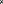

========
Notation
========

This explains the notation in the book. The mathematical symbol is shown and
then an example of a variable name that we use in the code.

.. todo:: Add the notation that is in the hand drawn figures.

General
=======

:math:`x`, ``x``, |notation-scalar|
   Scalars are normal mathematical font.
:math:`\mathbf{R}`, ``R``
   Matrices are capitalized letters in bold font.
:math:`\mathbf{J}_{\bar{v},\bar{u}}`
   The Jacobian of the vector function :math:`\bar{v}` with respect to the
   entries in vector :math:`\bar{u}` where the :math:`(i,j)` entries of the
   Jacobian are :math:`\mathbf{J}_{ij} = \frac{\partial v_i}{\partial u_j}`.

Orientation of Reference Frames
===============================

:math:`A`, ``A``, |notation-ref-frame|
   Reference frame :math:`A`.
:math:`\hat{a}_x,\hat{a}_y,\hat{a}_z`, ``A.x``, ``A.y``, ``A.z``, |notation-ref-frame-unit-vec|
   Right handed mutually perpendicular unit vectors fixed in reference frame
   :math:`A`.
:math:`{}^A\mathbf{C}^B`, ``A_C_B``, |notation-dcm|
   Direction cosine matrix relating reference frames (or rigid bodies)
   :math:`B` and :math:`A` where this relation between the right handed
   mutually perpendicular unit vectors fixed in the two reference frames follow
   this relationship:

   .. math::

      \begin{bmatrix}
        \hat{a}_x \\
        \hat{a}_y \\
        \hat{a}_z
      \end{bmatrix}
      =
      {}^A\mathbf{C}^B
      \begin{bmatrix}
        \hat{b}_x \\
        \hat{b}_y \\
        \hat{b}_z
      \end{bmatrix}

Vectors and Vector Differentiation
==================================

:math:`\bar{v}`, ``v``, |notation-vector|
   Vectors are indicated with a bar.
:math:`\hat{u}`, ``uhat = u.normalize()``, |notation-unit-vec|
   Unit vectors are indicated with a hat.
:math:`|\bar{v}|`, ``v.magnitude()``, |notation-vec-mag|
   Magnitude of a vector; Euclidean norm (2-norm).
:math:`\bar{u} \cdot \bar{v}`, ``u.dot(v)``, |notation-vec-dot|
   Dot product of two vectors.
:math:`\bar{u} \times \bar{v}`, ``u.cross(v)``, |notation-vec-cross|
   Cross product of two vectors.
:math:`\bar{u} \otimes \bar{v}`, ``u.outer(v)``, |notation-vec-outer|
   Outer product of two vectors.
:math:`\frac{{}^A\partial \bar{v}}{\partial q}`, ``dvdqA = v.diff(q, A)``, |notation-vec-par-diff|
   Partial derivative of :math:`\bar{v}` with respect to :math:`q` when
   observed from :math:`A`.
:math:`\frac{{}^A d \bar{v}}{dt}`, ``dvdtA = v.dt(A)``, |notation-vec-time-diff|
   Time derivative of :math:`\bar{v}` when observed from :math:`A`.

Angular and Translational Kinematics
====================================

:math:`{}^A\bar{\omega}^B`, ``A_w_B``
   Angular velocity vector of reference frame or rigid body :math:`B` when
   observed from reference frame or rigid body :math:`A`.
:math:`{}^A\bar{\alpha}^B`, ``A_alp_B``
   Angular acceleration vector of reference frame or rigid body :math:`B` when
   observed from reference frame or rigid body :math:`A`.
:math:`\bar{r}^{P/O}`, ``r_O_P``, |notation-pos-vec|
   Vector from point :math:`O` to point :math:`P`.
:math:`{}^A\bar{v}^P`, ``A_v_P``
   Translational velocity of point :math:`P` when observed from reference frame
   or rigid body :math:`A`.
:math:`{}^A\bar{a}^P`, ``A_a_P``
   Translational acceleration of point :math:`P` when observed from reference
   frame or rigid body :math:`A`.

Constraints
===========

.. todo:: Add Y_k, kin diff eqs.

:math:`N,M,n,m,p`
   :math:`N` coordinates, :math:`M` holonomic constraints, :math:`n`
   generalized coordinates and generalized speeds, :math:`m` nonholonomic
   constraints, and :math:`p` degrees of freedom. These are related by the two
   equations :math:`n=N-M` and :math:`p=n-m`.
:math:`\bar{f}_h(q_1, \ldots, q_N, t) = 0 \textrm{ where } \bar{f}_h \in \mathbb{R}^M`, ``fh``
   Vector function of :math:`M` holonomic constraint equations among the
   :math:`N` coordinates.
:math:`\bar{f}_n(u_1, \ldots, u_n, q_1, \ldots, q_n, t) = 0 \textrm{ where } \bar{f}_n \in \mathbb{R}^m`, ``fn``
   Vector function of :math:`m` nonholonomic constraint equations among the
   :math:`n` generalized speeds and generalized coordinates.
:math:`\mathbf{A}_r`
   Linear coefficient matrix for :math:`\bar{u}_r` in the nonholonomic
   constraint equations.
:math:`\mathbf{A}_s`
   Linear coefficient matrix for :math:`\bar{u}_s` in the nonholonomic
   constraint equations.
:math:`\bar{b}_{rs}`
   Terms not linear in :math:`\bar{u}_s` or :math:`\bar{u}_r` in the
   nonholonomic constraint equations.
:math:`\mathbf{A}_n`
   Linear coefficient matrix for :math:`\bar{u}_s` in the equation for
   :math:`\bar{u}_r=\mathbf{A}_n\bar{u}_s + \bar{b}_n`.
:math:`\bar{b}_n`
   Terms not linear in :math:`\bar{u}_s` in the equation for
   :math:`\bar{u}_r=\mathbf{A}_n\bar{u}_s + \bar{b}_n`.

Mass Distribution
=================

:math:`\bar{I}^{B/O}_a`, ``I_B_O_a``
   Inertia vector of rigid body :math:`B` or set of particles :math:`B` with
   respect to point :math:`O` about the unit vector :math:`\hat{n}_a`.
:math:`\breve{Q}`, ``Q``
   Dyadics are indicated with a breve accent.
:math:`\breve{I}^{B/O}`, ``I_B_O``
   Inertia dyadic of body :math:`B` or set of particles :math:`B` with respect
   to point :math:`O`.
:math:`\breve{I}^{B/B_o}`, ``I_B_Bo``
   Central inertia dyadic of body :math:`B` or set of particles :math:`B` with respect
   to mass center :math:`B_o`.
:math:`{}^A \bar{H}^{B/O}`, ``A_H_B_O``
   Angular momentum of rigid body :math:`B` with respect to point :math:`O` in
   reference frame :math:`A`.

Force, Moment, and Torque
=========================

:math:`\bar{R}^{S}`, ``R_S``
   Resultant of the vector set :math:`S`.
:math:`\bar{R}^{S/Q}`, ``R_S_Q``
   Resultant of the vector set :math:`S` bound to a line of action through
   point :math:`Q`.
:math:`\bar{M}^{S/P}`, ``M_S_P``
   Moment of the resultant of the vector set :math:`S` about point :math:`P`.
:math:`\bar{T}^{B}`, ``T_B``
   Torque of couple acting on reference frame or body :math:`B`.

Generalized Forces
==================

:math:`{}^A\bar{v}_r^P`, ``v_P_r``
   r\ :sup:`th` holonomic partial velocity of point :math:`P` in reference
   frame :math:`A` associated with the generalized speed :math:`u_r`.
:math:`{}^A\bar{\omega}_r^B`, ``w_B_r``
   r\ :sup:`th` holonomic partial angular velocity of reference frame :math:`B`
   in reference frame :math:`A` associated with the generalized speed
   :math:`u_r`.
:math:`{}^A\tilde{v}_r^P`, ``v_P_r``
   r\ :sup:`th` nonholonomic partial velocity of point :math:`P` in reference
   frame :math:`A` associated with the generalized speed :math:`u_r`.
:math:`{}^A\tilde{\omega}_r^B`, ``w_B_r``
   r\ :sup:`th` nonholonomic partial angular velocity of reference frame
   :math:`B` in reference frame :math:`A` associated with the generalized speed
   :math:`u_r`.
:math:`F_r`, ``F1``
   r\ :sup:`th` holonomic generalized active force associated with the
   generalized speed :math:`u_r`.
:math:`\tilde{F}_r`, ``F1``
   r\ :sup:`th` nonholonomic generalized active force associated with the
   generalized speed :math:`u_r`.
:math:`\bar{F}_r`, ``Fr``
   Column vector of all generalized active forces (holonomic or nonholonomic).
:math:`F^*_r`, ``F1s``
   r\ :sup:`th` holonomic generalized inertia force associated with the
   generalized speed :math:`u_r`.
:math:`\tilde{F}^*_r`, ``F1s``
   r\ :sup:`th` nonholonomic generalized inertia force associated with the
   generalized speed :math:`u_r`.
:math:`\bar{F}^*_r`, ``Frs``
   Column vector of all generalized active forces (holonomic or nonholonomic).

Unconstrained Equations of Motion
=================================

:math:`\bar{f}_k(\dot{\bar{q}}, \bar{u}, \bar{q}, t)  = 0`
   Kinematical differential equations.
:math:`\mathbf{M}_k`
   Linear coefficient matrix for :math:`\dot{\bar{q}}` in the kinematical
   differential equations.
:math:`\bar{g}_k`
   Terms not linear in :math:`\dot{\bar{q}}` in the kinematical differential
   equations.
:math:`\bar{f}_d(\dot{\bar{u}}, \bar{u}, \bar{q}, t) = 0`
   Dynamical differential equations.
:math:`\mathbf{M}_d`
   Linear coefficient matrix for :math:`\dot{\bar{u}}` in the dynamical
   differential equations, often called the "mass matrix".
:math:`\bar{g}_d`
   Terms not linear in :math:`\dot{\bar{u}}` in the dynamical differential
   equations.
:math:`\bar{x}=[\bar{q} \quad \bar{u}]^T`
   State of a multibody system.
:math:`\mathbf{M}_m`
   Linear coefficient matrix for :math:`\dot{\bar{x}}` in the equations of
   motion.
:math:`\bar{g}_m`
   Terms not linear in :math:`\dot{\bar{x}}` in the equations of motion.

Equations of Motion with Nonholonomic Constraints
=================================================

:math:`\bar{f}_n(\bar{u}_s, \bar{u}_r, \bar{q}, t) = 0`
   Nonholonomic constraint equations.
:math:`\mathbf{M}_n=\mathbf{A}_r`
   Linear coefficient matrix for :math:`\bar{u}_r` in the nonholonomic
   constraint equations.
:math:`\bar{g}_n=\mathbf{A}_s\bar{u}_s+\bar{b}_{rs}`
   Terms not linear in :math:`\bar{u}_r` in the nonholonomic constraint
   equations.
:math:`\dot{\bar{f}}_n(\dot{\bar{u}}_s, \dot{\bar{u}}_r, \bar{u}_s, \bar{u}_r, \bar{q}, t) = 0`
   Time derivative of the nonholonomic constraint equations.
:math:`\mathbf{M}_{nd}`
   Linear coefficient matrix for :math:`\dot{\bar{u}}_r` in the time
   differentiated nonholonomic constraint equations.
:math:`\bar{g}_{nd}`
   Terms not linear in :math:`\dot{\bar{u}}_r` in the time differentiated
   nonholonomic constraint equations.

Equations of Motion with Holonomic Constraints
==============================================

:math:`\dot{\bar{f}}_h(\bar{u}, \bar{u}_r, \bar{q}, \bar{q}_r, t) = 0`
   Time derivative of the holonomic constraints.
:math:`\mathbf{M}_{hd}`
   Linear coefficient matrix for :math:`\bar{u}_r` in the time differentiated
   holonomic constraints.
:math:`\bar{g}_{hd}`
   Terms not inear in :math:`\bar{u}_r` in the time differentiated holonomic
   constraints.

Energy and Power
================

:math:`P`, ``P``
   Power
:math:`W`, ``W``
   Work
:math:`K,K_Q,K_B`, ``K,KQ,KB``
   Kinetic energy, kinetic energy of particle :math:`Q`, kinetic energy of body
   :math:`B`
:math:`V`, ``V``
   Potential energy
:math:`E`, ``E``
   Total energy, i.e. :math:`E=K+V`

.. |notation-vector| image:: figures/notation-vector.svg
   :height: 15px

.. |notation-unit-vec| image:: figures/notation-unit-vec.svg
   :height: 15px

.. |notation-dcm| image:: figures/notation-dcm.svg
   :height: 25px

.. |notation-pos-vec| image:: figures/notation-pos-vec.svg
   :height: 25px

.. |notation-ref-frame-unit-vec| image:: figures/notation-ref-frame-unit-vec.svg
   :height: 20px

.. |notation-ref-frame| image:: figures/notation-ref-frame.svg
   :height: 20px

.. |notation-vec-cross| image:: figures/notation-vec-cross.svg
   :height: 20px

.. |notation-vec-dot| image:: figures/notation-vec-dot.svg
   :height: 20px

.. |notation-vec-mag| image:: figures/notation-vec-mag.svg
   :height: 20px

.. |notation-vec-outer| image:: figures/notation-vec-outer.svg
   :height: 20px

.. |notation-vec-par-diff| image:: figures/notation-vec-par-diff.svg
   :height: 30px

.. |notation-vec-time-diff| image:: figures/notation-vec-time-diff.svg
   :height: 30px

Lagrange's method
=================

:math:`L`, ``L``
   Lagrangian the difference between the kinetic energy and the potential energy: :math:`L = K - V`

:math:`a_r`
   Multiplicative term associated with generalized speed :math:`q_r` in a constraint equation

:math:`\lambda`
   Lagrange multiplier, variable encoding the (scaled) magnitude of a constraint force

:math:`\bar{f}_{hn}`
   Combined time-derivatives of holonomic constraints and non-holonomic constraints

:math:`\boldsymbol{M}_{hn}`, ``M_hn``
   Jacobian of constraint equations with respect to :math:`\dot{\bar{q}}`

:math:`\bar{p}`, ``p``
   Generalized momenta ssociated with the :math:`\bar{q}` generalized coordinates

:math:`\bar{g}_d`
   Dynamic bias, the sum of terms not linear
   in $\ddot{\bar{q}}$ in the inertial forces and the generalized conservative forces
   considered in the Lagrangian.

