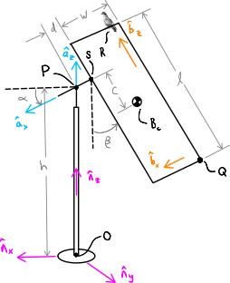

========================
Translational Kinematics
========================

.. note::

   You can download this example as a Python script:
   :jupyter-download:script:`translational` or Jupyter Notebook:
   :jupyter-download:notebook:`translational`.

In multibody dynamics, we are going to need to calculate the translation
velocities and accelerations of points. We will learn that the acceleration of
the mass centers of the bodies in a multibody system will be a primary
ingredient in forming Newton's Second Law of motion :math:`\bar{F} = m\bar{a}`.
This chapter will equip you to calculate the relative translational velocities
and accelerations of points in a system.

Translational Velocity
======================

If a point :math:`P` is moving with respect to a point :math:`O` that is fixed
in reference frame :math:`A` the translational velocity vector of point
:math:`P` is defined as:

.. math::
   :label: translational-velocity-definition

   {}^A\bar{v}^P := \frac{{}^Ad\bar{r}^{P/O}}{dt}

We also know from Eq. :math:numref:`deriv-arb-vector` that the time derivative
of any vector can be written in terms of the angular velocity of the associated
reference frames, so:

.. math::
   :label: point-velocity-two-frames

   {}^A\bar{v}^P
   & =
   \frac{{}^Ad\bar{r}^{P/O}}{dt} \\
   & =
   \frac{{}^Bd\bar{r}^{P/O}}{dt} +
   {}^A\bar{\omega}^B\times\bar{r}^{P/O} \\
   & =
   {}^B\bar{v}^P + {}^A\bar{\omega}^B\times\bar{r}^{P/O}

This formulation will allow us to utilize different reference frames to
simplify velocity calculations. Take for example this piece of kinetic art that
now stands in Rotterdam:

.. figure:: https://upload.wikimedia.org/wikipedia/commons/thumb/0/03/Rickey_Rotterdam_04.JPG/360px-Rickey_Rotterdam_04.JPG
   :align: center

   Kinetic sculpture "Two Turning Vertical Rectangles" (1971) in Rotterdam/The
   Netherlands (FOP) by George Rickey.
   https://nl.wikipedia.org/wiki/Two_Turning_Vertical_Rectangles

   K.Siereveld, Public domain, via Wikimedia Commons

.. todo:: Need a non-breaking space between K. and Siereveld.

User https://www.reddit.com/user/stravalnak posted this video of the sculpture
to Reddit during the 2022 storm Eunice:

.. raw:: html

   

   <video width="320" controls>
     <source src="https://v.redd.it/egrhlwlbrmi81/DASH_1080.mp4"
     type="video/mp4">
   </video>
   
 From: https://www.reddit.com/r/Rotterdam/comments/svo3cs/hij_maakt_overuren/

   

and it looks very dangerous. It would be interesting to know the velocity and
acceleration of various points on this sculpture. First, we sketch a
configuration diagram:

   Sketch of one of the two plates mounted on the rotating T-support. Reference
   frames :math:`N`, :math:`A`, and :math:`B` are shown. Also note the pigeon
   trying to walk across one edge of the plate at point :math:`R`.

   Pigeon SVG from https://freesvg.org/vector-clip-art-of-homing-pigeon Public Domain

Now let's use SymPy Mechanics to calculate Eq.
:math:numref:`point-velocity-two-frames` for this example.

.. jupyter-execute::

   import sympy as sm
   import sympy.physics.mechanics as me
   me.init_vprinting(use_latex='mathjax')

Set up the orientations:

.. jupyter-execute::

   alpha, beta = me.dynamicsymbols('alpha, beta')

   N = me.ReferenceFrame('N')
   A = me.ReferenceFrame('A')
   B = me.ReferenceFrame('B')

   A.orient_axis(N, alpha, N.z)
   B.orient_axis(A, beta, A.x)

Write out the position vectors to :math:`P`, :math:`S`, and :math:`Q`:

.. jupyter-execute::

   h, d, w, c, l = sm.symbols('h, d, w, c, l')

   r_O_P = h*N.z
   r_P_S = -d*A.x
   r_S_Q = -w*B.x - (c + l/2)*B.z

   r_O_P, r_P_S, r_S_Q

Now calculate:

.. math::
   :label: trans-vel-with-cross

   {}^N\bar{v}^S = {}^A\bar{v}^S + {}^N\bar{\omega}^A\times\bar{r}^{S/O}

:math:`S` is not moving when observed from :math:`A` so:

.. jupyter-execute::

   (r_O_P + r_P_S).dt(A)

The second term does have a value and can be found with these two components:

.. jupyter-execute::

   A.ang_vel_in(N)

.. jupyter-execute::

   me.cross(A.ang_vel_in(N), r_O_P + r_P_S)

giving :math:`{}^N\bar{v}^S`:

.. jupyter-execute::

   N_v_S = (r_O_P + r_P_S).dt(A) + me.cross(A.ang_vel_in(N), r_O_P + r_P_S)
   N_v_S

Similarly for point :math:`Q`:

.. jupyter-execute::

   (r_O_P + r_P_S + r_S_Q).dt(B)

.. jupyter-execute::

   me.cross(B.ang_vel_in(N), r_O_P + r_P_S + r_S_Q)

.. jupyter-execute::

   N_v_Q = (r_O_P + r_P_S + r_S_Q).dt(B) + me.cross(B.ang_vel_in(N), r_O_P + r_P_S + r_S_Q)
   N_v_Q

SymPy Mechanics provides the
:external:py:class:`~sympy.physics.vector.point.Point` object that simplifies
working with position vectors. Start by creating points and setting relative
positions among points with
:external:py:meth:`~sympy.physics.vector.point.Point.set_pos`.

.. jupyter-execute::

   O = me.Point('O')
   P = me.Point('P')
   S = me.Point('S')
   Q = me.Point('Q')

   P.set_pos(O, h*N.z)
   S.set_pos(P, -d*A.x)
   Q.set_pos(S, -w*B.x - (c + l/2)*B.z)

Once relative positions among points are established you can request the
position vector between any pair of points that are connected by the
:external:py:meth:`~sympy.physics.vector.point.Point.set_pos` statements, for
example :math:`\bar{r}^{Q/O}` is:

.. jupyter-execute::

   Q.pos_from(O)

Also, once the position vectors are established, velocities can be calculated.
You will always explicitly need to set the velocity of at least one point. In
our case, we can set :math:`{}^N\bar{v}^O=0` with
:external:py:meth:`~sympy.physics.vector.point.Point.set_vel`:

.. jupyter-execute::

   O.set_vel(N, 0)

.. note::

   SymPy Mechanics has no way of knowing whether the sculpture is fixed on the
   road or floating around with some constant speed. All the relative
   velocities of the various points would not be changed in those two
   scenarios. Hence, at least the speed of one point must be specified.

Now the velocity in :math:`N` for any point that is connected to :math:`O` by
the prior :external:py:meth:`~sympy.physics.vector.point.Point.set_pos`
statements can be found with the
:external:py:meth:`~sympy.physics.vector.point.Point.vel` method:

.. jupyter-execute::

   Q.vel(N)

.. warning::

   :external:py:meth:`~sympy.physics.vector.point.Point.vel` method will
   calculate velocities naively, i.e. not necessarily give the simplest form.

Velocity Two Point Theorem
==========================

If there are two points :math:`P` and :math:`S` fixed in a reference frame
:math:`A` and you know the angular velocity :math:`{}^N\bar{\omega}^A` and the
velocity :math:`{}^N\bar{v}^P` then :math:`{}^N\bar{v}^S` can be calculated if
the vector :math:`\bar{r}^{S/P}`, which is fixed in :math:`A`, is known. The
following theorem provides a convenient formulation:

.. math::
   :label: vel-two-point

   {}^N\bar{v}^S &=  \frac{{}^N d\bar{r}^{S/O} }{dt} \\
   &= \frac{{}^N d\left(\bar{r}^{P/O} + \bar{r}^{S/P}\right)}{dt} \\
   &= {}^N\bar{v}^P + \frac{{}^N d\bar{r}^{S/P} }{dt} \\
   &= {}^N\bar{v}^P + {}^N\bar{\omega}^A \times \bar{r}^{S/P}

For our example kinetic sculpture, both :math:`O` and :math:`P` are fixed in
:math:`N`, so :math:`{}^N\bar{v}^P=0`:

.. jupyter-execute::

   N_v_P = 0*N.z

Only the cross product then needs to be formed:

.. jupyter-execute::

   N_v_S = N_v_P +  me.cross(A.ang_vel_in(N), S.pos_from(P))
   N_v_S

Using pairs of points both fixed in the same reference frame and Eq.
:math:numref:`vel-two-point` gives a compact result.

Point objects have the
:external:py:meth:`~sympy.physics.vector.point.Point.v2pt_theory` method for
applying  the above equation given the other point fixed in the same frame, the
frame you want the velocity in, and the frame both points are fixed in. The
velocity of :math:`P` is set to zero using
:external:py:meth:`~sympy.physics.vector.point.Point.set_vel` first to ensure
we start with a known velocity.

.. jupyter-execute::

   P.set_vel(N, 0)
   S.v2pt_theory(P, N, A)

Note that when you call
:external:py:meth:`~sympy.physics.vector.point.Point.v2pt_theory` it also sets
the velocity of point :math:`S` to this version of the velocity vector:

.. jupyter-execute::

   S.vel(N)

Both points :math:`S` and :math:`Q` are fixed in reference frame :math:`B` and
we just calculated :math:`{}^N\bar{v}^S`, so we can use the two point theorem
to find the velocity of :math:`Q` in a similar fashion by applying:

.. math::
   :label: trans-vel-cross-for-Q

   {}^N\bar{v}^Q = {}^N\bar{v}^S + {}^N\bar{\omega}^B \times \bar{r}^{Q/S}

First, using the manual calculation:

.. jupyter-execute::

   N_v_Q = N_v_S +  me.cross(B.ang_vel_in(N), Q.pos_from(S))
   N_v_Q

and then with the
:external:py:meth:`~sympy.physics.vector.point.Point.v2pt_theory`:

.. jupyter-execute::

   Q.v2pt_theory(S, N, B)

.. admonition:: Exercise

   Calculate the velocity of the center of mass of the plate :math:`B_c` using
   the two point theorem.

.. admonition:: Solution
   :class: dropdown

   .. jupyter-execute::

      Bc = me.Point('B_c')
      Bc.set_pos(S, -c*B.z - w/2*A.x)
      Bc.v2pt_theory(S, N, B)

Velocity One Point Theorem
==========================

If you are interested in the velocity of a point :math:`R` that is moving in a
reference frame :math:`B` and you know the velocity of a point :math:`S` fixed
in :math:`B` then the velocity of :math:`R` is the sum of it's velocity when
observed from :math:`B` and the velocity of a point fixed in :math:`B` at
:math:`R` at that instant of time. Put into mathematical terms we get:

.. math::
   :label: velocity-one-point

   {}^N\bar{v}^R = {}^B\bar{v}^R + {}^N\bar{v}^T

where point :math:`T` is a point that coincides with :math:`R` at that instant.

Combined with the two point theorem for :math:`T`, you can write:

.. math::
   :label: velocity-one-point-expanded

   {}^N\bar{v}^R = {}^B\bar{v}^R + {}^N\bar{v}^S + {}^N\bar{\omega}^B \times \bar{r}^{R/S}

In our kinetic sculpture example, if the pigeon :math:`R` is walking at a
distance :math:`s` in the :math:`\hat{b}_x` direction from the upper right
corner, then we can calculate the velocity of the pigeon when observed from the
:math:`N` reference frame. First establish the position of :math:`R`:

.. jupyter-execute::

   s = me.dynamicsymbols('s')
   t = me.dynamicsymbols._t

   R = me.Point('R')
   R.set_pos(Q, l*B.z + s*B.x)

The velocity of the pigeon when observed from :math:`B` is:

.. jupyter-execute::

   B_v_R = s.diff(t)*B.x
   B_v_R

Now the other terms:

.. jupyter-execute::

   r_S_R = R.pos_from(S)
   r_S_R

.. jupyter-execute::

   N_v_T = N_v_S + me.cross(B.ang_vel_in(N), r_S_R)
   N_v_T

And finally the velocity of the pigeon when observed from :math:`N`:

.. jupyter-execute::

   N_v_R = B_v_R + N_v_T
   N_v_R

There is a method
:external:py:meth:`~sympy.physics.vector.point.Point.v1pt_theory` that does
this calculation. It does require that the point :math:`S`'s, in our case,
velocity is fixed in :math:`B` before making the computation:

.. jupyter-execute::

   S.set_vel(B, 0)
   R.v1pt_theory(S, N, B)

.. todo:: Why is S.set_vel(B, 0) required. It isn't in my manual calculation?
   Maybe something that can be improved in SymPy.

Translational Acceleration
==========================

The acceleration of point :math:`P` in reference frame :math:`A` is defined as

.. math::
   :label: translational-acceleration-definition

   {}^A\bar{a}^P := \frac{{}^A d {}^A\bar{v}^P}{dt}

Using SymPy Mechanics, the acceleration of a point in a reference frame can be
calculated with :external:py:meth:`~sympy.physics.vector.point.Point.acc`:

.. jupyter-execute::

   S.acc(N)

Acceleration Two Point Theorem
==============================

The two point theorem above has a corollary for acceleration. Starting with the
velocity theorem:

.. math::
   :label: velocity-two-point-repeat

   {}^N\bar{v}^S = {}^N\bar{v}^P + {}^N\bar{\omega}^A \times \bar{r}^{S/P}

the acceleration can be found by applying the definition of acceleration:

.. math::
   :label: acceleration-two-point

   {}^N\bar{a}^S
   & = \frac{{}^N d\left({}^N\bar{v}^P\right)}{dt} +
       \frac{{}^N d \left( {}^N\bar{\omega}^A \times \bar{r}^{S/P}\right)}{dt} \\
   & = {}^N\bar{a}^P +
   \frac{{}^N d \left( {}^N\bar{\omega}^A \right)}{dt} \times \bar{r}^{S/P} +
   {}^N\bar{\omega}^A \times \frac{{}^N d  \left(\bar{r}^{S/P}\right)}{dt} \\
   & =
   {}^N\bar{a}^P +
   {}^N\bar{\alpha}^A \times\bar{r}^{S/P} +
   {}^N\bar{\omega}^A\times\left({}^N\bar{\omega}^A \times\bar{r}^{S/P}\right)

This presentation of the acceleration shows the tangential component of
acceleration:

.. math::
   :label: tangential

   {}^N\bar{\alpha}^A \times\bar{r}^{S/P}

:math:`{}^N\bar{\alpha}^A` can be calculated with
:external:py:meth:`~sympy.physics.vector.frame.ReferenceFrame.ang_acc_in`:

.. jupyter-execute::

   me.cross(A.ang_acc_in(N), S.pos_from(P))

And this presentation also shows the radial component of acceleration:

.. math::
   :label: radial

   {}^N\bar{\omega}^A\times\left({}^N\bar{\omega}^A \times\bar{r}^{S/P}\right)

which can also be calculated using the methods of with
:external:py:class:`~sympy.physics.vector.point.Point` and
:external:py:class:`~sympy.physics.vector.frame.ReferenceFrame`:

.. jupyter-execute::

   me.cross(A.ang_vel_in(N), me.cross(A.ang_vel_in(N), S.pos_from(P)))

Lastly, :external:py:meth:`~sympy.physics.vector.point.Point.a2pt_theory`
calculates the acceleration using this theorem with:

.. jupyter-execute::

   S.a2pt_theory(P, N, A)

where :math:`S` and :math:`P` are fixed in :math:`A` and the velocity is
desired in :math:`N`.

.. admonition:: Exercise

   Calculate the acceleration of point :math:`Q` with the two point theorem.

.. admonition:: Solution
   :class: dropdown

   .. jupyter-execute::

      Q.a2pt_theory(S, N, B)

Acceleration One Point Theorem
==============================

The velocity one point theorem also can be time differentiated to see its
acceleration form. Starting with the expanded one point theorem for velocity:

.. math::
   :label: vel-one-point-repeat

   {}^N\bar{v}^R = {}^B\bar{v}^R + {}^N\bar{v}^S + {}^N\bar{\omega}^B \times \bar{r}^{R/S}

and taking the time derivative in the frame :math:`N` the corollary formula for
acceleration can be derived:

.. math::
   :label: acceleration-one-point

   {}^N\bar{a}^R
   & =
   \frac{{}^Nd {}^B\bar{v}^R}{dt} +
   \frac{{}^Nd {}^N\bar{v}^S}{dt} +
   \frac{{}^Nd {}^N\bar{\omega}^B \times \bar{r}^{R/S}}{dt} \\
   & =
   \frac{{}^Nd {}^N\bar{v}^R }{dt} +
   {}^N\bar{\omega}^B \times {}^N\bar{v}^R +
   {}^N\bar{a}^S +
   \frac{{}^Nd {}^N\bar{\omega}^B}{dt} \times \bar{r}^{R/S} +
   {}^N\bar{\omega}^B \times \frac{{}^Nd \bar{r}^{R/S}}{dt} \\
   & =
   {}^B\bar{a}^R +
   {}^N\bar{\omega}^B \times {}^B\bar{v}^R +
   {}^N\bar{a}^S +
   {}^N\bar{\alpha}^B \times \bar{r}^{R/S} +
   {}^N\bar{\omega}^B \times \left( {}^B\bar{v}^T +
   {}^N\bar{\omega}^B \times \bar{r}^{R/S} \right) \\
   & =
   {}^B\bar{a}^R +
   2{}^N\bar{\omega}^B \times {}^B\bar{v}^R +
   {}^N\bar{a}^S +
   {}^N\bar{\alpha}^B \times \bar{r}^{R/S} +
   {}^N\bar{\omega}^B \times \left(
   {}^N\bar{\omega}^B \times \bar{r}^{R/S} \right)

One of my dynamics professors, Dean Karnopp, liked to call this equation the
"five term beast", as it is about the nastiest equation that shows up in
dynamics. Looking carefully at this form, the result of the two point theorem
is embedded, so this is equivalent to:

.. math::
   :label: acc-one-point

   {}^N\bar{a}^R
   =
   {}^B\bar{a}^R +
   {}^N\bar{a}^T +
   2{}^N\bar{\omega}^B \times {}^B\bar{v}^R

where :math:`T` is again the point fixed at :math:`R` in this instant of time.
The term :math:`2{}^N\bar{\omega}^B \times {}^N\bar{v}^R` is the `Coriolis
acceleration`_ that arises from :math:`R` moving in the rotating frame
:math:`B`.

.. _Coriolis acceleration: https://en.wikipedia.org/wiki/Coriolis_force

The three terms in Eq. :math:numref:`acc-one-point` can be calculated for our
pigeon like so:

.. jupyter-execute::

   B_a_R = R.acc(B)
   B_a_R

.. jupyter-execute::

   N_a_T = R.a2pt_theory(S, N, B)
   N_a_T

.. jupyter-execute::

   2*me.cross(B.ang_vel_in(N), R.vel(B))

The :external:py:meth:`~sympy.physics.vector.point.Point.a1pt_theory` method
can also be used to make this calculation:

.. jupyter-execute::

   R.a1pt_theory(S, N, B)

The acceleration of the pigeon when viewed from :math:`N` is no flapping
matter.
