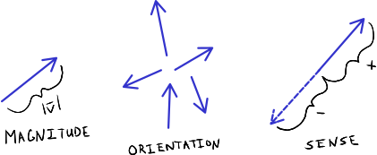
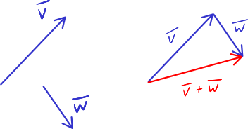
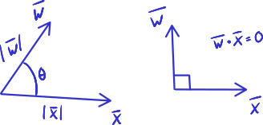
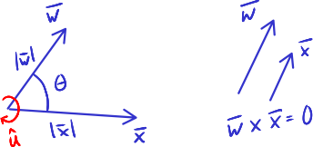

=======
Vectors
=======

.. note::

   You can download this example as a Python script:
   :jupyter-download:script:`vectors` or Jupyter Notebook:
   :jupyter-download:notebook:`vectors`.

.. jupyter-execute::

   import sympy as sm
   import sympy.physics.mechanics as me
   sm.init_printing(use_latex='mathjax')

What is a vector?
=================

Vectors have three characteristics:

1. magnitude
2. orientation
3. sense

The direction the vector points is derived from both the orientation and the
sense. Vectors are equal when all three characteristics are the same.

   Three characteristics of vectors: magnitude, orientation, and sense.

.. note::

   In this text we will distinguish scalar variables, e.g. :math:`v`, from
   vectors by including a bar over the top of the symbol, e.g. :math:`\bar{v}`.
   Vectors will be drawn as follows:

   .. figure:: figures/vectors-figure-notation.svg
      :align: center

      Various ways vectors will be drawn in figures.

   .. figure:: https://upload.wikimedia.org/wikipedia/commons/thumb/3/34/Right-hand_grip_rule.svg/240px-Right-hand_grip_rule.svg.png
      :align: center

      See `right-hand rule <https://en.wikipedia.org/wiki/Right-hand_rule>`_
      for a refresher on right handed systems.

      Right_hand_rule_simple.png: The original uploader was Schorschi2 at
      German Wikipedia.derivative work: Wizard191, Public domain, via Wikimedia
      Commons

Vectors have these mathematical properties:

- scalar multiplicative: :math:`\bar{v} = \lambda\bar{u}` where :math:`\lambda`
  can only change the magnitude and the sense of the vector, i.e.
  :math:`\bar{v}` and :math:`\bar{u}` have the same orientation
- commutative: :math:`\bar{u} + \bar{v} = \bar{v} + \bar{u}`
- distributive: :math:`\lambda(\bar{u} + \bar{v}) = \lambda\bar{u} +
  \lambda\bar{v}`
- associative: :math:`(\bar{u} + \bar{v}) + \bar{w} = \bar{u} + (\bar{v} +
  \bar{w})`

Unit vectors are vectors with a magnitude of :math:`1`. If the magnitude of
:math:`\bar{v}` is 1, then we indicate this with :math:`\hat{v}`. Any vector
has an associated unit vector with the same orientation and sense, found by:

.. math::
   :label: unit-vector-def

   \hat{u} = \frac{\bar{u}}{|\bar{u}|}

where :math:`|\bar{u}|` is the `Euclidean norm`_ (2-norm), or magnitude, of
the vector :math:`\bar{u}`.

.. _Euclidean norm: https://en.wikipedia.org/wiki/Norm_(mathematics)#Euclidean_norm

.. _vector-functions:

Vector Functions
================

Vectors can be functions of scalar variables. If a change in scalar variable
:math:`q` changes the magnitude and/or direction of :math:`\bar{v}` when
observed from :math:`A`, :math:`\bar{v}` is a vector function of :math:`q` in
:math:`A`. Note that this implies that :math:`\bar{v}` may not be a vector
function of scalar variable :math:`q` when observed from another reference
frame.

Let vector :math:`\bar{v}` be a function of :math:`n` scalars
:math:`q_1,q_2,\ldots,q_n` in :math:`A`. If we introduce
:math:`\hat{a}_x,\hat{a}_y,\hat{a}_z` as a set of mutually perpendicular unit
vectors fixed in :math:`A`, then these unit vectors are constant when observed
from :math:`A`. There are then three unique scalar functions
:math:`v_x,v_y,v_z` of :math:`q_1,q_2,\ldots,q_n` such that:

.. math::
   :label: vector-with-meas-nums

   \bar{v} = v_x \hat{a}_x + v_y \hat{a}_y + v_y \hat{a}_y

:math:`v_x \hat{a}_x` is called the :math:`\hat{a}_x` component of
:math:`\bar{v}` and :math:`v_x` is called measure number of :math:`\bar{v}`.
Since the components are mutually perpendicular the measure number can also be
found from the dot product of :math:`\bar{v}` and the respective unit vector:

.. math::
   :label: meas-num-dots

   \bar{v} = (\bar{v} \cdot \hat{a}_x) \hat{a}_x +
             (\bar{v} \cdot \hat{a}_y) \hat{a}_y +
             (\bar{v} \cdot \hat{a}_z) \hat{a}_z

which is the projection of :math:`\bar{v}` onto each unit vector. When written
this way we can say that :math:`\bar{v}` is expressed in :math:`A`. See
sections 1.1-1.3 in [Kane1985]_ for a more general explanation.

Addition
========

When we add vector :math:`\bar{b}` to vector :math:`\bar{a}`, the result is
a vector that starts at the tail of :math:`\bar{a}` and ends at the tip of
:math:`\bar{b}`:

   Graphical vector addition

Vectors in SymPy Mechanics are created by first introducing a reference frame
and using its associated unit vectors to construct vectors of arbitrary
magnitude and direction.

.. jupyter-execute::

   N = me.ReferenceFrame('N')

Now introduce some scalar variables:

.. jupyter-execute::

   a, b, c, d, e, f = sm.symbols('a, b, c, d, e, f')

The simplest 3D non-unit vector is made up of a single component:

.. jupyter-execute::

   v = a*N.x
   v

A, possible more familiar, column matrix form of a vector is accessed with the
:external:py:meth:`~sympy.physics.vector.vector.Vector.to_matrix`.

.. jupyter-execute::

   v.to_matrix(N)

Fully 3D and arbitrary vectors can be created by providing a measure number for
each unit vector of :math:`N`:

.. jupyter-execute::

   w = a*N.x + b*N.y + c*N.z
   w

And the associated column matrix form:

.. jupyter-execute::

   w.to_matrix(N)

Vector addition works by adding the measure numbers of each common component:

.. math::
   :label: vector-add

   \bar{w} = & a \hat{n}_x + b \hat{n}_y + c \hat{n}_z \\
   \bar{x} = & d \hat{n}_x + e \hat{n}_y + f \hat{n}_z \\
   \bar{w} + \bar{x} = & (a + d) \hat{n}_x + (b + e) \hat{n}_y + (c + f) \hat{n}_z

SymPy Mechanics vectors work as expected:

.. jupyter-execute::

   x = d*N.x + e*N.y + f*N.z
   x

.. jupyter-execute::

   w + x

Scaling
=======

Multiplying a vector by a scalar changes its magnitude, but not its
orientation. Scaling by a negative number changes a vector's magnitude and
reverses its sense (rotates it by :math:`\pi` radians).

.. figure:: figures/vectors-scaling.svg
   :alt: Vector scaling

   Vector scaling

.. jupyter-execute::

   y = 2*w
   y

.. jupyter-execute::

   z = -w
   z

.. admonition:: Exercise

   Create three vectors that lie in the :math:`xy` plane of reference frame
   :math:`N` where each vector is:

   1. of length :math:`l` that is at an angle of :math:`\frac{\pi}{4}`
      degrees from the :math:`\hat{n}_x` unit vector.
   2. of length :math:`10` and is in the :math:`-\hat{n}_y` direction
   3. of length :math:`l` and is :math:`\theta` radians from the
      :math:`\hat{n}_y` unit vector.

   Finally, add vectors from 1 and 2 and substract :math:`5` times the third
   vector.

   Hint: SymPy has fundamental constants and trigonometic functions, for
   example ``sm.tan, sm.pi``.

.. admonition:: Solution
   :class: dropdown

   .. jupyter-execute::

      N = me.ReferenceFrame('N')
      l, theta = sm.symbols('l, theta')

   .. jupyter-execute::

      v1 = l*sm.cos(sm.pi/4)*N.x + l*sm.sin(sm.pi/4)*N.y
      v1

   .. jupyter-execute::

      v2 = -10*N.y
      v2

   .. jupyter-execute::

      v3 = -l*sm.sin(theta)*N.x + l*sm.cos(theta)*N.y
      v3

   .. jupyter-execute::

      v1 + v2 - 5*v3

Dot Product
===========

The dot product, which yields a scalar quantity, is defined as:

.. math::
   :label: vector-dot

   \bar{v} \cdot \bar{w} = |\bar{v}| |\bar{w}| \cos{\theta}

where :math:`\theta` is the angle between the two vectors. For arbitrary
measure numbers this results in the following:

.. math::
   :label: dot-rules

   \bar{v} = & v_x \hat{n}_x + v_y \hat{n}_y + v_z \hat{n}_z \\
   \bar{w} = & w_x \hat{n}_x + w_y \hat{n}_y + w_z \hat{n}_z \\
   \bar{v} \cdot \bar{w} = & v_x w_x + v_v w_y + v_z w_z

   Vector dot product

The dot product has these properties:

- You can pull out scalars: :math:`c \bar{u} \cdot d \bar{v} = cd (\bar{u} \cdot \bar{v})`
- Order does not matter (commutative multiplication): :math:`\bar{u} \cdot \bar{v} = \bar{v} \cdot \bar{u}`
- You can distribute: :math:`\bar{u} \cdot (\bar{v} + \bar{w}) = \bar{u} \cdot \bar{v} + \bar{u} \cdot \bar{w}`

The dot product is often used to determine:

- the angle between two vectors:
  :math:`\theta = \arccos\frac{\bar{a} \cdot \bar{b}}{|\bar{a}|\bar{b}|}`
- a vector’s magnitude: :math:`|\bar{v}| = \sqrt{\bar{v} \cdot \bar{v}}`
- the length of a vector along a direction of another vector :math:`\hat{u}`
  (called the projection):
  :math:`\mbox{proj}_\hat{u} \bar{v} = \bar{v} \cdot \hat{u}`
- if two vectors are perpendicular: :math:`\bar{v} \cdot \bar{w} = 0 \mbox{ if }\bar{v} \perp \bar{w}`
- Compute power: :math:`P = \bar{F} \cdot \bar{v}`, where :math:`\bar{F}` is a
  force vector and :math:`\bar{v}` is the velocity of the point the force is
  acting on.

Also, dot products are used to convert a vector equation into a scalar equation
by "dotting" an entire equation with a vector.

.. jupyter-execute::

    N = me.ReferenceFrame('N')
    w = a*N.x + b*N.y + c*N.z
    x = d*N.x + e*N.y + f*N.z

The :external:py:func:`~sympy.physics.vector.functions.dot` function
calculates the dot product:

.. jupyter-execute::

    me.dot(w, x)

The method form is equivalent:

.. jupyter-execute::

    w.dot(x)

You can compute a unit vector :math:`\hat{w}` in the same direction as
:math:`\bar{w}` with the
:external:py:meth:`~sympy.physics.vector.vector.Vector.normalize` method:

.. jupyter-execute::

   w.normalize()

.. admonition:: Exercise

   Write your own function that normalizes an arbitrary vector and show that it
   gives the same result as ``w.normalize()``.

.. admonition:: Solution
   :class: dropdown

   .. jupyter-execute::

      def normalize(vector):
          return vector/sm.sqrt(me.dot(vector, vector))

      normalize(w)

SymPy Mechanics vectors also have a method
:external:py:meth:`~sympy.physics.vector.vector.Vector.magnitude` which is
helpful:

.. jupyter-execute::

   w.magnitude()

.. jupyter-execute::

   w/w.magnitude()

.. admonition:: Exercise

   Given the vectors
   :math:`\bar{v}_1 = a \hat{\mathbf{n}}_x + b\hat{\mathbf{n}}_y + a \hat{\mathbf{n}}_z`
   and
   :math:`\bar{v}_2=b \hat{\mathbf{n}}_x + a\hat{\mathbf{n}}_y + b \hat{\mathbf{n}}_z`
   find the angle between the two vectors using the dot product.

.. admonition:: Solution
   :class: dropdown

   .. jupyter-execute::

      N = me.ReferenceFrame('N')
      v1 = a*N.x + b*N.y + a*N.z
      v2 = b*N.x + a*N.y + b*N.z

   .. jupyter-execute::

      sm.acos(v1.dot(v2) / (v1.magnitude()*v2.magnitude()))

Cross Product
=============

The `cross product`_, which yields a vector quantity, is defined as:

.. math::
   :label: vector-cross

   \bar{v} \times \bar{w} = |\bar{v}|\bar{w}| \sin\theta \hat{u}

where :math:`\theta` is the angle between the two vectors, and :math:`\hat{u}`
is the unit vector perpendicular to both :math:`\bar{v}` and :math:`\bar{w}`
whose sense is given by the right-hand rule. For arbitrary measure numbers this
results in the following:

.. math::
   :label: vector-cross-rules

   \bar{v} = & v_x \hat{n}_x + v_y \hat{n}_y + v_z \hat{n}_z \\
   \bar{w} = & w_x \hat{n}_x + w_y \hat{n}_y + w_z \hat{n}_z \\
   \bar{v} \times \bar{w} = &
   (v_y w_z - v_z w_y) \hat{n}_x +
   (v_z w_x - v_x w_z) \hat{n}_y +
   (v_x w_y - v_y w_x) \hat{n}_z

.. _cross product: https://en.wikipedia.org/wiki/Cross_product

   Vector cross product

Some properties of cross products are:

- Crossing a vector with itself "cancels" it: :math:`\bar{a} \times \bar{a} = \bar{0}`
- You can pull out scalars: :math:`c \bar{a} \times d \bar{b} = cd (\bar{a} \times \bar{b})`
- Order **DOES** matter (because of the right-hand rule): :math:`\bar{a} \times
  \bar{b} = -\bar{b} \times \bar{a}`
- You can distribute:
  :math:`\bar{a} \times (\bar{b} + \bar{c}) = \bar{a} \times \bar{b} + \bar{a} \times \bar{c}`
- They are **NOT** associative:
  :math:`\bar{a} \times (\bar{b} \times \bar{c}) \neq (\bar{a} \times \bar{b}) \times \bar{c}`

The cross product is used to:

-  obtain a vector/direction perpendicular to two other vectors
-  determine if two vectors are parallel:
   :math:`\bar{v} \times \bar{w} = \bar{0} \mbox{ if } \bar{v} \parallel \bar{w}`
-  compute moments: :math:`\bar{r} \times \bar{F}`
-  compute the area of a triangle

SymPy Mechanics can calculate cross products with the
:external:py:func:`~sympy.physics.vector.functions.cross`. function:

.. jupyter-execute::

    N = me.ReferenceFrame('N')
    w = a*N.x + b*N.y + c*N.z
    w

.. jupyter-execute::

    x = d*N.x + e*N.y + f*N.z
    x

.. jupyter-execute::

    me.cross(w, x)

The method form is equivalent:

.. jupyter-execute::

    w.cross(x)

.. admonition:: Exercise

   Given three points located in reference frame :math:`N` by:

   .. math::
      :label: triangle

      \bar{p}_1 = 23 \hat{n}_x - 12 \hat{n}_y \\
      \bar{p}_2 = 16 \hat{n}_x + 2 \hat{n}_y - 4 \hat{n}_z \\
      \bar{p}_3 = \hat{n}_x + 14 \hat{n}_z

   Find the area of the triangle bounded by these three points using the cross
   product.

   Hint: Search online for the relationship of the cross product to triangle
   area.

.. admonition:: Solution
   :class: dropdown

   .. jupyter-execute::

      N = me.ReferenceFrame('N')

      p1 = 23*N.x - 12* N.y
      p2 = 16*N.x + 2*N.y - 4*N.z
      p3 = N.x + 14*N.z

      me.cross(p2 - p1, p3 - p1).magnitude() / 2

Vectors Expressed in Multiple Reference Frames
==============================================

This presentation of vectors becomes quite useful when you need to describe
vectors with components in multiple reference frames. Utilizing unit vectors
fixed in various frames is rather natural, with no need to think about
direction cosine matrices.

.. jupyter-execute::

   N = me.ReferenceFrame('N')
   A = me.ReferenceFrame('A')
   a, b, theta = sm.symbols('a, b, theta')

   v = a*A.x + b*N.y
   v

All of the previously described operations work as expected:

.. jupyter-execute::

   v + v

If an orientation is established between the two reference frames, the
direction cosine transformations are handled for you and can be used to
naturally express the vector in either reference frame using the
:external:py:meth:`~sympy.physics.vector.vector.Vector.express`.

.. jupyter-execute::

   A.orient_axis(N, theta, N.z)

   v.express(N)

.. jupyter-execute::

   v.express(A)

Relative Position Among Points
==============================

Take for example the `balanced-arm lamp`_, which has multiple articulated
joints configured in a way to balance the weight of the lamp in any
configuration. Here are two examples:

.. figure:: https://upload.wikimedia.org/wikipedia/commons/thumb/c/cc/Anglepoise_1227.jpg/353px-Anglepoise_1227.jpg

   Balanced-arm desk lamp.

   Flickr user "renaissance chambara", cropped by uploader, CC BY 2.0
   https://creativecommons.org/licenses/by/2.0, via Wikimedia Commons

.. figure:: https://upload.wikimedia.org/wikipedia/commons/thumb/0/07/GraphyArchy_-_Wikipedia_00323.jpg/320px-GraphyArchy_-_Wikipedia_00323.jpg

   Example of a huge balance-arm lamp in Rotterdam at the Schouwburgplein.

   GraphyArchy, CC BY-SA 4.0 https://creativecommons.org/licenses/by-sa/4.0,
   via Wikimedia Commons

.. _balanced-arm lamp: https://en.wikipedia.org/wiki/Balanced-arm_lamp

With those in mind, :numref:`vectors-desk-lamp` shows a possible diagram of a
desk lamp with all necessary configuration information present. The base
:math:`N` is fixed to the desk. The first linkage :math:`A` is oriented with
respect to :math:`N` by a :math:`z\textrm{-}x` body fixed orientation through
angles :math:`q_1` and :math:`q_2`. Point :math:`P_1` is fixed in :math:`N` and
is located at the center of the base. Linkage :math:`A` is defined by points
:math:`P_1` and :math:`P_2` which are separated by length :math:`l_1` along the
:math:`\hat{a}_z` direction. Linkage :math:`B` orients simply with respect to
:math:`A` about :math:`\hat{a}_x=\hat{b}_x` through angle :math:`q_3` and point
:math:`P_3` is :math:`l_2` from :math:`P_2` along :math:`\hat{b}_z`. Lastly,
the lamp head :math:`C` orients relative to :math:`B` by a :math:`x\textrm{-}z`
body fixed orientation through angles :math:`q_4` and :math:`q_5`. The center of
the light bulb :math:`P_4` is located relative to :math:`P_3` by the distances
:math:`l_3` along :math:`\hat{c}_z` and :math:`l_4` along :math:`-\hat{c}_y`.

.. _vectors-desk-lamp:
.. figure:: figures/vectors-desk-lamp.svg
   :align: center
   :width: 500px

   Configuration diagram of a balanced-arm desk lamp.

We will use the following notation for vectors that indicate the relative
position between two points:

.. math::
   :label: position-vect-p2p1

   \bar{r}^{P_2/P_1}

which reads as the "position vector from :math:`P_1` to :math:`P_2`". The tail
of the vector is at :math:`P_1` and the tip is at :math:`P_2`.

.. admonition:: Exercise

   Reread the :ref:`vector-function` section and answer the following
   questions:

   1. Is :math:`\bar{r}^{P_2/P_1}` vector function of :math:`q_1` and :math:`q_2` in N?
   2. Is :math:`\bar{r}^{P_2/P_1}` vector function of :math:`q_1` and :math:`q_1` in A?
   3. Is :math:`\bar{r}^{P_2/P_1}` vector function of :math:`q_3` and :math:`q_4` in N?
   4. Is :math:`\bar{r}^{P_3/P_2}` vector function of :math:`q_1` and :math:`q_2` in N?

.. admonition:: Solution
   :class: dropdown

   See below how to use ``.free_symbols()`` to find the answers.

We can now write position vectors between pairs of points as we move from the
base of the lamp to the light bulb. We'll do so with SymPy Mechanics. First
create the necessary symbols and reference frames.

.. jupyter-execute::

   q1, q2, q3, q4, q5 = sm.symbols('q1, q2, q3, q4, q5')
   l1, l2, l3, l4 = sm.symbols('l1, l2, l3, l4')
   N = me.ReferenceFrame('N')
   A = me.ReferenceFrame('A')
   B = me.ReferenceFrame('B')
   C = me.ReferenceFrame('C')

Now establish the orientations, starting with :math:`A`'s orientation relative to
:math:`N`.

.. jupyter-execute::

   A.orient_body_fixed(N, (q1, q2, 0), 'ZXZ')

Notice that the unneeded third simple orientation angle was set to zero. Set a
simple orientation for :math:`B` relative to :math:`A`.

.. jupyter-execute::

   B.orient_axis(A, q3, A.x)

And finally :math:`C` relative to :math:`B`.

.. jupyter-execute::

   C.orient_body_fixed(B, (q4, q5, 0), 'XZX')

We can now create position vectors between pairs of points in the most
convenient frame to do so, i.e. the reference frame in which both points are
fixed.

.. jupyter-execute::

   R_P1_P2 = l1*A.z
   R_P2_P3 = l2*B.z
   R_P3_P4 = l3*C.z - l4*C.y

The position vector from :math:`P_1` to :math:`P_4` is then found by vector
addition:

.. jupyter-execute::

   R_P1_P4 = R_P1_P2 + R_P2_P3 + R_P3_P4
   R_P1_P4

To convince you of the utility of our vector notation, have a look at what
:math:`\bar{r}^{P_4/P_1}` looks like if expressed completely in the :math:`N`
frame:

.. jupyter-execute::

   R_P1_P4.express(N)

If you have properly established your orientations and position vectors, SymPy
Mechanics can help you determine the answers to the previous exercise.
Expressing :math:`\bar{r}^{P2/P1}` in :math:`N` can show us which scalar
variables that vector function depends on in :math:`N`.

.. jupyter-execute::

   R_P1_P2.express(N)

By inspection we see :math:`l_1,q_1,q_2`. The
:external:py:meth:`~sympy.physics.vector.vector.Vector.free_symbols` function
can extract these scalars directly:

.. jupyter-execute::

   R_P1_P2.free_symbols(N)

.. warning::

   ``free_symbols()`` shows all SymPy ``Symbol`` objects, but will not show
   ``Function()`` objects. In the next chapter we will introduce a way to do
   the same thing when functions of time are present in your vector
   expressions.

Similarly, other vector functions can be inspected:

.. jupyter-execute::

   R_P1_P2.free_symbols(A)

.. jupyter-execute::

   R_P1_P4.free_symbols(N)
