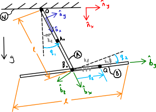

===============================
Three Dimensional Visualization
===============================

.. note::

   You can download this example as a Python script:
   :jupyter-download-script:`visualization` or Jupyter Notebook:
   :jupyter-download-notebook:`visualization`.

.. jupyter-execute::

   from scipy.integrate import solve_ivp
   import numpy as np
   import sympy as sm
   import sympy.physics.mechanics as me

.. container:: invisible

   .. jupyter-execute::

      class ReferenceFrame(me.ReferenceFrame):

          def __init__(self, *args, **kwargs):

              kwargs.pop('latexs', None)

              lab = args[0].lower()
              tex = r'\hat{{{}}}_{}'

              super(ReferenceFrame, self).__init__(*args,
                                                   latexs=(tex.format(lab, 'x'),
                                                           tex.format(lab, 'y'),
                                                           tex.format(lab, 'z')),
                                                   **kwargs)
      me.ReferenceFrame = ReferenceFrame

In this chapter, I will give a basic introduction to creating three dimensional
graphics to visualize the motion of your multibody system. There are many
software tools for generating interactive three dimensional graphics from
classic lower level tools like OpenGL_ to graphical user interfaces for drawing
and animating 3D models like Blender_ [#]_.  We will use pythreejs_ which is a
Python wrapper to the three.js_ Javascript library that is built on WebGL_
which is a low level graphics library similar to OpenGL but made to execute
through your web browser. Check out the demos_ on three.js's website to get an
idea of how powerful the tool is for 3D visualizations in the web browser.

.. _OpenGL: https://en.wikipedia.org/wiki/OpenGL
.. _Blender: https://en.wikipedia.org/wiki/Blender_(software)
.. _pythreejs: https://pythreejs.readthedocs.io/en/stable/
.. _three.js: https://threejs.org/
.. _WebGL: https://en.wikipedia.org/wiki/WebGL
.. _demos: https://threejs.org/examples/#webgl_animation_keyframes

I will again use the example in :numref:`fig-eom-double-rod-pendulum`. Here is
the figure for that system:

The following dropdown has all of the code to construct the model and simulate
it with the time values ``ts`` and the state trajectories ``xs`` as the final
output.

.. admonition:: Modeling and Simulation Code
   :class: dropdown

   .. jupyter-execute::

      m, g, kt, kl, l = sm.symbols('m, g, k_t, k_l, l')
      q1, q2, q3 = me.dynamicsymbols('q1, q2, q3')
      u1, u2, u3 = me.dynamicsymbols('u1, u2, u3')

      N = me.ReferenceFrame('N')
      A = me.ReferenceFrame('A')
      B = me.ReferenceFrame('B')

      A.orient_axis(N, q1, N.z)
      B.orient_axis(A, q2, A.x)

      A.set_ang_vel(N, u1*N.z)
      B.set_ang_vel(A, u2*A.x)

      O = me.Point('O')
      Ao = me.Point('A_O')
      Bo = me.Point('B_O')
      Q = me.Point('Q')

      Ao.set_pos(O, l/2*A.x)
      Bo.set_pos(O, l*A.x)
      Q.set_pos(Bo, q3*B.y)

      O.set_vel(N, 0)
      Ao.v2pt_theory(O, N, A)
      Bo.v2pt_theory(O, N, A)
      Q.set_vel(B, u3*B.y)
      Q.v1pt_theory(Bo, N, B)

      t = me.dynamicsymbols._t

      qdot_repl = {q1.diff(t): u1,
                   q2.diff(t): u2,
                   q3.diff(t): u3}

      Q.set_acc(N, Q.acc(N).xreplace(qdot_repl))

      R_Ao = m*g*N.x
      R_Bo = m*g*N.x + kl*q3*B.y
      R_Q = m/4*g*N.x - kl*q3*B.y
      T_A = -kt*q1*N.z + kt*q2*A.x
      T_B = -kt*q2*A.x

      I = m*l**2/12
      I_A_Ao = I*me.outer(A.y, A.y) + I*me.outer(A.z, A.z)
      I_B_Bo = I*me.outer(B.x, B.x) + I*me.outer(B.z, B.z)

      points = [Ao, Bo, Q]
      forces = [R_Ao, R_Bo, R_Q]
      masses = [m, m, m/4]

      frames = [A, B]
      torques = [T_A, T_B]
      inertias = [I_A_Ao, I_B_Bo]

      Fr_bar = []
      Frs_bar = []

      for ur in [u1, u2, u3]:

          Fr = 0
          Frs = 0

          for Pi, Ri, mi in zip(points, forces, masses):
              vr = Pi.vel(N).diff(ur, N)
              Fr += vr.dot(Ri)
              Rs = -mi*Pi.acc(N)
              Frs += vr.dot(Rs)

          for Bi, Ti, Ii in zip(frames, torques, inertias):
              wr = Bi.ang_vel_in(N).diff(ur, N)
              Fr += wr.dot(Ti)
              Ts = -(Bi.ang_acc_in(N).dot(Ii) +
                     me.cross(Bi.ang_vel_in(N), Ii).dot(Bi.ang_vel_in(N)))
              Frs += wr.dot(Ts)

          Fr_bar.append(Fr)
          Frs_bar.append(Frs)

      Fr = sm.Matrix(Fr_bar)
      Frs = sm.Matrix(Frs_bar)

      q = sm.Matrix([q1, q2, q3])
      u = sm.Matrix([u1, u2, u3])
      p = sm.Matrix([g, kl, kt, l, m])

      qd = q.diff(t)
      ud = u.diff(t)

      ud_zerod = {udr: 0 for udr in ud}

      Mk = -sm.eye(3)
      gk = u

      Md = Frs.jacobian(ud)
      gd = Frs.xreplace(ud_zerod) + Fr

      eval_eom = sm.lambdify((q, u, p), [Mk, gk, Md, gd])

      def eval_rhs(t, x, p):
          """Return the right hand side of the explicit ordinary differential
          equations which evaluates the time derivative of the state ``x`` at time
          ``t``.

          Parameters
          ==========
          t : float
             Time in seconds.
          x : array_like, shape(6,)
             State at time t: [q1, q2, q3, u1, u2, u3]
          p : array_like, shape(5,)
             Constant parameters: [g, kl, kt, l, m]

          Returns
          =======
          xd : ndarray, shape(6,)
              Derivative of the state with respect to time at time ``t``.

          """

          # unpack the q and u vectors from x
          q = x[:3]
          u = x[3:]

          # evaluate the equations of motion matrices with the values of q, u, p
          Mk, gk, Md, gd = eval_eom(q, u, p)

          # solve for q' and u'
          qd = np.linalg.solve(-Mk, np.squeeze(gk))
          ud = np.linalg.solve(-Md, np.squeeze(gd))

          # pack dq/dt and du/dt into a new state time derivative vector dx/dt
          xd = np.empty_like(x)
          xd[:3] = qd
          xd[3:] = ud

          return xd

      q_vals = np.array([
          np.deg2rad(25.0),  # q1, rad
          np.deg2rad(5.0),  # q2, rad
          0.1,  # q3, m
      ])

      u_vals = np.array([
          0.1,  # u1, rad/s
          2.2,  # u2, rad/s
          0.3,  # u3, m/s
      ])

      p_vals = np.array([
          9.81,  # g, m/s**2
          3.0,  # kl, N/m
          0.01,  # kt, Nm/rad
          0.6,  # l, m
          1.0,  # m, kg
      ])

      x0 = np.empty(6)
      x0[:3] = q_vals
      x0[3:] = u_vals

      fps = 20
      t0, tf = 0.0, 10.0
      ts = np.linspace(t0, tf, num=int(fps*(tf - t0)))
      result = solve_ivp(eval_rhs, (t0, tf), x0, args=(p_vals,), t_eval=ts)
      xs = result.y.T

.. jupyter-execute::

   ts.shape, xs.shape

.. [#] Blender was birthed in the Netherlands!

pythreejs
=========

pythreejs allows you to use three.js via Python. The functions and objects that
pythreejs makes available are found in `its documentation`_, but since these
have a 1:1 mapping to the three.js code, you'll also find more comprehensive
information in the `ThreeJS documentation`_. We will import pythreejs like so:

.. jupyter-execute::

   import pythreejs as p3js

.. _its documentation: https://pythreejs.readthedocs.io
.. _ThreeJS documentation: https://threejs.org/docs/index.html

pythreejs has many `primitive geometric shapes`_, for example
:external:py:class:`~pythreejs.CylinderGeometry` can be used to create
cylinders and cones:

.. jupyter-execute::

   cyl_geom = p3js.CylinderGeometry(radiusTop=2.0, radiusBottom=10.0, height=50.0)
   cyl_geom

The image above is interactive; you can use your mouse or trackpad to click,
hold, and move the object.

.. _primitive geometric shapes: https://pythreejs.readthedocs.io/en/stable/examples/Geometries.html

If you want to apply a material to the surface of the geometry you create a
:external:py:class:`~pythreejs.Mesh` which associates a
:external:py:class:`~pythreejs.Material` with the geometry. For example, you can
color the above cylinder like so:

.. jupyter-execute::

   red_material = p3js.MeshStandardMaterial(color='red')

   cyl_mesh = p3js.Mesh(geometry=cyl_geom, material=red_material)

   cyl_mesh

Creating a Scene
================

Here I create a new orange cylinder that is displaced from the origin of the
scene and that has its own coordinate axes.
:external:py:class:`~pythreejs.AxesHelper` creates simple X (red), Y (green), and
Z (blue) affixed to the mesh. :external:py:attr:`~pythreejs.Object3D.position` is
overridden to set the position.

.. jupyter-execute::

   cyl_geom = p3js.CylinderGeometry(radiusTop=0.1, radiusBottom=0.5, height=2.0)
   cyl_material = p3js.MeshStandardMaterial(color='orange', wireframe=True)
   cyl_mesh = p3js.Mesh(geometry=cyl_geom, material=cyl_material)
   axes = p3js.AxesHelper()
   cyl_mesh.add(axes)
   cyl_mesh.position = (3.0, 3.0, 3.0)

Now we will create a :external:py:class:`~pythreejs.Scene` which can contain
multiple meshes and other objects like lights, cameras, and axes. There is a
fair amount of boiler plate code for creating the static scene. All of the
objects should be added to the ``children=`` keyword argument of ``Scene``. The
last line creates a :external:py:class:`~pythreejs.WebGLBufferRenderer` that links the camera
view to the scene and enables :external:py:class:`~pythreejs.OrbitControls` to
allow zooming, panning, and rotating with a mouse or trackpad.

.. jupyter-execute::

   view_width = 600
   view_height = 400

   camera = p3js.PerspectiveCamera(position=[10.0, 10.0, 10.0],
                                   aspect=view_width/view_height)
   dir_light = p3js.DirectionalLight(position=[0.0, 10.0, 10.0])
   ambient_light = p3js.AmbientLight()

   axes = p3js.AxesHelper()
   scene = p3js.Scene(children=[cyl_mesh, axes, camera, dir_light, ambient_light])
   controller = p3js.OrbitControls(controlling=camera)
   renderer = p3js.Renderer(camera=camera,
                            scene=scene,
                            controls=[controller],
                            width=view_width,
                            height=view_height)

Now display the scene by calling the renderer:

.. jupyter-execute::

   renderer

Transformation Matrices
=======================

The location and orientation of any given mesh is stored in its `transformation
matrix`_. A transformation matrix is commonly used in graphics applications
because it can describe the position, orientation, scaling, and skewing of a
mesh of points. A transformation matrix that only describes rotation and
position takes this form:

.. math::
   :label: eq-transformation-matrix

   \mathbf{T} = \begin{bmatrix}
   {}^N\mathbf{C}^B & \bar{0} \\
   \bar{r}^{P/O} & 1
   \end{bmatrix} \quad \mathbf{T}\in \mathbb{R}^{4x4}

.. _transformation matrix: https://en.wikipedia.org/wiki/Transformation_matrix

Here the direction cosine matrix of a mesh :math:`B` with respect to the
scene's global reference frame :math:`N` is stored in the first three rows and
columns, the position vector to a reference point :math:`P` fixed in the mesh
relative to the scene's origin point :math:`O` is stored in the first three
columns of the bottom row. If there is no rotation or translation, the
transformation matrix becomes the identity matrix. This matrix is stored in the
:external:py:attr:`~pythreejs.Object3D.matrix` attribute of the mesh:

.. jupyter-execute::

   cyl_mesh.matrix

Notice that the 4x4 matrix is stored "flattened" in a single list of 16 values.

.. jupyter-execute::

   len(cyl_mesh.matrix)

If you change this list to a NumPy array you can
:external:py:meth:`~numpy.ndarray.reshape` it and
:external:py:meth:`~numpy.ndarray.flatten` it to see the connection.

.. jupyter-execute::

   np.array(cyl_mesh.matrix).reshape(4, 4)

.. jupyter-execute::

   np.array(cyl_mesh.matrix).reshape(4, 4).flatten()

Each mesh/geometry has its own local coordinate system and origin. For the
cylinder, the origin is at the geometric center and the axis of the cylinder is
aligned with its local Y axis. For our body :math:`A`, we need the cylinder's
axis to align with our :math:`\hat{a}_x` vector. To solve this, we need to
create a new reference frame in which its Y unit vector is aligned with the
:math:`\hat{a}_x`. I introduce reference frame :math:`A_c` for this purpose:

.. jupyter-execute::

   Ac = me.ReferenceFrame('Ac')
   Ac.orient_axis(A, sm.pi/2, A.z)

Now we can create a transformation matrix for :math:`A_c` and :math:`A_o`.
:math:`A_o` aligns with the cylinder mesh's origin and :math:`A_c` aligns with
its coordinate system.

.. jupyter-execute::

   TA = sm.eye(4)
   TA[:3, :3] = Ac.dcm(N)
   TA[3, :3] = sm.transpose(Ao.pos_from(O).to_matrix(N))
   TA

The :math:`B` rod is already correctly aligned with the cylinder geometry's
local coordinate system so we do not need to introduce a new reference frame
for its transformation matrix.

.. jupyter-execute::

   TB = sm.eye(4)
   TB[:3, :3] = B.dcm(N)
   TB[3, :3] = sm.transpose(Bo.pos_from(O).to_matrix(N))
   TB

Lastly, we will introduce a sphere mesh to show the location of point
:math:`Q`. We can choose any reference frame because a sphere looks the same
from all directions, but I choose to use the :math:`B` frame here since we
describe the point as sliding along the rod :math:`B`. This choice will play a
role in making the local coordinate axes visualize a bit better in the final
animations.

.. jupyter-execute::

   TQ = sm.eye(4)
   TQ[:3, :3] = B.dcm(N)
   TQ[3, :3] = sm.transpose(Q.pos_from(O).to_matrix(N))
   TQ

Now that we have symbolic transformation matrices, let's flatten them all to be
in the form that three.js needs:

.. jupyter-execute::

   TA = TA.reshape(16, 1)
   TB = TB.reshape(16, 1)
   TQ = TQ.reshape(16, 1)

.. jupyter-execute::

   TA

Now create a function to numerically evaluate the transformation matrices given
the generalized coordinates and constants of the system:

.. jupyter-execute::

   eval_transform = sm.lambdify((q, p), (TA, TB, TQ))
   eval_transform(q_vals, p_vals)

Finally, create a list of lists for the transformation matrices at each time in
``ts``, as this is the form needed for the animation data below:

.. jupyter-execute::

   TAs = []
   TBs = []
   TQs = []

   for xi in xs:
       TAi, TBi, TQi = eval_transform(xi[:3], p_vals)
       TAs.append(TAi.squeeze().tolist())
       TBs.append(TBi.squeeze().tolist())
       TQs.append(TQi.squeeze().tolist())

Here are the first two numerical transformation matrices to see what we have
created:

.. jupyter-execute::

   TAs[:2]

Geometry and Mesh Definitions
=============================

Create two cylinders for rods :math:`A` and :math:`B` and a sphere for particle
:math:`Q`:

.. jupyter-execute::

   rod_radius = p_vals[3]/20  # l/20
   sphere_radius = p_vals[3]/16  # l/16

   geom_A = p3js.CylinderGeometry(
       radiusTop=rod_radius,
       radiusBottom=rod_radius,
       height=p_vals[3],  # l
   )

   geom_B = p3js.CylinderGeometry(
       radiusTop=rod_radius,
       radiusBottom=rod_radius,
       height=p_vals[3],  # l
   )

   geom_Q = p3js.SphereGeometry(radius=sphere_radius)

Now create meshes for each body and add a material of a different color for
each mesh. Each mesh will need a unique name so that we can associate the
animation information with the correct object. After the creation of the mesh
set :external:py:attr:`~pythreejs.Object3D.matrixAutoUpdate` to false so that we can
manually specify the transformation matrix during the animation.  Lastly, add
local coordinate axes to each mesh and set the transformation matrix to the
initial configuration.

.. jupyter-execute::

   arrow_length = 0.2

   mesh_A = p3js.Mesh(
       geometry=geom_A,
       material=p3js.MeshStandardMaterial(color='red'),
       name='mesh_A',
   )
   mesh_A.matrixAutoUpdate = False
   mesh_A.add(p3js.AxesHelper(arrow_length))
   mesh_A.matrix = TAs[0]

   mesh_B = p3js.Mesh(
       geometry=geom_B,
       material=p3js.MeshStandardMaterial(color='blue'),
       name='mesh_B',
   )
   mesh_B.matrixAutoUpdate = False
   mesh_B.add(p3js.AxesHelper(arrow_length))
   mesh_B.matrix = TBs[0]

   mesh_Q = p3js.Mesh(
       geometry=geom_Q,
       material=p3js.MeshStandardMaterial(color='green'),
       name='mesh_Q',
   )
   mesh_Q.matrixAutoUpdate = False
   mesh_Q.add(p3js.AxesHelper(arrow_length))
   mesh_Q.matrix = TQs[0]

Scene Setup
===========

Now create a scene and renderer similar to as we did earlier. Include the
camera, lighting, coordinate axes, and all of the meshes.

.. jupyter-execute::

   view_width = 600
   view_height = 400

   camera = p3js.PerspectiveCamera(position=[1.5, 0.6, 1],
                                   up=[-1.0, 0.0, 0.0],
                                   aspect=view_width/view_height)

   key_light = p3js.DirectionalLight(position=[0, 10, 10])
   ambient_light = p3js.AmbientLight()

   axes = p3js.AxesHelper()

   children = [mesh_A, mesh_B, mesh_Q, axes, camera, key_light, ambient_light]

   scene = p3js.Scene(children=children)

   controller = p3js.OrbitControls(controlling=camera)
   renderer = p3js.Renderer(camera=camera, scene=scene, controls=[controller],
                            width=view_width, height=view_height)

Animation Setup
===============

three.js uses the concept of a "track" to track the data that changes over time
for an animation. A :external:py:class:`~pythreejs.VectorKeyframeTrack` can be used
to associate time varying transformation matrices with a specific mesh. Create
a track for each mesh. Make sure that the name keyword argument matches the
name of the mesh with this syntax: ``scene/<mesh name>.matrix``. The ``times``
and ``values`` keyword arguments hold the simulation time values and the list
of transformation matrices at each time, respectively.

.. jupyter-execute::

   track_A = p3js.VectorKeyframeTrack(
       name="scene/mesh_A.matrix",
       times=ts,
       values=TAs
   )

   track_B = p3js.VectorKeyframeTrack(
       name="scene/mesh_B.matrix",
       times=ts,
       values=TBs
   )

   track_Q = p3js.VectorKeyframeTrack(
       name="scene/mesh_Q.matrix",
       times=ts,
       values=TQs
   )

Now create an :external:py:class:`~pythreejs.AnimationAction` that links the
tracks to a play/pause button and associates this with the scene.

.. jupyter-execute::

   tracks = [track_B, track_A, track_Q]
   duration = ts[-1] - ts[0]
   clip = p3js.AnimationClip(tracks=tracks, duration=duration)
   action = p3js.AnimationAction(p3js.AnimationMixer(scene), clip, scene)

You can find more about setting up animations with pythreejs in their
documentation:

https://pythreejs.readthedocs.io/en/stable/examples/Animation.html

Animated Interactive 3D Visualization
=====================================

With the scene and animation now defined the renderer and the animation
controls can be displayed with:

.. jupyter-execute::

   renderer

.. jupyter-execute::

   action

The axes attached to the inertial reference frame and each mesh are the local
coordinate system for that object. The X axis is red, the Y axis is green, the
Z axis is blue.

The animation can be used to confirm realistic motion of the multibody system
and to visually explore the various motions that can occur.

.. todo:: Create a function that takes the simulation parameters and outputs
   the animation to show how to quickly iterate on changes to initial
   conditions and parameters.

.. todo::

   Show how to import more complex shapes.
   https://github.com/KhronosGroup/glTF-Sample-Models/raw/master/2.0/Suzanne/glTF/Suzanne.gltf
   https://upload.wikimedia.org/wikipedia/commons/e/e3/Suzanne.stl
   https://commons.wikimedia.org/wiki/File:Suzanne.stl
